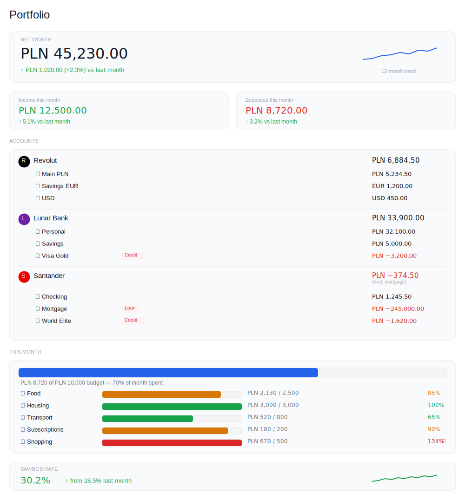
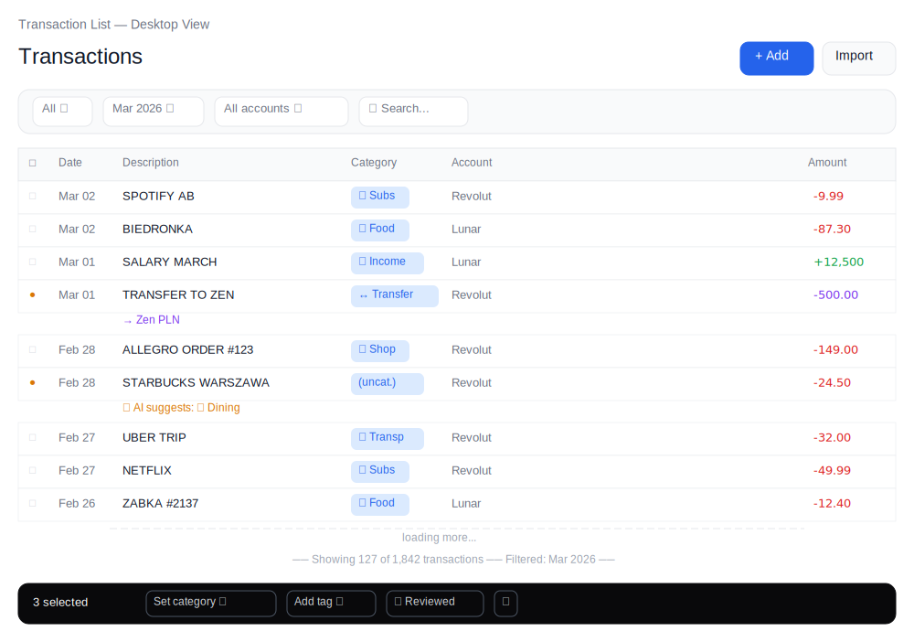
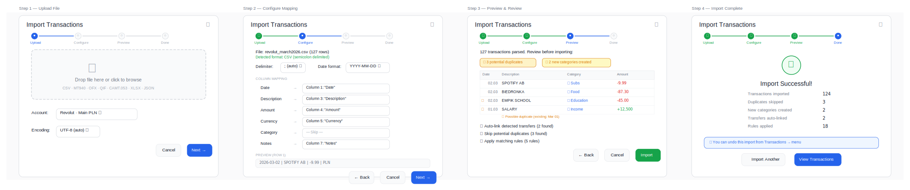
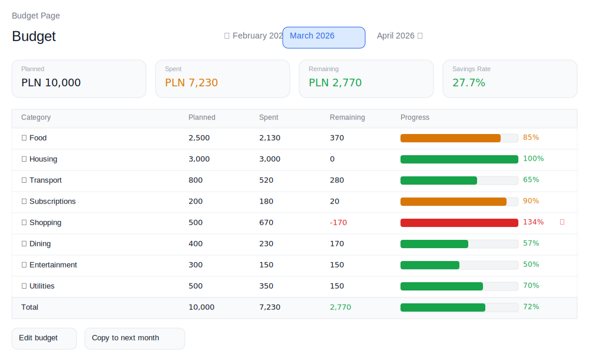
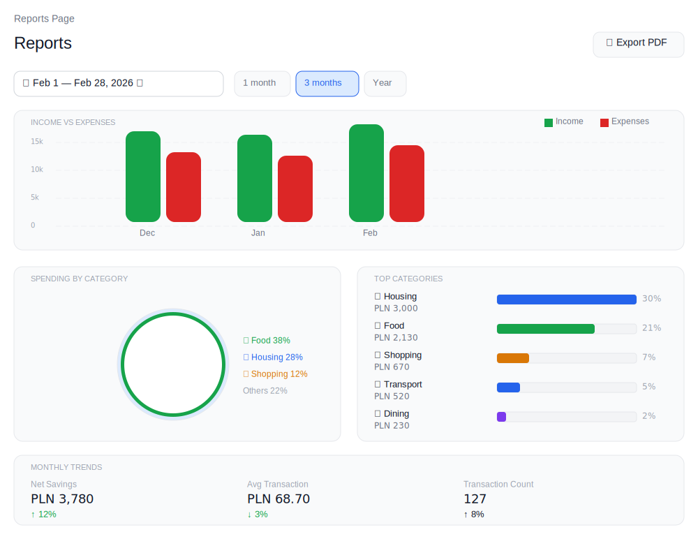
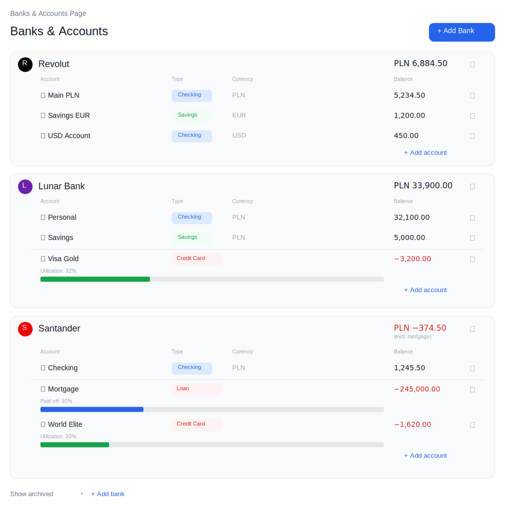

<div align="center">
  
  <h1>RustVault</h1>
  <p><strong>Self-hosted personal finance platform built in Rust</strong></p>
  <p>Take full control of your financial data. No cloud dependency. No subscriptions. Your server, your data.</p>

  <p>
    <a href="https://github.com/Xsarius/RustVault/stargazers"></a>
    <a href="https://github.com/Xsarius/RustVault/blob/main/LICENSE"></a>
    <a href="https://github.com/Xsarius/RustVault/issues"></a>
    <a href="https://github.com/Xsarius/RustVault"></a>
    <a href="https://github.com/Xsarius/RustVault"></a>
    <a href="https://github.com/Xsarius/RustVault"></a>
  </p>
</div>

---

> [!IMPORTANT]
> **RustVault is under active development and not yet ready for production use.**
> The project is in early stages — we're building in public and designing the architecture.
> If you're interested in self-hosted personal finance, **star ⭐ and watch 👁️ this repo** to follow progress and get notified when the first release drops.

---

## What is RustVault?

RustVault is an **open-source, self-hosted personal finance platform** designed for people who want to own their financial data — not hand it to a SaaS provider. It runs on your own hardware (a VPS, Raspberry Pi, NAS, or any Docker host) and gives you a fast, modern interface to manage transactions, budgets, reports, and multi-currency accounts.

Built from the ground up in **Rust** for performance and reliability, with a **SolidJS** frontend and **Capacitor** native mobile apps — all wrapped into a **single Docker image** you deploy in minutes.

### Why self-hosted?

- **Your data, your server** — financial data never leaves your network. Full database ownership, no third-party access.
- **Free forever** — open-source under AGPL-3.0. No subscriptions, no feature gates, no usage limits.
- **Run anywhere** — deploy on a VPS, Raspberry Pi, NAS, or any machine that runs Docker. One image, one command.
- **Always available** — no dependency on external services. Works offline, runs as long as your server runs.
- **Fully customizable** — complete access to the source code, REST API, and database. Build on top of it, extend it, make it yours.
- **Universal bank support** — import transactions from any bank worldwide via standard file formats (CSV, MT940, OFX, CAMT.053, and more).

---

## Key Features

- **Multi-currency accounts** — banks, checking, savings, cash, credit, investment
- **Budgeting** with progress tracking and period comparison
- **Import from any bank** — CSV, MT940, OFX/QFX, QIF, CAMT.053, XLSX, JSON
- **Custom statement parsers** — define per-bank parsing profiles for automated column mapping, date/amount format handling, and metadata extraction so repeat imports from the same bank just work
- **Auto-categorization** — rules engine + optional AI-assisted categorization
- **Duplicate & transfer detection** across accounts
- **Reports & charts** — income/expense breakdown, trends, cash flow (ECharts)
- **Tags & hierarchical categories** with audit log and edit history
- **Single Docker image** — PostgreSQL, multi-user RBAC, backup & restore
- **Web, iOS & Android** — SolidJS SPA + Capacitor native apps
- **Dark & light themes**, full i18n, RTL support, WCAG 2.1 AA accessible

---

## Architecture

> PostgreSQL ships in the provided `docker-compose.yml` but can point to any external instance. Reverse proxy is optional — the server handles TLS termination if needed.
> For detailed backend diagrams (request flow, import pipeline, crate dependencies) see [BACKEND_PLAN.md](BACKEND_PLAN.md#architecture-diagrams).

**Single binary. Single image. Full platform.**

- **Backend:** Rust (Axum) — compiles to a single binary with embedded migrations and static assets
- **Frontend:** SolidJS with Kobalte headless components, Tailwind CSS, and TanStack Table
- **Mobile:** Capacitor wraps the same SPA into native iOS and Android apps
- **Database:** PostgreSQL with compile-time checked queries via SQLx
- **Container:** Multi-stage Docker build — one image, `docker compose up`, done

---

## Wireframes

The UI is designed for **data density and readability** — inspired by Linear, Mercury OS, and the best parts of Firefly III and YNAB. Finance data is the hero, not decoration.

<details>
<summary><strong>Dashboard</strong> — Portfolio overview with net worth, account balances, budget progress, and recent activity</summary>
<br/>
<p align="center"></p>
</details>

<details>
<summary><strong>Transactions</strong> — High-density table with search, filters, bulk actions, and inline editing</summary>
<br/>
<p align="center"></p>
</details>

<details>
<summary><strong>Import Wizard</strong> — 4-step pipeline: Upload → Configure columns → Preview & categorize → Done</summary>
<br/>
<p align="center"></p>
</details>

<details>
<summary><strong>Budget</strong> — Category-based budgeting with progress bars and period comparison</summary>
<br/>
<p align="center"></p>
</details>

<details>
<summary><strong>Reports</strong> — Interactive charts for income/expense breakdown, trends, and cash flow</summary>
<br/>
<p align="center"></p>
</details>

<details>
<summary><strong>Banks & Accounts</strong> — Organized by bank with nested account cards</summary>
<br/>
<p align="center"></p>
</details>

---

## Self-Hosting

### Requirements

- **Docker** with Docker Compose (or any OCI-compatible runtime)
- **PostgreSQL 18+** (included in the provided `docker-compose.yml`)
- Minimum **1 CPU core** and **512 MB RAM** (runs comfortably on a Raspberry Pi 4)

### Quick Start

```bash
# Clone the repository
git clone https://github.com/Xsarius/RustVault.git
cd RustVault

# Copy and edit the environment file
cp .env.example .env
# Edit .env — set your database password, JWT secret, and domain

# Start everything
docker compose up -d
```

Open `http://localhost:8080` (or your configured domain) and create your first account.

### Reverse Proxy

RustVault works behind any reverse proxy. Example configs for popular options:

<details>
<summary><strong>Caddy</strong></summary>

```
finance.yourdomain.com {
    reverse_proxy rustvault:8080
}
```
</details>

<details>
<summary><strong>Nginx</strong></summary>

```nginx
server {
    listen 443 ssl http2;
    server_name finance.yourdomain.com;

    ssl_certificate /etc/letsencrypt/live/finance.yourdomain.com/fullchain.pem;
    ssl_certificate_key /etc/letsencrypt/live/finance.yourdomain.com/privkey.pem;

    location / {
        proxy_pass http://rustvault:8080;
        proxy_set_header Host $host;
        proxy_set_header X-Real-IP $remote_addr;
        proxy_set_header X-Forwarded-For $proxy_add_x_forwarded_for;
        proxy_set_header X-Forwarded-Proto $scheme;
    }
}
```
</details>

<details>
<summary><strong>Traefik</strong> (Docker labels)</summary>

```yaml
labels:
  - "traefik.enable=true"
  - "traefik.http.routers.rustvault.rule=Host(`finance.yourdomain.com`)"
  - "traefik.http.routers.rustvault.tls.certresolver=letsencrypt"
  - "traefik.http.services.rustvault.loadbalancer.server.port=8080"
```
</details>

---

## Tech Stack

| Layer | Technology |
|---|---|
| **Backend** | Rust + Axum |
| **Database** | PostgreSQL + SQLx |
| **Frontend** | SolidJS + TypeScript |
| **UI System** | Kobalte + Tailwind CSS |
| **Charts** | Apache ECharts |
| **Mobile** | Capacitor |
| **Auth** | Argon2id + JWT |
| **Import formats** | CSV, MT940, OFX/QFX, QIF, CAMT.053, XLSX, JSON |
| **AI (optional)** | Ollama / OpenAI / Anthropic |
| **i18n** | Fluent (backend) + ICU MessageFormat (frontend) |
| **Deployment** | Docker multi-stage |

---

## Roadmap

Development follows a phased approach — each phase is self-contained and shippable.


```
  P0        P1        P2        P3         P4        P5        P6        P7
  ┃         ┃         ┃         ┃          ┃         ┃         ┃         ┃
  ▼         ▼         ▼         ▼          ▼         ▼         ▼         ▼
  ○─────────○─────────○─────────○──────────○─────────○─────────○─────────●
  Scaffold  Backend   UI Shell  Txn &      Budget    Reports   Mobile    v1.0
                                Import
```

<details>
<summary><strong>Phase 0 — Project Scaffolding</strong>&ensp; 🔜 Next</summary>

> Repo structure, CI, dev environment, Docker skeleton.

- Cargo workspace with 5 crates (`server`, `core`, `db`, `import`, `ai`)
- SolidJS + Vite + Tailwind + Kobalte frontend scaffold
- Multi-stage Dockerfile & `docker-compose.yml` with PostgreSQL 18
- GitHub Actions CI (Rust check/clippy/test, frontend lint/build, Docker build)
- i18n infrastructure (Fluent + ICU MessageFormat)
- mdBook documentation skeleton & initial ADRs
</details>

<details>
<summary><strong>Phase 1 — Core Backend</strong>&ensp; 📋 Planned</summary>

> Auth, user/account CRUD, API foundation.

- User registration & login (Argon2id + JWT access/refresh tokens)
- Full CRUD for **Banks**, **Accounts**, **Categories** (hierarchical), and **Tags**
- Audit log middleware — every mutation is tracked
- User settings endpoint (default currency, locale, date format, AI toggle)
- Backend i18n — localized API error messages via `Accept-Language`
- Integration tests for all endpoints
</details>

<details>
<summary><strong>Phase 2 — Web UI Shell</strong>&ensp; 📋 Planned</summary>

> App shell with navigation, auth pages, entity management UI.

- SolidJS routing with responsive sidebar + mobile bottom tabs
- Login/registration pages with JWT token management
- Bank & Account management page (grouped, nested, archivable)
- Category tree view (drag-and-drop re-parenting) & Tag management
- Settings page with language selector, dark/light theme toggle
- Frontend i18n — all strings externalized, locale-aware dates & numbers
- Performance foundations: code splitting, skeleton screens, route prefetch
</details>

<details>
<summary><strong>Phase 3 — Transactions & Import</strong>&ensp; 📋 Planned</summary>

> The core differentiator — automated, flexible data import from any bank.

- Transaction CRUD with full-text search, bulk actions, pagination
- Transfer detection & linking (confidence scoring, card top-up detection)
- Duplicate detection on import
- **8 import parsers**: CSV, MT940, OFX/QFX, QIF, CAMT.053, XLSX/ODS, JSON
- 4-step Import Wizard UI (upload → map columns → preview → confirm)
- Auto-categorization rules engine (if/then conditions, saved per account)
- Transaction list with inline editing, filters, and column customization
</details>

<details>
<summary><strong>Phase 4 — Budgeting & Forecasting</strong>&ensp; 📋 Planned</summary>

> Create budgets, track actuals, compare periods.

- Budget CRUD with per-category planned amounts
- Automatic actual-amount computation from transactions
- Recurring budgets with auto-generation & copy-from-previous
- Budget dashboard: progress bars, variance charts, over-budget alerts
- Period comparison view (side-by-side months)
</details>

<details>
<summary><strong>Phase 5 — Reports & Analytics</strong>&ensp; 📋 Planned</summary>

> Rich, interactive financial charts and reports.

- Dashboard: net worth trend, income vs. expenses, category breakdown, cash flow
- Income/Expense report with drill-down by month → category
- Category analysis (treemap, trends, anomaly highlights)
- Account balance history (multi-account overlay)
- Cash flow forecast (projection based on historical averages)
- ECharts with lazy loading, modular imports, LTTB downsampling
- Export all reports as CSV or PDF
</details>

<details>
<summary><strong>Phase 6 — Mobile Apps</strong>&ensp; 📋 Planned</summary>

> Native iOS & Android apps via Capacitor.

- Capacitor project wrapping the SolidJS SPA
- Native plugins: Camera (receipts), Filesystem (import), Biometric Auth, Push Notifications
- Mobile-optimized UI: bottom tabs, pull-to-refresh, swipe actions
- Offline support with mutation queue (stretch goal)
- Fastlane for automated builds in CI
</details>

<details>
<summary><strong>Phase 7 — Polish, Security & v1.0</strong>&ensp; 📋 Planned</summary>

> Harden, optimize, document, and ship.

- Security hardening: rate limiting, CSP/HSTS headers, input validation audit, backup encryption
- Performance: DB index tuning, Brotli compression, ETag caching, Lighthouse CI gate (score ≥ 90)
- Multi-user: household invites, RBAC (admin/member/viewer), shared accounts
- Multi-currency: daily exchange rates (ECB/OER), reporting currency conversion
- WebSocket real-time updates (import progress, dashboard sync)
- Full data export (CSV/JSON/QIF) & backup/restore endpoints
- Complete API docs (OpenAPI/Scalar at `/api/docs`), mdBook user guide, Storybook
- Docker Hub / GHCR image publishing
</details>

<details>
<summary><strong>AI Features</strong>&ensp; 📋 Parallel track</summary>

> Optional, runs alongside Phase 3+. Fully opt-in — works without any AI provider.

- Smart categorization suggestions (local Ollama or cloud OpenAI/Anthropic)
- Receipt scanning via camera or file upload (OCR → structured data)
- Natural language transaction search
- Self-hosted AI support — no data leaves your network
</details>

---

## Contributing

RustVault is in early development and we welcome contributors! Whether it's code, documentation, design, translations, or ideas — all contributions are valuable.

1. **Fork** this repository
2. **Create** a feature branch (`git checkout -b feat/my-feature`)
3. **Commit** using [Conventional Commits](https://www.conventionalcommits.org/) (`feat:`, `fix:`, `docs:`, etc.)
4. **Push** and open a **Pull Request**

> A detailed contributing guide will be published as the codebase matures.

---

## Comparisons

How RustVault compares to other self-hosted finance tools:

| Feature | RustVault | Firefly III | Actual Budget | GnuCash |
|---|---|---|---|---|
| **Language** | Rust | PHP | JS/Node | C++ |
| **Self-hosted** | ✅ Docker | ✅ Docker | ✅ Docker | ❌ Desktop |
| **Mobile app** | ✅ Native (Capacitor) | ❌ Web only | ✅ Web/Electron | ❌ |
| **Import formats** | 8+ (CSV, MT940, OFX, QIF, CAMT.053, XLSX, JSON, PDF) | CSV, camt.053 | OFX, QIF, CSV | OFX, QIF, CSV |
| **Auto-categorization** | ✅ Rules + AI | ✅ Rules | ✅ Rules | ❌ |
| **Multi-currency** | ✅ | ✅ | ❌ | ✅ |
| **Performance** | ⚡ Compiled Rust | 🐘 PHP | ⚡ Node | ⚡ Native |
| **AI features** | ✅ Optional, self-hosted | ❌ | ❌ | ❌ |
| **API** | REST + WebSocket | REST | REST | ❌ |

---

## Security

RustVault takes security seriously — your financial data is among the most sensitive personal data you have.

- **Argon2id** password hashing with recommended parameters
- **Short-lived JWT** access tokens (15 min) — never stored in localStorage
- **HttpOnly/Secure** refresh tokens with rotation detection
- **Rate limiting** on auth endpoints (brute force protection)
- **CSP, HSTS, X-Frame-Options** security headers by default
- **Compile-time SQL** query checking (no SQL injection via SQLx)
- **Dependency auditing** via `cargo audit` in CI

---

## License

RustVault is licensed under the [GNU Affero General Public License v3.0 (AGPL-3.0)](LICENSE).

This means you can freely use, modify, and self-host RustVault. If you modify and run it as a network service, you must make your source code available under the same license.

---

<div align="center">
  <p>
    <strong>Built for people who believe financial data should be private by default.</strong>
  </p>
  <p>
    <a href="https://github.com/Xsarius/RustVault/stargazers">⭐ Star this repo</a> · <a href="https://github.com/Xsarius/RustVault/issues">Report a Bug</a> · <a href="https://github.com/Xsarius/RustVault/issues">Request a Feature</a>
  </p>
</div>
