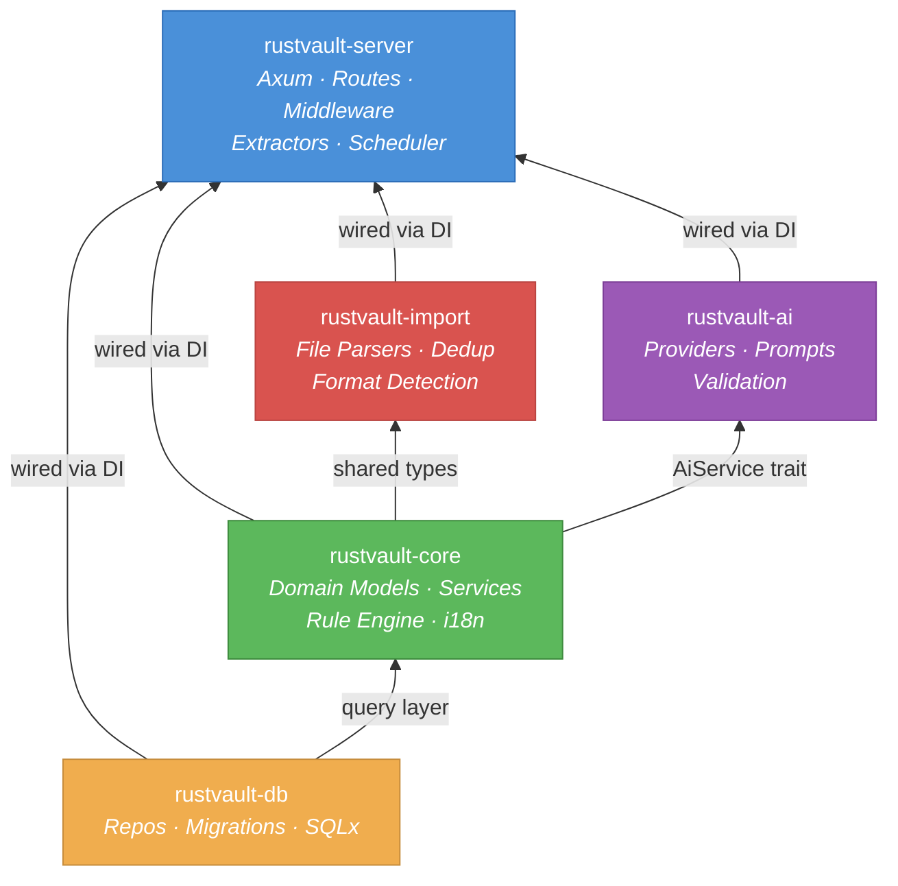
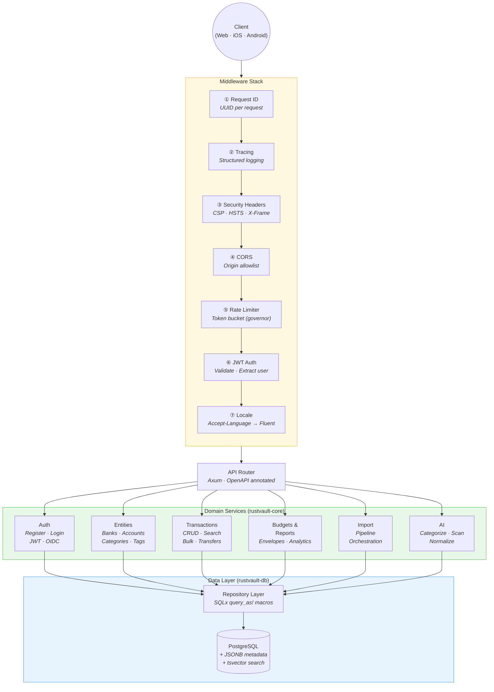
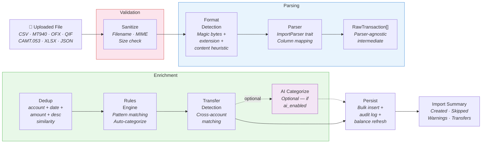
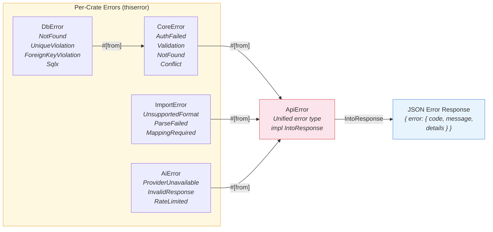
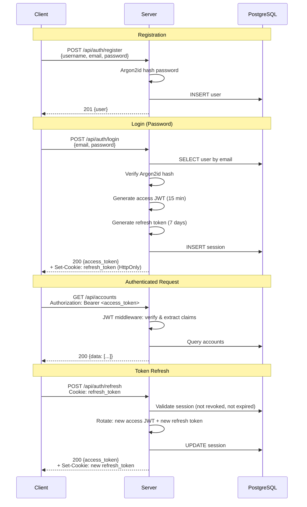
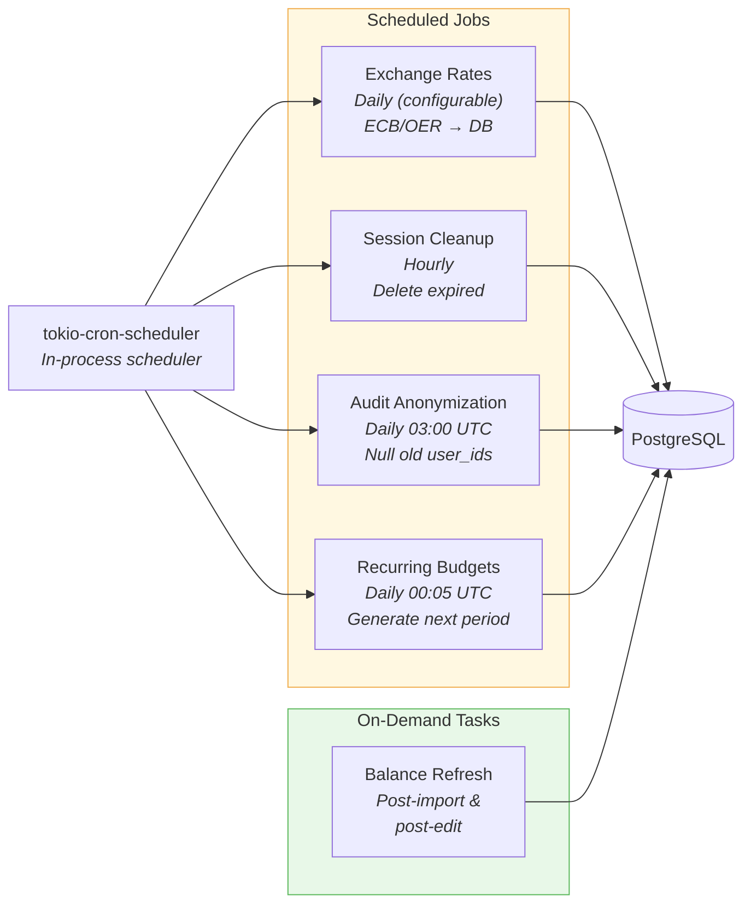

# RustVault — Backend Implementation Plan

> Detailed technical blueprint for the Rust backend server.
> Covers crate structure, dependencies, module design, middleware, database layer, and per-module implementation details.

---

## Table of Contents

1. [Workspace Structure](#1-workspace-structure)
2. [Dependency Inventory](#2-dependency-inventory)
3. [Configuration System](#3-configuration-system)
4. [Error Handling Architecture](#4-error-handling-architecture)
5. [Middleware Stack](#5-middleware-stack)
6. [Database Layer (`rustvault-db`)](#6-database-layer-rustvault-db)
7. [Domain Core (`rustvault-core`)](#7-domain-core-rustvault-core)
8. [HTTP Server (`rustvault-server`)](#8-http-server-rustvault-server)
9. [Import Engine (`rustvault-import`)](#9-import-engine-rustvault-import)
10. [AI Module (`rustvault-ai`)](#10-ai-module-rustvault-ai)
11. [Background Tasks & Scheduling](#11-background-tasks--scheduling)
12. [Testing Strategy](#12-testing-strategy)
13. [Build, Lint & CI](#13-build-lint--ci)
14. [Implementation Sequence](#14-implementation-sequence)

---

## 1. Workspace Structure

```
Cargo.toml                     # [workspace] — members, shared dependencies
crates/
├── rustvault-server/          # Binary crate — Axum HTTP server, main()
│   ├── Cargo.toml
│   └── src/
│       ├── main.rs            # Entrypoint: load config, init tracing, build app, serve
│       ├── app.rs             # Build Axum Router with all layers & routes
│       ├── config.rs          # Config loading (env + TOML), typed structs
│       ├── routes/
│       │   ├── mod.rs         # Re-exports, route group assembly
│       │   ├── auth.rs        # POST /auth/register, login, refresh, GET /auth/me, sessions
│       │   ├── banks.rs       # CRUD /banks (list with nested accounts, archive cascades)
│       │   ├── accounts.rs    # CRUD /accounts (filterable by bank/type/currency, archive)
│       │   ├── categories.rs  # CRUD /categories (+ /categories/bulk)
│       │   ├── tags.rs        # CRUD /tags (+ /tags/bulk)
│       │   ├── transactions.rs # CRUD /transactions (+ /transactions/bulk, search, type filter)
│       │   ├── transfers.rs   # POST /transfers (create, link, detect), DELETE /transfers/{id} (unlink)
│       │   ├── imports.rs     # /import/upload, configure, execute (with transfer detection), list, rollback
│       │   ├── rules.rs       # CRUD /rules (+ /rules/test)
│       │   ├── budgets.rs     # CRUD /budgets (+ lines, summary, copy)
│       │   ├── reports.rs     # /reports/summary, income-expense, category, balance, cash-flow
│       │   ├── settings.rs    # GET/PUT /settings, GET /i18n/locales
│       │   ├── ai.rs          # /ai/receipt/scan, suggestions, categorize, normalize, status, models
│       │   ├── admin.rs       # /admin/users, backup, restore (admin-only)
│       │   ├── health.rs      # GET /health (public, no auth)
│       │   └── ws.rs          # WebSocket /ws — real-time events (P7)
│       ├── middleware/
│       │   ├── mod.rs
│       │   ├── auth.rs        # JWT extraction + validation middleware
│       │   ├── request_id.rs  # Generate/propagate X-Request-Id
│       │   ├── locale.rs      # Parse Accept-Language → resolve locale
│       │   ├── audit.rs       # Post-response hook to write audit log entries
│       │   ├── rate_limit.rs  # Token-bucket rate limiter (tower layer)
│       │   └── security_headers.rs # CSP, HSTS, X-Frame-Options, etc.
│       ├── extractors/
│       │   ├── mod.rs
│       │   ├── auth.rs        # AuthUser extractor (from JWT middleware state)
│       │   ├── pagination.rs  # PaginationParams extractor (cursor, limit)
│       │   ├── locale.rs      # ResolvedLocale extractor
│       │   └── json.rs        # Validated JSON body extractor (validator + serde)
│       └── response.rs        # Unified ApiResponse<T>, ApiError → IntoResponse
│
├── rustvault-core/            # Library crate — domain logic, services, no HTTP awareness
│   ├── Cargo.toml
│   └── src/
│       ├── lib.rs             # #![warn(missing_docs)], re-exports
│       ├── error.rs           # CoreError enum (thiserror)
│       ├── models/            # Domain structs (NOT DB rows — mapped)
│       │   ├── mod.rs
│       │   ├── user.rs        # User, NewUser, UserSettings, Role
│       │   ├── bank.rs        # Bank, NewBank, BankWithAccounts
│       │   ├── account.rs     # Account, NewAccount, AccountType (checking/savings/cash/credit/invest/prepaid)
│       │   ├── category.rs    # Category, NewCategory, CategoryTree
│       │   ├── tag.rs         # Tag, NewTag
│       │   ├── transaction.rs # Transaction, NewTransaction, TransactionType, TransactionFilter, BulkUpdate
│       │   ├── transfer.rs    # Transfer, NewTransfer, TransferMethod, TransferSuggestion, TransferDetectParams
│       │   ├── import.rs      # Import, ImportStatus, ImportSummary
│       │   ├── rule.rs        # AutoRule, RuleCondition, RuleAction, RuleMatch
│       │   ├── budget.rs      # Budget, BudgetLine, BudgetSummary, BudgetComparison
│       │   ├── audit.rs       # AuditEntry, AuditAction
│       │   ├── exchange.rs    # ExchangeRate, CurrencyPair
│       │   └── pagination.rs  # Page<T>, CursorPage<T>, PaginationParams
│       ├── services/          # Business logic — orchestrates DB + rules + external calls
│       │   ├── mod.rs
│       │   ├── auth.rs        # register, login, refresh, revoke, change_password
│       │   ├── bank.rs        # CRUD + list with nested accounts + archive (cascade)
│       │   ├── account.rs     # CRUD + balance recalculation + filtered list (by bank, type, currency)
│       │   ├── category.rs    # CRUD + tree operations + bulk create
│       │   ├── tag.rs         # CRUD + bulk create
│       │   ├── transaction.rs # CRUD + search + bulk update + duplicate detection
│       │   ├── transfer.rs    # Create transfer, link/unlink, detect matches, card topup detection
│       │   ├── import.rs      # Orchestrates: parse → dedup → categorize → detect transfers → persist → summary
│       │   ├── rule.rs        # CRUD + evaluate rules on a transaction set
│       │   ├── budget.rs      # CRUD + actual computation + recurring + copy
│       │   ├── report.rs      # Aggregation queries: summary, income/expense, trends
│       │   ├── audit.rs       # Write audit entries, query history
│       │   ├── exchange.rs    # Fetch rates, convert, cache
│       │   ├── settings.rs    # User settings CRUD
│       │   └── export.rs      # Export transactions as CSV/JSON/QIF
│       ├── rules/             # Auto-categorization rule engine
│       │   ├── mod.rs
│       │   ├── engine.rs      # Evaluate all rules against a transaction, return actions
│       │   ├── condition.rs   # Condition types: contains, regex, range, account, AND/OR
│       │   └── action.rs      # Action types: set_category, add_tag, set_payee, set_metadata
│       ├── i18n.rs            # Backend i18n helpers: load Fluent bundles, format messages
│       ├── crypto.rs          # Argon2 hashing, JWT encode/decode, AES encryption for API keys
│       └── clock.rs           # Abstraction over time (enables deterministic tests)
│
├── rustvault-db/              # Library crate — SQLx queries, migrations, repositories
│   ├── Cargo.toml
│   └── src/
│       ├── lib.rs             # Pool type alias, re-exports
│       ├── error.rs           # DbError enum (thiserror): maps sqlx::Error
│       ├── pool.rs            # Create PgPool from config, run embedded migrations
│       ├── repos/             # Repository pattern — SQL query layer
│       │   ├── mod.rs
│       │   ├── user.rs        # find_by_id, find_by_email, insert, update, delete
│       │   ├── bank.rs        # CRUD + list_by_user_with_accounts + archive (cascade to accounts)
│       │   ├── account.rs     # CRUD + list_by_user (filterable by bank/type/currency) + update_balance_cache
│       │   ├── category.rs    # CRUD + tree_by_user + bulk_insert + find_or_create
│       │   ├── tag.rs         # CRUD + list_by_user + bulk_insert + find_or_create
│       │   ├── transaction.rs # CRUD + search (tsvector) + paginated list + bulk_update
│       │   ├── transfer.rs    # insert, find_by_id, delete, find_matches (transfer detection queries)
│       │   ├── import.rs      # CRUD + list_by_user + update_status + link_transactions
│       │   ├── rule.rs        # CRUD + list_by_user_ordered
│       │   ├── budget.rs      # CRUD + lines CRUD + actual_sums_by_category
│       │   ├── audit.rs       # insert + query_by_entity + anonymize_old
│       │   ├── exchange.rs    # upsert_rate, get_rate, get_latest_rates
│       │   ├── session.rs     # insert, revoke, list_by_user, cleanup_expired
│       │   └── settings.rs    # get_by_user, upsert
│       └── migrations/        # SQL migrations (embedded via sqlx::migrate!)
│           ├── 0001_initial_schema.sql
│           ├── 0002_transactions_imports_rules.sql
│           ├── 0003_budgets.sql
│           ├── 0004_exchange_rates.sql
│           ├── 0005_sessions.sql
│           └── 0006_full_text_search.sql
│
├── rustvault-import/          # Library crate — file parsers & import pipeline
│   ├── Cargo.toml
│   └── src/
│       ├── lib.rs             # Parser registry, ImportParser trait, RawTransaction
│       ├── error.rs           # ImportError enum (thiserror)
│       ├── raw.rs             # RawTransaction struct (parser-agnostic intermediate)
│       ├── registry.rs        # ParserRegistry — registered parsers, format detection
│       ├── detect.rs          # Format detection: magic bytes + extension + content heuristic
│       ├── parsers/
│       │   ├── mod.rs
│       │   ├── csv.rs         # CSV parser (delimiter/date/decimal auto-detect, column mapping)
│       │   ├── mt940.rs       # MT940/SWIFT parser
│       │   ├── ofx.rs         # OFX/QFX parser (SGML normalizer + XML parser)
│       │   ├── qif.rs         # QIF line-based parser
│       │   ├── camt053.rs     # ISO 20022 CAMT.053 XML parser
│       │   ├── xlsx.rs        # XLSX/XLS/ODS parser (calamine)
│       │   ├── json.rs        # Generic JSON parser with field mapping
│       │   └── pdf.rs         # PDF text extraction (optional, feature-gated)
│       ├── mapping.rs         # ColumnMapping struct — saved per account, applied to CSV/XLSX/JSON
│       ├── dedup.rs           # Duplicate detection: (account, date, amount, desc_similarity)
│       └── sanitize.rs        # Filename sanitization, MIME validation, size checks
│
└── rustvault-ai/              # Library crate — AI features, toggleable
    ├── Cargo.toml
    └── src/
        ├── lib.rs             # Feature gate, public API surface
        ├── config.rs          # AiConfig struct, provider presets
        ├── error.rs           # AiError enum (thiserror)
        ├── receipt.rs         # Receipt scanning orchestration
        ├── categorize.rs      # Single + batch categorization
        ├── normalize.rs       # Payee normalization
        ├── enrichment.rs      # Import pipeline hook: categorize + normalize batch
        ├── validate.rs        # Response validation pipeline (JSON parse, schema, sanity, confidence)
        ├── prompts/
        │   ├── mod.rs         # Prompt template engine (variable substitution)
        │   ├── receipt.rs     # Receipt scanning prompt
        │   ├── categorize.rs  # Single + batch categorization prompts
        │   └── normalize.rs   # Payee normalization prompt
        └── providers/
            ├── mod.rs         # AiProvider trait definition
            ├── ollama.rs      # Ollama REST API client
            ├── openai.rs      # OpenAI chat completions client
            ├── anthropic.rs   # Anthropic messages client
            └── openai_compat.rs # Generic OpenAI-compatible client
```

### Crate Dependency Graph



- `rustvault-core` depends on: `rustvault-db`
- `rustvault-import` depends on: `rustvault-core` (for `RawTransaction` and shared types)
- `rustvault-ai` depends on: `rustvault-core` (for domain models, `AiService` trait)
- `rustvault-server` depends on: all four

> **Circular dependency note:** `rustvault-core` defines an `AiService` trait — `rustvault-ai` implements it. `rustvault-server` wires them together via dependency injection, avoiding any circular dependency.

---

### Architecture Diagrams

#### Backend Request Flow



#### Import Pipeline



#### Error Flow (Crate → API Response)



#### Authentication Flow



#### Background Tasks & Scheduling



---

## 2. Dependency Inventory

All dependencies listed with purpose and whether they use an existing crate or require custom implementation.

### Workspace-Level (`Cargo.toml`)

**Workspace Settings:**

| Setting | Value |
|---------|-------|
| `resolver` | `2` |
| `members` | `crates/*` |
| `version` | `0.1.0` |
| `edition` | `2024` |
| `rust-version` | `1.85` |
| `license` | `MIT OR Apache-2.0` |

**Shared Dependencies:**

| Crate | Version | Features | Purpose |
|-------|---------|----------|---------|
| `tokio` | 1 | `full` | Async runtime |
| `serde` | 1 | `derive` | Serialization / deserialization |
| `serde_json` | 1 | — | JSON handling |
| `thiserror` | 2 | — | Typed error enums |
| `tracing` | 0.1 | — | Structured logging |
| `tracing-subscriber` | 0.3 | `env-filter`, `json` | Log subscriber (JSON output, env filter) |
| `sqlx` | 0.8 | `runtime-tokio`, `tls-rustls`, `postgres`, `uuid`, `time`, `rust_decimal`, `json`, `migrate` | Async Postgres driver, compile-time queries, migrations |
| `uuid` | 1 | `v4`, `serde` | Entity IDs |
| `time` | 0.3 | `serde`, `formatting`, `parsing` | Dates, timestamps |
| `rust_decimal` | 1 | `serde-with-str` | Financial amounts (no floating point) |

### `rustvault-server`

| Crate | Version | Purpose |
|-------|---------|---------|
| `axum` | 0.8 | HTTP framework, routing, extractors, middleware |
| `axum-extra` | 0.10 | Cookie support (`CookieJar`), typed headers |
| `tower` | 0.5 | Service middleware (rate limiting, timeouts, CORS) |
| `tower-http` | 0.6 | CORS, compression (Brotli/gzip), request body limit, trace layer |
| `tokio` | 1 | Async runtime |
| `serde` | 1 | Serialization/deserialization |
| `serde_json` | 1 | JSON |
| `tracing` | 0.1 | Structured logging |
| `tracing-subscriber` | 0.3 | Log subscriber (JSON output, env filter) |
| `dotenvy` | 0.15 | Load `.env` file for secret env vars |
| `toml` | 0.8 | Parse `config.toml` |
| `validator` | 0.19 | Request body validation (`#[derive(Validate)]`) |
| `utoipa` | 5 | OpenAPI spec generation from types + handlers |
| `utoipa-scalar` | 0.3 | Scalar UI for API docs at `/api/docs` |
| `tokio-cron-scheduler` | 0.13 | Scheduled background tasks (exchange rates, budget recurrence) |
| `governor` | 0.7 | Token-bucket rate limiting |
| `anyhow` | 1 | Ergonomic error handling in `main` |

### `rustvault-core`

| Crate | Version | Purpose |
|-------|---------|---------|
| `serde` | 1 | Domain model serialization |
| `serde_json` | 1 | JSONB field handling |
| `thiserror` | 2 | Typed domain errors |
| `uuid` | 1 | Entity IDs |
| `time` | 0.3 | Dates, timestamps |
| `rust_decimal` | 1 | Financial amounts (no floating point) |
| `argon2` | 0.5 | Password hashing (Argon2id) |
| `jsonwebtoken` | 9 | JWT encode/decode |
| `aes-gcm` | 0.10 | AES-256-GCM encryption for AI API keys |
| `rand` | 0.8 | Secure random generation (salts, tokens) |
| `regex` | 1 | Rule engine regex conditions |
| `fluent` | 0.16 | Project Fluent i18n runtime |
| `fluent-syntax` | 0.11 | Fluent file parsing |
| `unic-langid` | 0.9 | Language tag parsing (BCP 47) |
| `openidconnect` | 4 | OIDC discovery, Authorization Code + PKCE flow, ID token validation |
| `reqwest` | 0.12 | HTTP client for OIDC provider communication (used by `openidconnect`) |
| `tracing` | 0.1 | Structured logging |
| `validator` | 0.19 | Domain model validation (`#[derive(Validate)]`) |
| `sha2` | 0.10 | SHA-256 hashing for refresh token storage |

### `rustvault-db`

| Crate | Version | Purpose |
|-------|---------|---------|
| `sqlx` | 0.8 | Async Postgres driver, compile-time checked queries, migrations |
| `serde` | 1 | Row deserialization |
| `serde_json` | 1 | JSONB fields |
| `uuid` | 1 | PK types |
| `time` | 0.3 | Timestamp fields |
| `rust_decimal` | 1 | Numeric fields |
| `thiserror` | 2 | DB error types |
| `tracing` | 0.1 | Query logging |

### `rustvault-import`

| Crate | Version | Purpose |
|-------|---------|---------|
| `csv` | 1 | CSV parsing |
| `quick-xml` | 0.37 | OFX 2.x XML + CAMT.053 XML parsing |
| `calamine` | 0.26 | XLSX/XLS/ODS spreadsheet reading |
| `serde` | 1 | Deserialization |
| `serde_json` | 1 | JSON import format |
| `rust_decimal` | 1 | Amount parsing |
| `time` | 0.3 | Date parsing |
| `thiserror` | 2 | Import error types |
| `tracing` | 0.1 | Parse logging |
| `encoding_rs` | 0.8 | Charset detection/conversion (MT940 is often Latin-1) |
| `strsim` | 0.11 | String similarity (for duplicate description matching) |
| `infer` | 0.16 | MIME type detection from magic bytes |
| *MT940 parser* | — | Parse SWIFT MT940 bank statements (custom, see §9.3) |
| *OFX SGML normalizer* | — | Convert OFX 1.x SGML to well-formed XML (custom, see §9.4) |
| *QIF parser* | — | Parse Quicken Interchange Format (custom, see §9.5) |

### `rustvault-ai`

| Crate | Version | Purpose |
|-------|---------|---------|
| `reqwest` | 0.12 | HTTP client for AI provider APIs (Ollama, OpenAI, Anthropic) |
| `serde` | 1 | Request/response serialization |
| `serde_json` | 1 | JSON mode responses |
| `thiserror` | 2 | AI error types |
| `tracing` | 0.1 | Logging |
| `base64` | 0.22 | Image encoding for vision APIs |
| `tokio` | 1 | Async runtime, semaphore for concurrency limiting |
| `async-trait` | 0.1 | Async trait support for `AiProvider` |

> **Note:** The `Lazy` static in the AI semaphore uses `std::sync::LazyLock` (stable since Rust 1.80) — no extra crate needed.


---

## 3. Configuration System

### Design: Secrets in Env Vars, Tuning in TOML

Secrets and deploy-specific values that users set when running Docker Compose go in environment variables. Server tuning parameters with sensible defaults go in `config.toml`.

### Environment Variables (Secrets & Deploy-Specific)

```bash
# Required — database connection (mapped to PG* env vars internally)
DATABASE_HOST=localhost
DATABASE_PORT=5432
DATABASE_USER=rustvault
DATABASE_PASSWORD=<strong-random-password>
DATABASE_NAME=rustvault
JWT_SECRET=<min-256-bit-random-string>
ENCRYPTION_KEY=<32-byte-hex>                   # App-level encryption (AI API keys)
JWT_SECRET_OLD=<previous-jwt-secret>           # Previous JWT secret for graceful key rotation (optional)
OPEN_EXCHANGE_RATES_APP_ID=<app-id>            # Required if exchange_rates.provider = "openexchangerates"

# OIDC / SSO (optional — set to enable OIDC login)
OIDC_CLIENT_ID=rustvault
OIDC_CLIENT_SECRET=<client-secret>             # From OIDC provider (Authentik, Keycloak, etc.)
OIDC_ISSUER_URL=https://auth.example.com/application/o/rustvault/

# Optional
RUSTVAULT_CONFIG=/etc/rustvault/config.toml     # Custom config path
```

### `config.toml` (Server Tuning — Sensible Defaults)

```toml
[server]
port = 8080
allowed_origins = []                # CORS origins (e.g. ["https://finance.example.com"])
request_timeout_secs = 30
max_body_size = "10MB"
max_upload_size = "50MB"

[database]
url = ""                        # Connection URL — constructed from PG* env vars if empty
max_connections = 10
min_connections = 2
acquire_timeout_secs = 5
idle_timeout_secs = 300
max_lifetime_secs = 1800

[auth]
allow_new_user_register = true        # Set to false to disable public registration
access_token_ttl_secs = 900           # 15 minutes
refresh_token_ttl_secs = 604800       # 7 days
max_sessions_per_user = 10
password_min_length = 10
password_max_length = 128
login_rate_limit_attempts = 5
login_rate_limit_window_secs = 900    # 15 minutes
account_lockout_threshold = 20
audit_retention_days = 90             # Days to keep audit log entries before anonymization

[auth.oidc]
enabled = false                                # Auto-enabled when OIDC_ISSUER_URL env var is set
display_name = "SSO"                           # Button label shown on login page (e.g. "Authentik", "Keycloak")
scopes = ["openid", "profile", "email"]         # OIDC scopes to request
auto_register = true                           # Auto-create local user on first OIDC login
# client_id, client_secret, and issuer_url are ALWAYS from env vars, never in config file

[import]
max_file_size = "50MB"
max_receipt_size = "10MB"
rate_limit_per_user_per_hour = 50
temp_dir = "/tmp/rustvault-imports"
allowed_extensions = ["csv", "mt940", "sta", "ofx", "qfx", "qif", "xml", "xlsx", "xls", "ods", "json", "pdf"]

[rate_limit]
global_requests_per_min = 100
report_requests_per_min = 20

[ai]
enabled = false                       # Master toggle — false disables all AI routes and background tasks
ollama_base_url = "http://localhost:11434"
default_text_model = "phi3.5:mini"
default_vision_model = "smolvlm:2b"
default_confidence_threshold = 0.7
max_batch_size = 20
timeout_secs = 30
max_concurrent_requests = 5

[exchange_rates]
provider = "ecb"                      # "ecb" or "openexchangerates"
update_cron = "0 6 * * *"            # Daily at 06:00 UTC
# open_exchange_rates_app_id is set via env var if using OER

[logging]
format = "json"                       # "json" or "pretty"
level = "info"                        # Default log level (e.g. "debug", "info", "warn")

[docs]
serve_api_docs = true                 # Serve /api/docs in production
```

### Config Loading Implementation

```rust
// crates/rustvault-server/src/config.rs

/// Application configuration.
///
/// Loading priority: env vars (secrets) > config.toml (tuning) > defaults.
#[derive(Debug, Clone)]
pub struct AppConfig {
    pub server: ServerConfig,
    pub database: DatabaseConfig,
    pub auth: AuthConfig,
    pub import: ImportConfig,
    pub rate_limit: RateLimitConfig,
    pub ai: AiConfig,
    pub exchange_rates: ExchangeRatesConfig,
    pub logging: LoggingConfig,
    pub docs: DocsConfig,
    // Secrets (from env only)
    pub jwt_secret: String,
    pub jwt_secret_old: Option<String>,
    pub encryption_key: Option<Vec<u8>>,
    pub oidc_client_id: Option<String>,
    pub oidc_client_secret: Option<String>,
    pub oidc_issuer_url: Option<String>,
}

/// OIDC configuration (nested under `auth.oidc` in config.toml).
#[derive(Debug, Clone)]
pub struct OidcConfig {
    pub enabled: bool,
    pub display_name: String,
    pub scopes: Vec<String>,
    pub auto_register: bool,
}

impl AppConfig {
    /// Load config from env + TOML file.
    ///
    /// 1. Load `.env` file if present (via `dotenvy`).
    /// 2. Read config.toml from `RUSTVAULT_CONFIG` env var or `./config.toml`.
    /// 3. Parse TOML into config structs (with defaults for missing fields).
    /// 4. Read secret env vars (JWT_SECRET, OIDC_*, ENCRYPTION_KEY, etc.).
    pub fn load() -> Result<Self, ConfigError> { /* ... */ }
}
```

---

## 4. Error Handling Architecture

### Strategy: `thiserror` Enums per Crate → Unified `ApiError`

Each library crate defines its own error enum. The server crate maps all of them into a single `ApiError` type that implements Axum's `IntoResponse`.

### Per-Crate Error Types

```rust
// rustvault-db/src/error.rs
#[derive(Debug, thiserror::Error)]
pub enum DbError {
    #[error("record not found")]
    NotFound,
    #[error("unique constraint violated: {field}")]
    UniqueViolation { field: String },
    #[error("foreign key constraint violated")]
    ForeignKeyViolation,
    #[error("database error: {0}")]
    Sqlx(#[from] sqlx::Error),
    #[error("migration error: {0}")]
    Migration(#[from] sqlx::migrate::MigrateError),
}

// rustvault-core/src/error.rs
#[derive(Debug, thiserror::Error)]
pub enum CoreError {
    #[error("authentication failed: {reason}")]
    AuthFailed { reason: String },
    #[error("invalid credentials")]
    InvalidCredentials,
    #[error("token expired")]
    TokenExpired,
    #[error("token invalid: {0}")]
    TokenInvalid(String),
    #[error("access denied")]
    AccessDenied,
    #[error("account locked")]
    AccountLocked,
    #[error("validation error: {0}")]
    Validation(String),
    #[error("not found: {entity} with id {id}")]
    NotFound { entity: String, id: String },
    #[error("conflict: {0}")]
    Conflict(String),
    #[error("rule evaluation error: {0}")]
    RuleError(String),
    #[error("OIDC error: {0}")]
    OidcError(String),
    #[error("OIDC not configured")]
    OidcNotConfigured,
    #[error("OIDC user not pre-registered: {email}")]
    OidcUserNotRegistered { email: String },
    #[error("registration is disabled")]
    RegistrationDisabled,
    #[error("password login not available — use SSO")]
    PasswordLoginDisabled,
    #[error(transparent)]
    Db(#[from] rustvault_db::DbError),
    #[error("internal error: {0}")]
    Internal(String),
}

// rustvault-import/src/error.rs
#[derive(Debug, thiserror::Error)]
pub enum ImportError {
    #[error("unsupported format: {ext}")]
    UnsupportedFormat { ext: String },
    #[error("parse error at row {row}: {message}")]
    ParseError { row: usize, message: String },
    #[error("file too large: {size} bytes (max {max})")]
    FileTooLarge { size: u64, max: u64 },
    #[error("invalid file type: expected {expected}, got {actual}")]
    InvalidMimeType { expected: String, actual: String },
    #[error("column mapping required: unmapped columns {columns:?}")]
    MappingRequired { columns: Vec<String> },
    #[error("encoding error: {0}")]
    Encoding(String),
    #[error("IO error: {0}")]
    Io(#[from] std::io::Error),
}

// rustvault-ai/src/error.rs
#[derive(Debug, thiserror::Error)]
pub enum AiError {
    #[error("AI features are disabled")]
    Disabled,
    #[error("provider not configured: {provider}")]
    NotConfigured { provider: String },
    #[error("provider unavailable: {0}")]
    ProviderUnavailable(String),
    #[error("model not found: {model}")]
    ModelNotFound { model: String },
    #[error("invalid response from AI: {0}")]
    InvalidResponse(String),
    #[error("AI request timed out after {timeout_secs}s")]
    Timeout { timeout_secs: u32 },
    #[error("AI request failed: {0}")]
    RequestFailed(#[from] reqwest::Error),
}
```

### Unified API Error (Server Crate)

```rust
// rustvault-server/src/response.rs

use axum::http::StatusCode;
use axum::response::{IntoResponse, Response};
use serde::Serialize;

/// Standard API error response body.
#[derive(Serialize)]
pub struct ErrorBody {
    /// Wrapper for error details
    pub error: ErrorData,
}

#[derive(Serialize)]
pub struct ErrorData {
    /// Machine-readable error code (e.g., "INVALID_CREDENTIALS")
    pub code: String,
    /// Human-readable message (localized if possible)
    pub message: String,
    /// Optional field-level validation errors
    #[serde(skip_serializing_if = "Option::is_none")]
    pub details: Option<Vec<FieldError>>,
}

#[derive(Serialize)]
pub struct FieldError {
    pub field: String,
    pub message: String,
}

/// Unified error type for all API handlers.
///
/// Every handler returns `Result<impl IntoResponse, ApiError>`.
/// This type maps domain errors to proper HTTP status codes.
pub enum ApiError {
    // 400
    Validation(Vec<FieldError>),
    BadRequest(String),
    // 401
    Unauthorized(String),
    // 403
    Forbidden,
    // 404
    NotFound(String),
    // 409
    Conflict(String),
    // 413
    PayloadTooLarge(String),
    // 429
    RateLimited,
    // 500
    Internal(String),
    // 503
    ServiceUnavailable(String),
}

impl IntoResponse for ApiError {
    fn into_response(self) -> Response {
        let (status, code, message, details) = match self {
            ApiError::Validation(fields) => (
                StatusCode::BAD_REQUEST,
                "VALIDATION_ERROR",
                "One or more fields are invalid".into(),
                Some(fields),
            ),
            ApiError::Unauthorized(msg) => (
                StatusCode::UNAUTHORIZED,
                "UNAUTHORIZED",
                msg,
                None,
            ),
            ApiError::NotFound(entity) => (
                StatusCode::NOT_FOUND,
                "NOT_FOUND",
                format!("{entity} not found"),
                None,
            ),
            // ... etc.
        };

        let body = ErrorBody {
            error: ErrorData {
                code: code.to_string(),
                message,
                details,
            },
        };
        (status, axum::Json(body)).into_response()
    }
}

// Conversions from domain errors
impl From<CoreError> for ApiError {
    fn from(err: CoreError) -> Self {
        match err {
            CoreError::InvalidCredentials | CoreError::AuthFailed { .. } => {
                ApiError::Unauthorized("Invalid credentials".into())
            }
            CoreError::TokenExpired | CoreError::TokenInvalid(_) => {
                ApiError::Unauthorized("Token expired or invalid".into())
            }
            CoreError::AccessDenied => ApiError::Forbidden,
            CoreError::NotFound { entity, .. } => ApiError::NotFound(entity),
            CoreError::Validation(msg) => {
                ApiError::BadRequest(msg)
            }
            CoreError::Conflict(msg) => ApiError::Conflict(msg),
            CoreError::OidcNotConfigured => {
                ApiError::BadRequest("OIDC is not configured on this instance".into())
            }
            CoreError::OidcUserNotRegistered { email } => {
                ApiError::Forbidden  // User exists in OIDC provider but not pre-registered locally
            }
            CoreError::RegistrationDisabled => {
                ApiError::Forbidden  // Public registration is disabled in server config
            }
            CoreError::PasswordLoginDisabled => {
                ApiError::BadRequest("This account uses SSO — sign in with your identity provider".into())
            }
            CoreError::OidcError(msg) => {
                tracing::error!(%msg, "OIDC error");
                ApiError::Unauthorized("SSO authentication failed".into())
            }
            _ => {
                tracing::error!(?err, "internal error");
                ApiError::Internal("Internal server error".into())
            }
        }
    }
}
```

### Standard Success Response

```rust
/// Standard API success response.
#[derive(Serialize)]
pub struct ApiResponse<T: Serialize> {
    pub data: T,
}

/// Paginated response.
#[derive(Serialize)]
pub struct PaginatedResponse<T: Serialize> {
    pub data: Vec<T>,
    pub meta: PaginationMeta,
}

#[derive(Serialize)]
pub struct PaginationMeta {
    pub total: i64,
    pub page_size: i64,
    pub next_cursor: Option<String>,
    pub has_more: bool,
}
```

---

## 5. Middleware Stack

### Axum Layer Ordering (outermost → innermost)

```rust
// crates/rustvault-server/src/app.rs

pub fn build_app(config: &AppConfig, pool: PgPool) -> Router {
    // Shared state
    let state = AppState::new(config, pool);

    Router::new()
        // --- Public routes (no auth) ---
        .nest("/api", public_routes())       // includes /api/auth/login, /api/auth/register,
                                             //   /api/auth/oidc/authorize, /api/auth/oidc/callback,
                                             //   /api/auth/oidc/config
        // --- Protected routes (auth required) ---
        .nest("/api", protected_routes())
        // --- API docs ---
        .merge(api_docs_routes(config))
        // --- Static assets (SPA) ---
        .fallback_service(spa_handler())
        // === Middleware layers (applied bottom-to-top) ===
        // 1. Request ID (outermost — every request gets a UUID)
        .layer(request_id_layer())
        // 2. Tracing (logs request method, path, status, duration)
        .layer(trace_layer())
        // 3. Security headers (CSP, X-Frame-Options, etc.)
        .layer(security_headers_layer())
        // 4. CORS
        .layer(cors_layer(config))
        // 5. Compression (Brotli, gzip)
        .layer(CompressionLayer::new())
        // 6. Request body size limit
        .layer(DefaultBodyLimit::max(config.server.max_body_size))
        // 7. Request timeout
        .layer(TimeoutLayer::new(Duration::from_secs(
            config.server.request_timeout_secs
        )))
        // 8. Global rate limiter
        .layer(rate_limit_layer(config))
        // 9. State
        .with_state(state)
}
```

### Middleware Detail

#### 1. Request ID (`middleware/request_id.rs`)
- Generate a UUID v4 for each request.
- Store in request extensions.
- Return as `X-Request-Id` response header.
- Inject into tracing span so all logs include it.

**Crate**: `tower-http` (`SetRequestIdLayer` + `PropagateRequestIdLayer`) or custom.

#### 2. Tracing Layer
- Log: method, path, status code, latency, request_id, user_id (if authenticated).
- JSON format in production, pretty format in development.

**Crate**: `tower-http::trace::TraceLayer`

#### 3. Security Headers (`middleware/security_headers.rs`)
- Set headers listed in the security architecture (CSP, HSTS, X-Content-Type-Options, etc.).
- Implemented as a simple `tower` layer that appends response headers.

**Custom implementation**: thin wrapper using `tower::Layer`.

#### 4. CORS
- Strict origin allowlist from `config.server.allowed_origins` (config.toml).
- Default: same-origin only.
- Methods: `GET`, `POST`, `PUT`, `PATCH`, `DELETE`, `OPTIONS`.
- Headers: `Content-Type`, `Authorization`, `X-Requested-With`, `Accept-Language`.
- Credentials: allowed (for refresh token cookie).

**Crate**: `tower-http::cors::CorsLayer`

#### 5. Compression
- Brotli (preferred) → gzip (fallback).
- Applied to all responses > 1 KB.

**Crate**: `tower-http::compression::CompressionLayer`

#### 6. Body Size Limits
- Default: 10 MB for API JSON requests.
- File upload routes override to 50 MB via route-level `DefaultBodyLimit`.

**Crate**: `axum::extract::DefaultBodyLimit`

#### 7. Timeout
- 30s default request timeout. Configurable via `config.toml`.
- Returns 408 on timeout.

**Crate**: `tower::timeout::TimeoutLayer`

#### 8. Rate Limiting (`middleware/rate_limit.rs`)

**Custom implementation** using `tower::Layer` + `dashmap` for in-memory token buckets.

```rust
/// Per-IP token bucket rate limiter.
///
/// Configurable rates per route group:
/// - Global: 100 req/min/IP
/// - Auth endpoints: 5 req/15min/IP
/// - Import endpoints: 10 req/hour/user
/// - Report endpoints: 20 req/min/user
pub struct RateLimitLayer { /* ... */ }
```

**Crate**: `governor` (token bucket algorithm) or custom with `dashmap` + `tokio::time`.

| Approach | Pros | Cons |
|----------|------|------|
| `governor` crate | Battle-tested, configurable | Adds a dependency |
| Custom `dashmap` | No extra dep, simple | Must handle cleanup of old entries |

**Recommendation**: Use `governor` — it handles cleanup, burst, and sliding windows properly.

#### Auth Middleware (`middleware/auth.rs`)

Not a global tower layer — applied per route group via Axum's `middleware::from_fn_with_state`.

```rust
/// Extract JWT from `Authorization: Bearer <token>` header.
/// Validate signature, expiry, decode claims.
/// Set `AuthUser { user_id, role }` in request extensions.
///
/// Applied to all `/api/*` routes except:
/// - POST /api/auth/register
/// - POST /api/auth/login
/// - POST /api/auth/refresh (uses cookie, not header)
/// - GET /api/auth/oidc/authorize (initiates OIDC flow)
/// - GET /api/auth/oidc/callback (receives OIDC redirect)
/// - GET /api/auth/oidc/config (public OIDC status)
/// - GET /api/health
/// - GET /api/docs/*
pub async fn auth_middleware(
    State(state): State<AppState>,
    mut req: Request,
    next: Next,
) -> Result<Response, ApiError> { /* ... */ }
```

#### Locale Middleware (`middleware/locale.rs`)

```rust
/// Resolve the user's preferred locale.
///
/// Priority:
/// 1. Authenticated user's `settings.locale` (if set).
/// 2. `Accept-Language` header (best match against supported locales).
/// 3. Instance default locale (`en-US`).
///
/// Sets `ResolvedLocale` in request extensions.
pub async fn locale_middleware(
    State(state): State<AppState>,
    req: Request,
    next: Next,
) -> Response { /* ... */ }
```

### AppState

```rust
/// Shared application state, passed to all handlers via Axum's State extractor.
#[derive(Clone)]
pub struct AppState {
    pub pool: PgPool,
    pub config: Arc<AppConfig>,
    pub jwt_keys: Arc<JwtKeys>,           // Current + old key for rotation
    pub i18n: Arc<I18nService>,           // Fluent bundle cache
    pub parser_registry: Arc<ParserRegistry>, // Import parsers
    pub ai_service: Option<Arc<dyn AiService>>, // None if AI disabled
    pub oidc_client: Option<Arc<OidcClient>>,   // None if OIDC not configured
    pub scheduler: Arc<JobScheduler>,     // Background task scheduler
}
```

---

## 6. Database Layer (`rustvault-db`)

### 6.1 Connection Pool

```rust
// crates/rustvault-db/src/pool.rs

/// Create a configured PgPool from the app config.
pub async fn create_pool(config: &DatabaseConfig) -> Result<PgPool, DbError> {
    let pool = PgPoolOptions::new()
        .max_connections(config.max_connections)
        .min_connections(config.min_connections)
        .acquire_timeout(Duration::from_secs(config.acquire_timeout_secs))
        .idle_timeout(Duration::from_secs(config.idle_timeout_secs))
        .max_lifetime(Duration::from_secs(config.max_lifetime_secs))
        .connect(&config.url)
        .await?;

    Ok(pool)
}

/// Run all pending migrations.
pub async fn run_migrations(pool: &PgPool) -> Result<(), DbError> {
    sqlx::migrate!("./migrations")
        .run(pool)
        .await?;
    Ok(())
}
```

### 6.2 Repository Pattern

Each entity has a repository module with free functions (not a struct — avoids unnecessary state). All functions take `&PgPool` or `&mut PgConnection` (for transactions).

```rust
// crates/rustvault-db/src/repos/account.rs

use crate::error::DbError;
use rustvault_core::models::account::{Account, NewAccount};
use sqlx::PgPool;
use uuid::Uuid;

/// Fetch all accounts for a user, ordered by name.
pub async fn list_by_user(pool: &PgPool, user_id: Uuid) -> Result<Vec<Account>, DbError> {
    let rows = sqlx::query_as!(
        Account,
        r#"
        SELECT id, user_id, name, currency, type as "account_type: _",
               balance_cache, icon, color, is_archived, metadata,
               created_at
        FROM accounts
        WHERE user_id = $1 AND NOT is_archived
        ORDER BY name
        "#,
        user_id
    )
    .fetch_all(pool)
    .await?;

    Ok(rows)
}

/// Insert a new account. Returns the created account.
pub async fn insert(pool: &PgPool, user_id: Uuid, new: &NewAccount) -> Result<Account, DbError> {
    let row = sqlx::query_as!(
        Account,
        r#"
        INSERT INTO accounts (id, user_id, name, currency, type, icon, color, metadata)
        VALUES ($1, $2, $3, $4, $5, $6, $7, $8)
        RETURNING id, user_id, name, currency, type as "account_type: _",
                  balance_cache, icon, color, is_archived, metadata, created_at
        "#,
        Uuid::new_v4(),
        user_id,
        new.name,
        new.currency,
        new.account_type as _,
        new.icon,
        new.color,
        new.metadata,
    )
    .fetch_one(pool)
    .await
    .map_err(|e| match e {
        sqlx::Error::Database(ref db_err) if db_err.is_unique_violation() => {
            DbError::UniqueViolation { field: "name".into() }
        }
        other => DbError::Sqlx(other),
    })?;

    Ok(row)
}

/// Update account fields. Only the owner can update (enforced by WHERE clause).
pub async fn update(
    pool: &PgPool,
    user_id: Uuid,
    account_id: Uuid,
    name: Option<&str>,
    icon: Option<&str>,
    color: Option<&str>,
) -> Result<Account, DbError> { /* ... */ }

/// Soft-delete: set is_archived = true.
pub async fn archive(
    pool: &PgPool,
    user_id: Uuid,
    account_id: Uuid,
) -> Result<(), DbError> { /* ... */ }

/// Recalculate balance_cache from SUM of transactions.
pub async fn refresh_balance(
    pool: &PgPool,
    account_id: Uuid,
) -> Result<rust_decimal::Decimal, DbError> { /* ... */ }
```

### 6.3 Migration Design

All migrations are embedded in the binary via `sqlx::migrate!()`. Files live in `crates/rustvault-db/migrations/`.

#### Migration 0001 — Initial Schema

```sql
-- 0001_initial_schema.sql
-- Core entities: users, banks, accounts, categories, tags.

CREATE EXTENSION IF NOT EXISTS "pgcrypto";  -- gen_random_uuid()

CREATE TYPE user_role AS ENUM ('admin', 'member', 'viewer');
CREATE TYPE auth_provider AS ENUM ('local', 'oidc', 'both');
CREATE TYPE account_type AS ENUM ('checking', 'savings', 'cash', 'credit', 'investment', 'prepaid');

CREATE TABLE users (
    id              UUID PRIMARY KEY DEFAULT gen_random_uuid(),
    username        TEXT NOT NULL UNIQUE,
    email           TEXT NOT NULL UNIQUE,
    password_hash   TEXT,                      -- NULL for OIDC-only users
    role            user_role NOT NULL DEFAULT 'admin',
    auth_provider   auth_provider NOT NULL DEFAULT 'local',
    oidc_subject    TEXT,                      -- OIDC `sub` claim
    oidc_issuer     TEXT,                      -- OIDC issuer URL
    locale          TEXT NOT NULL DEFAULT 'en-US',
    timezone        TEXT NOT NULL DEFAULT 'UTC',
    settings        JSONB NOT NULL DEFAULT '{}',
    created_at      TIMESTAMPTZ NOT NULL DEFAULT now(),
    CONSTRAINT oidc_fields_together CHECK (
        (oidc_subject IS NULL) = (oidc_issuer IS NULL)
    )
);

CREATE UNIQUE INDEX idx_users_oidc ON users(oidc_issuer, oidc_subject)
    WHERE oidc_subject IS NOT NULL;

CREATE TABLE banks (
    id          UUID PRIMARY KEY DEFAULT gen_random_uuid(),
    user_id     UUID NOT NULL REFERENCES users(id) ON DELETE CASCADE,
    name        TEXT NOT NULL,
    icon        TEXT,
    color       TEXT,
    is_archived BOOLEAN NOT NULL DEFAULT false,
    sort_order  INT NOT NULL DEFAULT 0,
    metadata    JSONB NOT NULL DEFAULT '{}',
    created_at  TIMESTAMPTZ NOT NULL DEFAULT now(),
    updated_at  TIMESTAMPTZ NOT NULL DEFAULT now(),
    UNIQUE (user_id, name)
);

CREATE TABLE accounts (
    id                 UUID PRIMARY KEY DEFAULT gen_random_uuid(),
    user_id            UUID NOT NULL REFERENCES users(id) ON DELETE CASCADE,
    bank_id            UUID NOT NULL REFERENCES banks(id) ON DELETE CASCADE,
    name               TEXT NOT NULL,
    currency           TEXT NOT NULL DEFAULT 'USD',
    type               account_type NOT NULL DEFAULT 'checking',
    balance_cache      NUMERIC(19, 4) NOT NULL DEFAULT 0,
    supports_card_topup BOOLEAN NOT NULL DEFAULT false,
    icon               TEXT,
    color              TEXT,
    is_archived        BOOLEAN NOT NULL DEFAULT false,
    sort_order         INT NOT NULL DEFAULT 0,
    metadata           JSONB NOT NULL DEFAULT '{}',
    created_at         TIMESTAMPTZ NOT NULL DEFAULT now(),
    updated_at         TIMESTAMPTZ NOT NULL DEFAULT now(),
    UNIQUE (user_id, name)
);

CREATE TABLE categories (
    id          UUID PRIMARY KEY DEFAULT gen_random_uuid(),
    user_id     UUID NOT NULL REFERENCES users(id) ON DELETE CASCADE,
    name        TEXT NOT NULL,
    parent_id   UUID REFERENCES categories(id) ON DELETE SET NULL,
    icon        TEXT,
    color       TEXT,
    is_income   BOOLEAN NOT NULL DEFAULT false,
    sort_order  INT NOT NULL DEFAULT 0,
    metadata    JSONB NOT NULL DEFAULT '{}',
    created_at  TIMESTAMPTZ NOT NULL DEFAULT now(),
    UNIQUE NULLS NOT DISTINCT (user_id, name, parent_id)  -- PG 15+: treats NULLs as equal
);

CREATE TABLE tags (
    id          UUID PRIMARY KEY DEFAULT gen_random_uuid(),
    user_id     UUID NOT NULL REFERENCES users(id) ON DELETE CASCADE,
    name        TEXT NOT NULL,
    color       TEXT,
    created_at  TIMESTAMPTZ NOT NULL DEFAULT now(),
    UNIQUE (user_id, name)
);

CREATE TABLE audit_log (
    id          UUID PRIMARY KEY DEFAULT gen_random_uuid(),
    user_id     UUID REFERENCES users(id) ON DELETE SET NULL,
    entity_type TEXT NOT NULL,          -- 'account', 'transaction', etc.
    entity_id   UUID NOT NULL,
    action      TEXT NOT NULL,          -- 'create', 'update', 'delete'
    old_value   JSONB,
    new_value   JSONB,
    created_at  TIMESTAMPTZ NOT NULL DEFAULT now()
);

-- Auto-update `updated_at` trigger function
CREATE OR REPLACE FUNCTION set_updated_at()
RETURNS TRIGGER AS $$
BEGIN
    NEW.updated_at = now();
    RETURN NEW;
END;
$$ LANGUAGE plpgsql;

CREATE TRIGGER trg_banks_updated_at BEFORE UPDATE ON banks
    FOR EACH ROW EXECUTE FUNCTION set_updated_at();
CREATE TRIGGER trg_accounts_updated_at BEFORE UPDATE ON accounts
    FOR EACH ROW EXECUTE FUNCTION set_updated_at();

-- Indexes
CREATE INDEX idx_banks_user_id ON banks(user_id);
CREATE INDEX idx_accounts_user_id ON accounts(user_id);
CREATE INDEX idx_accounts_bank_id ON accounts(bank_id);
CREATE INDEX idx_categories_user_id ON categories(user_id);
CREATE INDEX idx_categories_parent_id ON categories(parent_id);
CREATE INDEX idx_tags_user_id ON tags(user_id);
CREATE INDEX idx_audit_log_entity ON audit_log(entity_type, entity_id);
CREATE INDEX idx_audit_log_user_created ON audit_log(user_id, created_at DESC);
```

#### Migration 0002 — Transactions, Imports, Rules

```sql
-- 0002_transactions_imports_rules.sql

CREATE TYPE transaction_type AS ENUM ('income', 'expense', 'transfer');
CREATE TYPE transfer_method AS ENUM ('internal', 'wire', 'sepa', 'card_payment', 'other');
CREATE TYPE transfer_status AS ENUM ('linked', 'suggested');
CREATE TYPE import_status AS ENUM ('pending', 'processing', 'completed', 'failed', 'rolled_back');

CREATE TABLE imports (
    id            UUID PRIMARY KEY DEFAULT gen_random_uuid(),
    user_id       UUID NOT NULL REFERENCES users(id) ON DELETE CASCADE,
    account_id    UUID NOT NULL REFERENCES accounts(id) ON DELETE CASCADE,
    filename      TEXT NOT NULL,
    format        TEXT NOT NULL,           -- 'csv', 'mt940', 'ofx', 'qif', 'camt053', 'xlsx', 'json'
    status        import_status NOT NULL DEFAULT 'pending',
    total_rows    INT NOT NULL DEFAULT 0,
    imported_rows INT NOT NULL DEFAULT 0,
    skipped_rows  INT NOT NULL DEFAULT 0,
    error_rows    INT NOT NULL DEFAULT 0,
    column_mapping JSONB,                 -- Saved column mapping (CSV/XLSX/JSON)
    errors        JSONB NOT NULL DEFAULT '[]',
    created_at    TIMESTAMPTZ NOT NULL DEFAULT now()
);

CREATE TABLE transactions (
    id            UUID PRIMARY KEY DEFAULT gen_random_uuid(),
    account_id    UUID NOT NULL REFERENCES accounts(id) ON DELETE CASCADE,
    type          transaction_type NOT NULL DEFAULT 'expense',
    date          DATE NOT NULL,
    amount        NUMERIC(19, 4) NOT NULL,
    currency      TEXT NOT NULL,
    description   TEXT NOT NULL DEFAULT '',
    original_desc TEXT,                    -- Raw bank description (immutable after import)
    category_id   UUID REFERENCES categories(id) ON DELETE SET NULL,
    payee         TEXT,
    notes         TEXT,
    import_id     UUID REFERENCES imports(id) ON DELETE SET NULL,
    is_reviewed   BOOLEAN NOT NULL DEFAULT false,
    metadata      JSONB NOT NULL DEFAULT '{}',
    created_at    TIMESTAMPTZ NOT NULL DEFAULT now(),
    updated_at    TIMESTAMPTZ NOT NULL DEFAULT now()
);

CREATE TABLE transaction_tags (
    transaction_id UUID NOT NULL REFERENCES transactions(id) ON DELETE CASCADE,
    tag_id         UUID NOT NULL REFERENCES tags(id) ON DELETE CASCADE,
    PRIMARY KEY (transaction_id, tag_id)
);

CREATE TABLE auto_rules (
    id          UUID PRIMARY KEY DEFAULT gen_random_uuid(),
    user_id     UUID NOT NULL REFERENCES users(id) ON DELETE CASCADE,
    name        TEXT NOT NULL,
    priority    INT NOT NULL DEFAULT 0,    -- Lower = higher priority
    conditions  JSONB NOT NULL,            -- AND/OR tree of conditions
    actions     JSONB NOT NULL,            -- Array of actions to apply
    is_active   BOOLEAN NOT NULL DEFAULT true,
    match_count INT NOT NULL DEFAULT 0,    -- How many times this rule matched
    created_at  TIMESTAMPTZ NOT NULL DEFAULT now()
);

-- Indexes for transactions
CREATE INDEX idx_transactions_account_date ON transactions(account_id, date DESC);
CREATE INDEX idx_transactions_category ON transactions(category_id);
CREATE INDEX idx_transactions_import ON transactions(import_id);
CREATE INDEX idx_transactions_reviewed ON transactions(account_id, is_reviewed)
    WHERE NOT is_reviewed;               -- Partial index for unreviewed
CREATE INDEX idx_transactions_dedup ON transactions(account_id, date, amount);

CREATE TRIGGER trg_transactions_updated_at BEFORE UPDATE ON transactions
    FOR EACH ROW EXECUTE FUNCTION set_updated_at();

CREATE TABLE transfers (
    id                    UUID PRIMARY KEY DEFAULT gen_random_uuid(),
    user_id               UUID NOT NULL REFERENCES users(id) ON DELETE CASCADE,
    from_transaction_id   UUID NOT NULL REFERENCES transactions(id) ON DELETE CASCADE,
    to_transaction_id     UUID NOT NULL REFERENCES transactions(id) ON DELETE CASCADE,
    method                transfer_method NOT NULL DEFAULT 'internal',
    status                transfer_status NOT NULL DEFAULT 'linked',
    exchange_rate         NUMERIC(19, 10),  -- Cross-currency rate (NULL if same currency)
    confidence            DOUBLE PRECISION, -- AI/heuristic match confidence (0.0–1.0)
    created_at            TIMESTAMPTZ NOT NULL DEFAULT now(),
    CONSTRAINT different_transactions CHECK (from_transaction_id <> to_transaction_id),
    UNIQUE (from_transaction_id),
    UNIQUE (to_transaction_id)
);

-- Indexes for other tables
CREATE INDEX idx_imports_user ON imports(user_id, created_at DESC);
CREATE INDEX idx_auto_rules_user ON auto_rules(user_id, priority);
CREATE INDEX idx_transaction_tags_tag ON transaction_tags(tag_id);
CREATE INDEX idx_transfers_user ON transfers(user_id);
CREATE INDEX idx_transfers_from ON transfers(from_transaction_id);
CREATE INDEX idx_transfers_to ON transfers(to_transaction_id);
```

#### Migration 0003 — Budgets

```sql
-- 0003_budgets.sql

CREATE TABLE budgets (
    id              UUID PRIMARY KEY DEFAULT gen_random_uuid(),
    user_id         UUID NOT NULL REFERENCES users(id) ON DELETE CASCADE,
    name            TEXT NOT NULL,
    period_start    DATE NOT NULL,
    period_end      DATE NOT NULL,
    currency        TEXT NOT NULL,
    is_recurring    BOOLEAN NOT NULL DEFAULT false,
    recurrence_rule TEXT,                -- 'monthly', 'quarterly', 'yearly'
    created_at      TIMESTAMPTZ NOT NULL DEFAULT now(),
    CONSTRAINT valid_period CHECK (period_end > period_start)
);

CREATE TABLE budget_lines (
    id                    UUID PRIMARY KEY DEFAULT gen_random_uuid(),
    budget_id             UUID NOT NULL REFERENCES budgets(id) ON DELETE CASCADE,
    category_id           UUID NOT NULL REFERENCES categories(id) ON DELETE CASCADE,
    planned_amount        NUMERIC(19, 4) NOT NULL,
    actual_amount_cache   NUMERIC(19, 4) NOT NULL DEFAULT 0,
    notes                 TEXT,
    created_at            TIMESTAMPTZ NOT NULL DEFAULT now(),
    UNIQUE (budget_id, category_id)
);

CREATE INDEX idx_budgets_user_period ON budgets(user_id, period_start, period_end);
CREATE INDEX idx_budget_lines_budget ON budget_lines(budget_id);
CREATE INDEX idx_budget_lines_category ON budget_lines(category_id);
```

#### Migration 0004 — Exchange Rates

```sql
-- 0004_exchange_rates.sql

CREATE TABLE exchange_rates (
    id              BIGSERIAL PRIMARY KEY,
    base_currency   TEXT NOT NULL,
    target_currency TEXT NOT NULL,
    rate            NUMERIC(19, 10) NOT NULL,
    date            DATE NOT NULL,
    source          TEXT NOT NULL,           -- 'ecb', 'openexchangerates'
    created_at      TIMESTAMPTZ NOT NULL DEFAULT now(),
    UNIQUE (base_currency, target_currency, date, source)
);

CREATE INDEX idx_exchange_rates_lookup
    ON exchange_rates(base_currency, target_currency, date DESC);
```

#### Migration 0005 — Sessions

```sql
-- 0005_sessions.sql

CREATE TABLE sessions (
    id              UUID PRIMARY KEY DEFAULT gen_random_uuid(),
    user_id         UUID NOT NULL REFERENCES users(id) ON DELETE CASCADE,
    refresh_token_hash TEXT NOT NULL UNIQUE,   -- SHA-256 of the refresh token
    ip_address      INET,
    user_agent      TEXT,
    expires_at      TIMESTAMPTZ NOT NULL,
    created_at      TIMESTAMPTZ NOT NULL DEFAULT now(),
    last_used_at    TIMESTAMPTZ NOT NULL DEFAULT now()
);

CREATE INDEX idx_sessions_user ON sessions(user_id);
CREATE INDEX idx_sessions_expires ON sessions(expires_at);
```

#### Migration 0006 — Full Text Search

```sql
-- 0006_full_text_search.sql

-- Add tsvector column for full-text search on transactions.
ALTER TABLE transactions
    ADD COLUMN search_vector tsvector
    GENERATED ALWAYS AS (
        to_tsvector('english',
            coalesce(description, '') || ' ' ||
            coalesce(original_desc, '') || ' ' ||
            coalesce(payee, '') || ' ' ||
            coalesce(notes, '')
        )
    ) STORED;

CREATE INDEX idx_transactions_search ON transactions USING GIN(search_vector);
```

### 6.4 Query Patterns

#### Compile-Time Checked Queries

All queries use `sqlx::query!` or `sqlx::query_as!` for **compile-time** SQL verification. This requires a running database during `cargo check` — configure via `DATABASE_*` env vars (mapped to standard PostgreSQL `PG*` env vars internally) or `DATABASE_URL` in `.env` file.

#### Transaction Filtering (Complex Queries)

For dynamic filters (transaction list), use runtime query building with `QueryBuilder`:

```rust
// crates/rustvault-db/src/repos/transaction.rs

use sqlx::QueryBuilder;

pub async fn search(
    pool: &PgPool,
    user_id: Uuid,
    filter: &TransactionFilter,
) -> Result<CursorPage<Transaction>, DbError> {
    let mut qb = QueryBuilder::new(
        "SELECT t.* FROM transactions t
         JOIN accounts a ON a.id = t.account_id
         WHERE a.user_id = "
    );
    qb.push_bind(user_id);

    if let Some(account_id) = &filter.account_id {
        qb.push(" AND t.account_id = ").push_bind(account_id);
    }
    if let Some(category_id) = &filter.category_id {
        qb.push(" AND t.category_id = ").push_bind(category_id);
    }
    if let Some(date_from) = &filter.date_from {
        qb.push(" AND t.date >= ").push_bind(date_from);
    }
    if let Some(date_to) = &filter.date_to {
        qb.push(" AND t.date <= ").push_bind(date_to);
    }
    if let Some(search) = &filter.search_text {
        qb.push(" AND t.search_vector @@ plainto_tsquery('english', ")
          .push_bind(search)
          .push(")");
    }
    if let Some(false) = filter.is_reviewed {
        qb.push(" AND NOT t.is_reviewed");
    }

    // Cursor-based pagination
    if let Some(cursor) = &filter.cursor {
        qb.push(" AND (t.date, t.id) < (")
          .push_bind(&cursor.date)
          .push(", ")
          .push_bind(&cursor.id)
          .push(")");
    }

    qb.push(" ORDER BY t.date DESC, t.id DESC LIMIT ")
      .push_bind(filter.limit + 1); // Fetch one extra to detect has_more

    let rows = qb.build_query_as::<Transaction>()
        .fetch_all(pool)
        .await?;

    // Build cursor page from rows
    // ...
}
```

#### Database Transactions (Multi-Step Operations)

For operations that must be atomic (e.g., import execute, budget copy), use SQLx transactions:

```rust
pub async fn execute_import(
    pool: &PgPool,
    import_id: Uuid,
    transactions: Vec<NewTransaction>,
) -> Result<ImportSummary, DbError> {
    let mut tx = pool.begin().await?;

    // 1. Insert all transactions
    for txn in &transactions {
        transaction_repo::insert_in_tx(&mut *tx, txn).await?;
    }

    // 2. Update import status
    import_repo::update_status_in_tx(&mut *tx, import_id, ImportStatus::Completed).await?;

    // 3. Refresh account balance
    account_repo::refresh_balance_in_tx(&mut *tx, account_id).await?;

    tx.commit().await?;

    Ok(summary)
}
```

---

## 7. Domain Core (`rustvault-core`)

### 7.1 Service Layer Pattern

Services contain business logic. They orchestrate database repos, validate business rules, and emit audit events. Services are stateless — they take a `&PgPool` (or `AppState`) and call repository functions.

```rust
// crates/rustvault-core/src/services/auth.rs

pub struct AuthService;

impl AuthService {
    /// Register a new user.
    ///
    /// 1. Validate input (email format, password length).
    /// 2. Check email uniqueness.
    /// 3. Hash password with Argon2id.
    /// 4. Insert user row.
    /// 5. Generate token pair.
    /// 6. Write audit log entry.
    pub async fn register(
        pool: &PgPool,
        input: RegisterInput,
        jwt_keys: &JwtKeys,
        auth_config: &AuthConfig,
    ) -> Result<AuthResponse, CoreError> {
        // Check if registration is enabled
        if !auth_config.allow_new_user_register {
            return Err(CoreError::RegistrationDisabled);
        }

        // Validate
        if input.password.len() < 10 {
            return Err(CoreError::Validation("Password must be at least 10 characters".into()));
        }

        // Check existing
        if user_repo::find_by_email(pool, &input.email).await?.is_some() {
            return Err(CoreError::Conflict("Email already registered".into()));
        }

        // Hash password
        let password_hash = crypto::hash_password(&input.password)?;

        // Insert user
        let user = user_repo::insert(pool, &NewUser {
            username: input.username,
            email: input.email,
            password_hash,
        }).await?;

        // Generate tokens
        let tokens = crypto::generate_token_pair(jwt_keys, &user)?;

        // Audit
        audit_repo::insert(pool, AuditEntry::new(
            user.id, "user", user.id, AuditAction::Create, None, Some(&user),
        )).await?;

        Ok(AuthResponse { user, tokens })
    }

    /// Login with email + password.
    pub async fn login(
        pool: &PgPool,
        input: LoginInput,
        jwt_keys: &JwtKeys,
        ip: IpAddr,
        user_agent: Option<String>,
    ) -> Result<AuthResponse, CoreError> { /* ... */ }

    /// Refresh an access token using a valid refresh token.
    ///
    /// Implements rotation: old refresh token is invalidated,
    /// a new one is issued. Detects token reuse (potential theft).
    pub async fn refresh(
        pool: &PgPool,
        refresh_token: &str,
        jwt_keys: &JwtKeys,
    ) -> Result<TokenPair, CoreError> { /* ... */ }

    /// Handle OIDC callback: exchange code for tokens, validate ID token,
    /// provision or link user, issue local JWT session.
    ///
    /// 1. Exchange authorization code for tokens via OIDC provider's token endpoint.
    /// 2. Validate `id_token` (signature via provider's JWKS, issuer, audience, expiry).
    /// 3. Extract claims: `sub`, `email`, `preferred_username`, `name`.
    /// 4. Look up user by `(auth_provider, oidc_subject)`.
    /// 5. If not found, look up by `email` — link existing local user to OIDC identity.
    /// 6. If no user exists and `auto_register = true`, create new user.
    /// 7. Issue local JWT token pair (same as password login).
    pub async fn oidc_callback(
        pool: &PgPool,
        oidc_client: &OidcClient,
        code: &str,
        state: &str,
        jwt_keys: &JwtKeys,
        ip: IpAddr,
        user_agent: Option<String>,
    ) -> Result<AuthResponse, CoreError> { /* ... */ }
}

/// OIDC client wrapper — initialized on startup from config.
///
/// Wraps the `openidconnect` crate's `CoreClient`, caching the
/// provider's OIDC discovery metadata and JWKS keys.
pub struct OidcClient {
    /// The `openidconnect::CoreClient` configured with discovery metadata.
    client: CoreClient,
    /// OIDC config from `config.toml` / env vars.
    config: OidcConfig,
}

impl OidcClient {
    /// Initialize OIDC client by fetching `.well-known/openid-configuration`
    /// from the issuer URL. Called once on server startup.
    /// Returns `None` if OIDC is not enabled in config.
    pub async fn try_init(config: &AppConfig) -> Result<Option<Self>, CoreError> { /* ... */ }

    /// Generate the authorization URL with PKCE.
    /// Returns (authorize_url, csrf_state, pkce_verifier).
    pub fn authorize_url(&self) -> (Url, CsrfToken, PkceCodeVerifier) { /* ... */ }

    /// Exchange authorization code for tokens and validate the ID token.
    /// Returns validated OIDC claims (sub, email, name, preferred_username).
    pub async fn exchange_code(
        &self,
        code: &str,
        pkce_verifier: PkceCodeVerifier,
    ) -> Result<OidcUserInfo, CoreError> { /* ... */ }
}

/// Extracted claims from a validated OIDC ID token.
#[derive(Debug, Clone)]
pub struct OidcUserInfo {
    /// OIDC subject identifier (unique per provider).
    pub subject: String,
    /// User's email (from `email` claim).
    pub email: Option<String>,
    /// Display name (from `name` or `preferred_username` claim).
    pub display_name: Option<String>,
    /// Username hint (from `preferred_username` claim).
    pub preferred_username: Option<String>,
}
```

### 7.2 Domain Models

Domain models are **not** 1:1 with DB rows. They may include computed fields, nested structures, or exclude sensitive fields.

```rust
// crates/rustvault-core/src/models/user.rs

/// User as returned from the API. No password_hash.
#[derive(Debug, Clone, Serialize, Deserialize)]
pub struct User {
    pub id: Uuid,
    pub username: String,
    pub email: String,
    pub role: Role,
    pub auth_provider: AuthProvider,
    pub locale: String,
    pub timezone: String,
    pub settings: UserSettings,
    pub created_at: OffsetDateTime,
}

/// How the user authenticates.
#[derive(Debug, Clone, Serialize, Deserialize, sqlx::Type, PartialEq)]
#[sqlx(type_name = "auth_provider", rename_all = "snake_case")]
pub enum AuthProvider {
    /// Password-based local authentication.
    Local,
    /// OIDC/SSO authentication only (no local password).
    Oidc,
    /// Both local password and OIDC linked.
    Both,
}

/// User settings stored in JSONB.
#[derive(Debug, Clone, Serialize, Deserialize, Default)]
pub struct UserSettings {
    #[serde(default = "default_currency")]
    pub default_currency: String,
    #[serde(default)]
    pub date_format: Option<String>,
    #[serde(default)]
    pub ai_enabled: bool,
    #[serde(default)]
    pub ai_provider: Option<String>,
    #[serde(default)]
    pub ai_model_text: Option<String>,
    #[serde(default)]
    pub ai_model_vision: Option<String>,
    #[serde(default)]
    pub ai_confidence_threshold: Option<f64>,
    #[serde(default)]
    pub ai_receipt_scanning: Option<bool>,
    #[serde(default)]
    pub ai_categorization_suggestions: Option<bool>,
    #[serde(default)]
    pub ai_import_enrichment: Option<bool>,
    #[serde(default)]
    pub ai_payee_normalization: Option<bool>,
    #[serde(default)]
    pub theme: Option<String>,
}

fn default_currency() -> String { "USD".into() }

/// Input for registration.
#[derive(Debug, Deserialize, Validate)]
pub struct RegisterInput {
    #[validate(length(min = 2, max = 50))]
    pub username: String,
    #[validate(email)]
    pub email: String,
    #[validate(length(min = 10, max = 128))]
    pub password: String,
}

// crates/rustvault-core/src/models/bank.rs

/// A user's bank — top-level grouping entity for accounts.
#[derive(Debug, Clone, Serialize, Deserialize)]
pub struct Bank {
    pub id: Uuid,
    pub user_id: Uuid,
    pub name: String,
    pub icon: Option<String>,
    pub color: Option<String>,
    pub is_archived: bool,
    pub sort_order: i32,
    pub metadata: serde_json::Value,
    pub created_at: OffsetDateTime,
    pub updated_at: OffsetDateTime,
}

/// Bank with nested accounts and aggregated balances.
#[derive(Debug, Clone, Serialize, Deserialize)]
pub struct BankWithAccounts {
    #[serde(flatten)]
    pub bank: Bank,
    pub accounts: Vec<Account>,
    /// Total balance per currency across all accounts in this bank.
    pub total_balance: HashMap<String, Decimal>,
}

/// Input for creating a new bank.
#[derive(Debug, Deserialize, Validate)]
pub struct NewBank {
    #[validate(length(min = 1, max = 100))]
    pub name: String,
    pub icon: Option<String>,
    pub color: Option<String>,
    pub metadata: Option<serde_json::Value>,
}

// crates/rustvault-core/src/models/account.rs

/// Account type enum — extended to include `prepaid`.
#[derive(Debug, Clone, Serialize, Deserialize, sqlx::Type)]
#[sqlx(type_name = "account_type", rename_all = "snake_case")]
pub enum AccountType {
    Checking,
    Savings,
    Cash,
    Credit,
    Investment,
    Prepaid,
}

/// An account within a bank.
#[derive(Debug, Clone, Serialize, Deserialize)]
pub struct Account {
    pub id: Uuid,
    pub user_id: Uuid,
    pub bank_id: Uuid,
    pub name: String,
    pub currency: String,
    pub account_type: AccountType,
    pub balance_cache: Decimal,
    pub supports_card_topup: bool,
    pub icon: Option<String>,
    pub color: Option<String>,
    pub is_archived: bool,
    pub sort_order: i32,
    pub metadata: serde_json::Value,
    pub created_at: OffsetDateTime,
    pub updated_at: OffsetDateTime,
}

/// Input for creating a new account.
#[derive(Debug, Deserialize, Validate)]
pub struct NewAccount {
    pub bank_id: Uuid,
    #[validate(length(min = 1, max = 100))]
    pub name: String,
    #[validate(length(equal = 3))]
    pub currency: String,
    pub account_type: AccountType,
    #[serde(default)]
    pub supports_card_topup: bool,
    pub icon: Option<String>,
    pub color: Option<String>,
    pub metadata: Option<serde_json::Value>,
}

// crates/rustvault-core/src/models/transaction.rs (additions)

/// Transaction type.
#[derive(Debug, Clone, Serialize, Deserialize, sqlx::Type)]
#[sqlx(type_name = "transaction_type", rename_all = "snake_case")]
pub enum TransactionType {
    Income,
    Expense,
    Transfer,
}

// crates/rustvault-core/src/models/transfer.rs

/// Transfer method — how money moved between accounts.
#[derive(Debug, Clone, Serialize, Deserialize, sqlx::Type)]
#[sqlx(type_name = "transfer_method", rename_all = "snake_case")]
pub enum TransferMethod {
    Internal,
    Wire,
    Sepa,
    CardPayment,
    Other,
}

/// Transfer status.
#[derive(Debug, Clone, Serialize, Deserialize, sqlx::Type)]
#[sqlx(type_name = "transfer_status", rename_all = "snake_case")]
pub enum TransferStatus {
    Linked,
    Suggested,
}

/// A transfer links two transactions (debit + credit) across accounts.
#[derive(Debug, Clone, Serialize, Deserialize)]
pub struct Transfer {
    pub id: Uuid,
    pub user_id: Uuid,
    pub from_transaction_id: Uuid,
    pub to_transaction_id: Uuid,
    pub method: TransferMethod,
    pub status: TransferStatus,
    pub exchange_rate: Option<Decimal>,
    pub confidence: Option<f64>,
    pub created_at: OffsetDateTime,
}

/// Nested transfer info included in transaction responses.
#[derive(Debug, Clone, Serialize, Deserialize)]
pub struct TransferInfo {
    pub transfer_id: Uuid,
    pub counterpart_transaction_id: Uuid,
    pub counterpart_account_id: Uuid,
    pub counterpart_account_name: String,
    pub counterpart_bank_name: String,
    pub direction: String,   // "outgoing" or "incoming"
    pub method: TransferMethod,
    pub status: TransferStatus,
    pub exchange_rate: Option<Decimal>,
    pub counterpart_amount: Option<Decimal>,
    pub counterpart_currency: Option<String>,
}

/// Input for creating a transfer.
#[derive(Debug, Deserialize, Validate)]
pub struct NewTransfer {
    pub from_account_id: Uuid,
    pub to_account_id: Uuid,
    pub date: time::Date,
    pub amount: Decimal,
    pub from_currency: Option<String>,
    pub to_currency: Option<String>,
    pub exchange_rate: Option<Decimal>,
    #[serde(default = "default_transfer_method")]
    pub method: TransferMethod,
    pub description: Option<String>,
    pub notes: Option<String>,
    pub metadata: Option<serde_json::Value>,
}

fn default_transfer_method() -> TransferMethod { TransferMethod::Internal }

/// Input for manually linking two transactions as a transfer.
#[derive(Debug, Deserialize)]
pub struct LinkTransferInput {
    pub debit_transaction_id: Uuid,
    pub credit_transaction_id: Uuid,
    #[serde(default = "default_transfer_method")]
    pub method: TransferMethod,
}

/// Parameters for transfer detection.
#[derive(Debug, Deserialize)]
pub struct TransferDetectParams {
    pub date_from: time::Date,
    pub date_to: time::Date,
    pub account_ids: Option<Vec<Uuid>>,
    #[serde(default = "default_date_tolerance")]
    pub date_tolerance_days: i32,
    #[serde(default = "default_amount_tolerance")]
    pub amount_tolerance_percent: Decimal,
    #[serde(default)]
    pub auto_link: bool,
}

fn default_date_tolerance() -> i32 { 3 }
fn default_amount_tolerance() -> Decimal { Decimal::new(10, 1) } // 1.0

/// A suggested transfer match.
#[derive(Debug, Clone, Serialize)]
pub struct TransferSuggestion {
    pub confidence: f64,
    pub debit_transaction: TransactionSummary,
    pub credit_transaction: TransactionSummary,
    pub suggested_method: TransferMethod,
    pub amount_difference: Decimal,
    pub date_difference_days: i32,
}
```

### 7.3 Rule Engine (`rules/`)

The rule engine evaluates user-defined auto-categorization rules against transactions. Rules are stored as JSONB in the database.

```rust
// crates/rustvault-core/src/rules/engine.rs

/// Evaluate all active rules against a single transaction.
///
/// Rules are evaluated in priority order (lowest priority number first).
/// First matching rule wins (short-circuit).
///
/// Returns the list of actions to apply, or empty if no rule matches.
pub fn evaluate(
    rules: &[AutoRule],
    transaction: &RawTransaction, // or Transaction
) -> Vec<RuleAction> {
    for rule in rules {
        if !rule.is_active {
            continue;
        }
        if evaluate_conditions(&rule.conditions, transaction) {
            return rule.actions.clone();
        }
    }
    vec![]
}

// crates/rustvault-core/src/rules/condition.rs

/// A condition tree (AND/OR groups).
#[derive(Debug, Clone, Serialize, Deserialize)]
#[serde(tag = "type")]
pub enum RuleCondition {
    #[serde(rename = "and")]
    And { conditions: Vec<RuleCondition> },
    #[serde(rename = "or")]
    Or { conditions: Vec<RuleCondition> },
    #[serde(rename = "description_contains")]
    DescriptionContains { value: String, case_sensitive: bool },
    #[serde(rename = "description_regex")]
    DescriptionRegex { pattern: String },
    #[serde(rename = "payee_equals")]
    PayeeEquals { value: String },
    #[serde(rename = "payee_contains")]
    PayeeContains { value: String },
    #[serde(rename = "amount_range")]
    AmountRange { min: Option<Decimal>, max: Option<Decimal> },
    #[serde(rename = "account_id")]
    AccountId { value: Uuid },
}

// crates/rustvault-core/src/rules/action.rs

#[derive(Debug, Clone, Serialize, Deserialize)]
#[serde(tag = "type")]
pub enum RuleAction {
    #[serde(rename = "set_category")]
    SetCategory { category_id: Uuid },
    #[serde(rename = "add_tag")]
    AddTag { tag_id: Uuid },
    #[serde(rename = "set_payee")]
    SetPayee { payee: String },
    #[serde(rename = "set_metadata")]
    SetMetadata { key: String, value: serde_json::Value },
}
```

### 7.4 Crypto Module

```rust
// crates/rustvault-core/src/crypto.rs

use argon2::{Argon2, PasswordHash, PasswordHasher, PasswordVerifier};
use argon2::password_hash::SaltString;
use jsonwebtoken::{encode, decode, Header, Algorithm, EncodingKey, DecodingKey, Validation};

/// Hash a password using Argon2id with recommended parameters.
///
/// Parameters: memory = 19456 KiB (19 MiB), iterations = 2, parallelism = 1.
pub fn hash_password(password: &str) -> Result<String, CoreError> {
    let salt = SaltString::generate(&mut rand::thread_rng());
    let argon2 = Argon2::new(
        argon2::Algorithm::Argon2id,
        argon2::Version::V0x13,
        argon2::Params::new(19456, 2, 1, None).unwrap(),
    );
    let hash = argon2
        .hash_password(password.as_bytes(), &salt)
        .map_err(|e| CoreError::Internal(format!("password hash error: {e}")))?;
    Ok(hash.to_string())
}

/// Verify a password against its hash.
pub fn verify_password(password: &str, hash: &str) -> Result<bool, CoreError> {
    let parsed = PasswordHash::new(hash)
        .map_err(|e| CoreError::Internal(format!("invalid hash: {e}")))?;
    Ok(Argon2::default()
        .verify_password(password.as_bytes(), &parsed)
        .is_ok())
}

/// JWT claims.
#[derive(Debug, Serialize, Deserialize)]
pub struct Claims {
    pub sub: Uuid,          // user_id
    pub role: String,       // "admin", "member", "viewer"
    pub exp: i64,           // Expiry timestamp
    pub iat: i64,           // Issued at
    pub jti: Uuid,          // JWT ID (for audit trail; token revocation uses session-based invalidation)
}

/// Generate an access + refresh token pair.
pub fn generate_token_pair(keys: &JwtKeys, user: &User) -> Result<TokenPair, CoreError> {
    // Access token: 15 minutes
    let access_claims = Claims { /* ... */ };
    let access_token = encode(
        &Header::new(Algorithm::HS256),
        &access_claims,
        &keys.encoding,
    )?;

    // Refresh token: random opaque string (not JWT)
    let refresh_token = generate_secure_token();

    Ok(TokenPair { access_token, refresh_token })
}

/// AES-256-GCM encryption for sensitive data (AI API keys).
pub fn encrypt(plaintext: &[u8], key: &[u8; 32]) -> Result<Vec<u8>, CoreError> { /* ... */ }
pub fn decrypt(ciphertext: &[u8], key: &[u8; 32]) -> Result<Vec<u8>, CoreError> { /* ... */ }
```

### 7.5 Clock Abstraction

For deterministic testing of time-dependent logic (token expiry, date filters):

```rust
// crates/rustvault-core/src/clock.rs

use time::OffsetDateTime;

/// Clock trait for abstractable time — enables deterministic tests.
pub trait Clock: Send + Sync {
    fn now(&self) -> OffsetDateTime;
}

/// Real system clock.
pub struct SystemClock;
impl Clock for SystemClock {
    fn now(&self) -> OffsetDateTime { OffsetDateTime::now_utc() }
}

/// Fixed clock for tests.
pub struct FixedClock(pub OffsetDateTime);
impl Clock for FixedClock {
    fn now(&self) -> OffsetDateTime { self.0 }
}
```

---

## 8. HTTP Server (`rustvault-server`)

### 8.1 Route Handlers

Handlers are thin — they extract request data, call service functions, and map results to responses.

```rust
// crates/rustvault-server/src/routes/banks.rs

use axum::{extract::{Path, State}, Json};
use crate::{extractors::auth::AuthUser, response::{ApiResponse, ApiError}, AppState};
use rustvault_core::{models::bank::*, services::bank::BankService};

/// List all banks for the authenticated user, with nested accounts.
#[utoipa::path(
    get,
    path = "/api/banks",
    responses(
        (status = 200, description = "Bank list with accounts", body = Vec<BankWithAccounts>),
    ),
    security(("bearer_auth" = []))
)]
pub async fn list_banks(
    State(state): State<AppState>,
    auth: AuthUser,
) -> Result<Json<ApiResponse<Vec<BankWithAccounts>>>, ApiError> {
    let banks = BankService::list_with_accounts(&state.pool, auth.user_id).await?;
    Ok(Json(ApiResponse { data: banks }))
}

/// Create a new bank.
pub async fn create_bank(
    State(state): State<AppState>,
    auth: AuthUser,
    Json(input): Json<NewBank>,
) -> Result<(StatusCode, Json<ApiResponse<Bank>>), ApiError> {
    input.validate().map_err(|e| ApiError::validation_from(e))?;
    let bank = BankService::create(&state.pool, auth.user_id, &input).await?;
    Ok((StatusCode::CREATED, Json(ApiResponse { data: bank })))
}

/// Update a bank.
pub async fn update_bank(
    State(state): State<AppState>,
    auth: AuthUser,
    Path(id): Path<Uuid>,
    Json(input): Json<UpdateBank>,
) -> Result<Json<ApiResponse<Bank>>, ApiError> {
    let bank = BankService::update(&state.pool, auth.user_id, id, &input).await?;
    Ok(Json(ApiResponse { data: bank }))
}

/// Archive a bank (cascades to all its accounts).
pub async fn archive_bank(
    State(state): State<AppState>,
    auth: AuthUser,
    Path(id): Path<Uuid>,
) -> Result<StatusCode, ApiError> {
    BankService::archive(&state.pool, auth.user_id, id).await?;
    Ok(StatusCode::NO_CONTENT)
}

// crates/rustvault-server/src/routes/accounts.rs

use axum::{extract::{Path, Query, State}, Json};
use crate::{extractors::auth::AuthUser, response::{ApiResponse, ApiError}, AppState};
use rustvault_core::{models::account::*, services::account::AccountService};

/// List accounts for the authenticated user (filterable by bank_id, type, currency).
#[utoipa::path(
    get,
    path = "/api/accounts",
    params(AccountFilter),
    responses(
        (status = 200, description = "Account list", body = Vec<Account>),
    ),
    security(("bearer_auth" = []))
)]
pub async fn list_accounts(
    State(state): State<AppState>,
    auth: AuthUser,
    Query(filter): Query<AccountFilter>,
) -> Result<Json<ApiResponse<Vec<Account>>>, ApiError> {
    let accounts = AccountService::list(&state.pool, auth.user_id, &filter).await?;
    Ok(Json(ApiResponse { data: accounts }))
}

/// Create a new account (requires bank_id).
#[utoipa::path(
    post,
    path = "/api/accounts",
    request_body = NewAccount,
    responses(
        (status = 201, description = "Account created", body = Account),
        (status = 400, description = "Validation error"),
        (status = 409, description = "Duplicate account name within bank"),
    ),
    security(("bearer_auth" = []))
)]
pub async fn create_account(
    State(state): State<AppState>,
    auth: AuthUser,
    Json(input): Json<NewAccount>,
) -> Result<(StatusCode, Json<ApiResponse<Account>>), ApiError> {
    input.validate().map_err(|e| ApiError::validation_from(e))?;
    let account = AccountService::create(&state.pool, auth.user_id, &input).await?;
    Ok((StatusCode::CREATED, Json(ApiResponse { data: account })))
}

/// Update an account.
pub async fn update_account(
    State(state): State<AppState>,
    auth: AuthUser,
    Path(id): Path<Uuid>,
    Json(input): Json<UpdateAccount>,
) -> Result<Json<ApiResponse<Account>>, ApiError> {
    let account = AccountService::update(&state.pool, auth.user_id, id, &input).await?;
    Ok(Json(ApiResponse { data: account }))
}

/// Archive an account (soft-delete).
pub async fn archive_account(
    State(state): State<AppState>,
    auth: AuthUser,
    Path(id): Path<Uuid>,
) -> Result<StatusCode, ApiError> {
    AccountService::archive(&state.pool, auth.user_id, id).await?;
    Ok(StatusCode::NO_CONTENT)
}

// crates/rustvault-server/src/routes/transfers.rs

use axum::{extract::{Path, State}, Json};
use crate::{extractors::auth::AuthUser, response::{ApiResponse, ApiError}, AppState};
use rustvault_core::{models::transfer::*, services::transfer::TransferService};

/// Create a transfer between two accounts (auto-creates linked debit+credit transactions).
pub async fn create_transfer(
    State(state): State<AppState>,
    auth: AuthUser,
    Json(input): Json<NewTransfer>,
) -> Result<(StatusCode, Json<ApiResponse<TransferResult>>), ApiError> {
    input.validate().map_err(|e| ApiError::validation_from(e))?;
    let result = TransferService::create(&state.pool, auth.user_id, &input).await?;
    Ok((StatusCode::CREATED, Json(ApiResponse { data: result })))
}

/// Link two existing transactions as a transfer.
pub async fn link_transfer(
    State(state): State<AppState>,
    auth: AuthUser,
    Json(input): Json<LinkTransferInput>,
) -> Result<Json<ApiResponse<Transfer>>, ApiError> {
    let transfer = TransferService::link(&state.pool, auth.user_id, &input).await?;
    Ok(Json(ApiResponse { data: transfer }))
}

/// Unlink a transfer (both transactions revert to standalone income/expense).
pub async fn unlink_transfer(
    State(state): State<AppState>,
    auth: AuthUser,
    Path(transfer_id): Path<Uuid>,
) -> Result<StatusCode, ApiError> {
    TransferService::unlink(&state.pool, auth.user_id, transfer_id).await?;
    Ok(StatusCode::NO_CONTENT)
}

/// Detect potential transfer pairs across user's accounts.
pub async fn detect_transfers(
    State(state): State<AppState>,
    auth: AuthUser,
    Json(params): Json<TransferDetectParams>,
) -> Result<Json<ApiResponse<TransferDetectResult>>, ApiError> {
    let result = TransferService::detect(&state.pool, auth.user_id, &params).await?;
    Ok(Json(ApiResponse { data: result }))
}

// crates/rustvault-server/src/routes/oidc.rs

use axum::{extract::{Query, State}, response::Redirect, Json};
use crate::{response::{ApiResponse, ApiError}, AppState};

/// Return OIDC configuration for the frontend (public endpoint).
/// Frontend uses this to decide whether to show the OIDC login button.
#[utoipa::path(
    get,
    path = "/api/auth/oidc/config",
    responses(
        (status = 200, description = "OIDC configuration", body = OidcPublicConfig),
    ),
)]
pub async fn oidc_config(
    State(state): State<AppState>,
) -> Json<ApiResponse<OidcPublicConfig>> {
    let config = match &state.oidc_client {
        Some(client) => OidcPublicConfig {
            enabled: true,
            display_name: client.config.display_name.clone(),
        },
        None => OidcPublicConfig {
            enabled: false,
            display_name: String::new(),
        },
    };
    Json(ApiResponse { data: config })
}

/// Initiate OIDC Authorization Code flow.
/// Generates PKCE verifier + CSRF state, stores in server-side session,
/// and redirects to the OIDC provider's authorization endpoint.
#[utoipa::path(
    get,
    path = "/api/auth/oidc/authorize",
    responses(
        (status = 302, description = "Redirect to OIDC provider"),
        (status = 400, description = "OIDC not configured"),
    ),
)]
pub async fn oidc_authorize(
    State(state): State<AppState>,
) -> Result<Redirect, ApiError> {
    let oidc = state.oidc_client.as_ref()
        .ok_or(CoreError::OidcNotConfigured)?;
    let (url, csrf_state, pkce_verifier) = oidc.authorize_url();
    // Store (csrf_state, pkce_verifier) in a short-lived server-side session
    // or encrypted cookie for validation in the callback.
    Ok(Redirect::temporary(url.as_str()))
}

/// OIDC callback — receives authorization code from provider.
/// Exchanges code for tokens, validates ID token, provisions user,
/// issues local JWT session, and redirects to frontend with tokens.
#[utoipa::path(
    get,
    path = "/api/auth/oidc/callback",
    params(
        ("code" = String, Query, description = "Authorization code from OIDC provider"),
        ("state" = String, Query, description = "CSRF state for validation"),
    ),
    responses(
        (status = 302, description = "Redirect to frontend with session established"),
        (status = 401, description = "OIDC authentication failed"),
        (status = 403, description = "User not pre-registered"),
    ),
)]
pub async fn oidc_callback(
    State(state): State<AppState>,
    Query(params): Query<OidcCallbackParams>,
    // Extract IP + User-Agent for session tracking
) -> Result<impl IntoResponse, ApiError> {
    let oidc = state.oidc_client.as_ref()
        .ok_or(CoreError::OidcNotConfigured)?;
    // 1. Validate CSRF state against stored session
    // 2. Exchange code for tokens (AuthService::oidc_callback)
    // 3. Set refresh_token cookie + redirect to frontend with access_token
    let auth_response = AuthService::oidc_callback(
        &state.pool, oidc, &params.code, &params.state,
        &state.jwt_keys, ip, user_agent,
    ).await?;
    // Redirect to frontend: /auth/oidc/callback?token=<access_token>
    Ok(/* redirect with cookie */)
}
```

### 8.2 Custom Extractors

```rust
// crates/rustvault-server/src/extractors/auth.rs

/// Extracts the authenticated user from the request extensions.
/// Set by auth middleware. Handlers that need auth simply add this extractor.
pub struct AuthUser {
    pub user_id: Uuid,
    pub role: Role,
}

#[axum::async_trait]
impl<S> FromRequestParts<S> for AuthUser
where S: Send + Sync,
{
    type Rejection = ApiError;

    async fn from_request_parts(parts: &mut Parts, _state: &S) -> Result<Self, Self::Rejection> {
        parts
            .extensions
            .get::<AuthUser>()
            .cloned()
            .ok_or(ApiError::Unauthorized("Not authenticated".into()))
    }
}

// crates/rustvault-server/src/extractors/pagination.rs

/// Pagination query parameters.
///
/// Usage: `GET /api/transactions?limit=50&cursor=...`
#[derive(Debug, Deserialize)]
pub struct PaginationParams {
    #[serde(default = "default_limit")]
    pub limit: i64,
    pub cursor: Option<String>, // opaque cursor (base64 of date+id)
}

fn default_limit() -> i64 { 50 }

// crates/rustvault-server/src/extractors/json.rs

/// JSON body extractor that runs `validator::Validate` automatically.
/// Returns 400 with field errors on validation failure.
pub struct ValidatedJson<T>(pub T);

#[axum::async_trait]
impl<S, T> FromRequest<S> for ValidatedJson<T>
where
    T: DeserializeOwned + Validate,
    S: Send + Sync,
{
    type Rejection = ApiError;

    async fn from_request(req: Request, state: &S) -> Result<Self, Self::Rejection> {
        let Json(value) = Json::<T>::from_request(req, state)
            .await
            .map_err(|e| ApiError::BadRequest(format!("Invalid JSON: {e}")))?;
        value.validate().map_err(|e| ApiError::validation_from(e))?;
        Ok(ValidatedJson(value))
    }
}
```

### 8.3 Router Assembly

```rust
// crates/rustvault-server/src/routes/mod.rs

/// Public routes — no authentication required.
pub fn public_routes() -> Router<AppState> {
    Router::new()
        .route("/auth/register", post(auth::register))
        .route("/auth/login", post(auth::login))
        .route("/auth/refresh", post(auth::refresh))
        .route("/auth/oidc/authorize", get(auth::oidc_authorize))
        .route("/auth/oidc/callback", get(auth::oidc_callback))
        .route("/auth/oidc/config", get(auth::oidc_config))
        .route("/health", get(health::health_check))
        .route("/i18n/locales", get(settings::list_locales))
}

/// Protected routes — authentication required.
pub fn protected_routes() -> Router<AppState> {
    Router::new()
        // Auth
        .route("/auth/me", get(auth::me))
        .route("/auth/sessions", get(auth::list_sessions))
        .route("/auth/sessions/{id}", delete(auth::revoke_session))
        .route("/auth/logout", post(auth::logout))
        .route("/auth/change-password", post(auth::change_password))
        // Banks
        .route("/banks", get(banks::list_banks).post(banks::create_bank))
        .route("/banks/{id}", put(banks::update_bank))
        .route("/banks/{id}/archive", put(banks::archive_bank))
        // Accounts
        .route("/accounts", get(accounts::list_accounts).post(accounts::create_account))
        .route("/accounts/{id}", put(accounts::update_account))
        .route("/accounts/{id}/archive", put(accounts::archive_account))
        // Categories
        .route("/categories", get(categories::list_categories).post(categories::create_category))
        .route("/categories/{id}", put(categories::update_category).delete(categories::delete_category))
        .route("/categories/bulk", post(categories::bulk_create))
        // Tags
        .route("/tags", get(tags::list_tags).post(tags::create_tag))
        .route("/tags/{id}", put(tags::update_tag).delete(tags::delete_tag))
        .route("/tags/bulk", post(tags::bulk_create))
        // Transactions
        .route("/transactions", get(transactions::list_transactions).post(transactions::create_transaction))
        .route("/transactions/{id}", get(transactions::get_transaction).put(transactions::update_transaction).delete(transactions::delete_transaction))
        .route("/transactions/bulk", patch(transactions::bulk_update))
        // Transfers
        .route("/transfers", post(transfers::create_transfer))
        .route("/transfers/link", post(transfers::link_transfer))
        .route("/transfers/detect", post(transfers::detect_transfers))
        .route("/transfers/{transfer_id}", delete(transfers::unlink_transfer))
        // Import
        .route("/import/upload", post(imports::upload))
        .route("/import/configure", post(imports::configure))
        .route("/import/execute", post(imports::execute))
        .route("/imports", get(imports::list_imports))
        .route("/imports/{id}", get(imports::get_import).delete(imports::rollback_import))
        // Rules
        .route("/rules", get(rules::list_rules).post(rules::create_rule))
        .route("/rules/{id}", put(rules::update_rule).delete(rules::delete_rule))
        .route("/rules/test", post(rules::test_rule))
        .route("/rules/rerun", post(rules::rerun_rules))
        // Budgets
        .route("/budgets", get(budgets::list_budgets).post(budgets::create_budget))
        .route("/budgets/{id}", get(budgets::get_budget).put(budgets::update_budget).delete(budgets::delete_budget))
        .route("/budgets/{id}/lines", post(budgets::add_line))
        .route("/budgets/{id}/lines/bulk", post(budgets::bulk_set_lines))
        .route("/budgets/{id}/lines/{line_id}", put(budgets::update_line).delete(budgets::delete_line))
        .route("/budgets/{id}/summary", get(budgets::budget_summary))
        .route("/budgets/{id}/copy", post(budgets::copy_budget))
        // Reports
        .route("/reports/summary", get(reports::dashboard_summary))
        .route("/reports/income-expense", get(reports::income_expense))
        .route("/reports/category/{id}/trend", get(reports::category_trend))
        .route("/reports/balance-history", get(reports::balance_history))
        .route("/reports/cash-flow", get(reports::cash_flow))
        // Export
        .route("/export/transactions", get(export::export_transactions))
        // Settings
        .route("/settings", get(settings::get_settings).put(settings::update_settings))
        // AI (conditionally included)
        .route("/ai/receipt/scan", post(ai::scan_receipt))
        .route("/ai/suggestions/{transaction_id}", get(ai::get_suggestions))
        .route("/ai/categorize/batch", post(ai::batch_categorize))
        .route("/ai/normalize/payees", post(ai::normalize_payees))
        .route("/ai/status", get(ai::ai_status))
        .route("/ai/models", get(ai::list_models))
        // Admin (admin role required)
        .route("/admin/users", get(admin::list_users))
        .route("/admin/backup", post(admin::create_backup))
        .route("/admin/restore", post(admin::restore_backup))
        // Apply auth middleware to all protected routes
        .layer(axum::middleware::from_fn_with_state(
            app_state.clone(),
            auth_middleware,
        ))
}
```

### 8.4 Main Entrypoint

```rust
// crates/rustvault-server/src/main.rs

#[tokio::main]
async fn main() -> anyhow::Result<()> {
    // 1. Load .env
    dotenvy::dotenv().ok();

    // 2. Load config
    let config = AppConfig::load()?;

    // 3. Init tracing
    init_tracing(&config.logging);

    // 4. Create DB pool + run migrations
    let pool = create_pool(&config.database).await?;
    run_migrations(&pool).await?;
    tracing::info!("database migrations applied");

    // 5. Init services
    let parser_registry = ParserRegistry::default_parsers();
    let ai_service = if config.ai.enabled {
        Some(init_ai_service(&config.ai).await?)
    } else {
        None
    };

    // 6. Start background scheduler
    let scheduler = init_scheduler(&config, pool.clone()).await?;

    // 7. Build app
    let state = AppState::new(config.clone(), pool, parser_registry, ai_service, scheduler);
    let app = build_app(&state);

    // 8. Bind + serve
    let addr = SocketAddr::from(([0, 0, 0, 0], config.server.port));
    tracing::info!(%addr, "starting server");

    let listener = tokio::net::TcpListener::bind(addr).await?;
    axum::serve(listener, app)
        .with_graceful_shutdown(shutdown_signal())
        .await?;

    tracing::info!("server stopped");
    Ok(())
}

/// Listen for Ctrl+C or SIGTERM for graceful shutdown.
async fn shutdown_signal() {
    tokio::signal::ctrl_c().await.ok();
    tracing::info!("shutdown signal received");
}
```

---

## 9. Import Engine (`rustvault-import`)

### 9.1 Parser Trait & Registry

```rust
// crates/rustvault-import/src/lib.rs

/// Trait implemented by each file format parser.
pub trait ImportParser: Send + Sync {
    /// Parser name (e.g., "csv", "mt940", "ofx").
    fn name(&self) -> &str;

    /// Supported file extensions (e.g., ["csv", "tsv"]).
    fn supported_extensions(&self) -> &[&str];

    /// MIME types this parser handles (for content-based detection).
    fn supported_mime_types(&self) -> &[&str];

    /// Parse a byte stream into raw transactions.
    ///
    /// `mapping` is provided for formats that support column mapping (CSV, XLSX, JSON).
    fn parse(
        &self,
        data: &[u8],
        mapping: Option<&ColumnMapping>,
    ) -> Result<ParseResult, ImportError>;
}

pub struct ParseResult {
    pub transactions: Vec<RawTransaction>,
    pub warnings: Vec<ParseWarning>,
    /// For CSV/XLSX: detected columns, if no mapping was provided → ask user to map.
    pub detected_columns: Option<Vec<String>>,
}

pub struct ParseWarning {
    pub row: usize,
    pub message: String,
}
```

```rust
// crates/rustvault-import/src/registry.rs

/// Registry of available parsers. Format detection checks each parser.
pub struct ParserRegistry {
    parsers: Vec<Box<dyn ImportParser>>,
}

impl ParserRegistry {
    /// Create a registry with all built-in parsers.
    pub fn default_parsers() -> Self {
        let mut registry = Self { parsers: vec![] };
        registry.register(Box::new(CsvParser));
        registry.register(Box::new(Mt940Parser));
        registry.register(Box::new(OfxParser));
        registry.register(Box::new(QifParser));
        registry.register(Box::new(Camt053Parser));
        registry.register(Box::new(XlsxParser));
        registry.register(Box::new(JsonParser));
        // PDF parser behind feature flag
        #[cfg(feature = "pdf")]
        registry.register(Box::new(PdfParser));
        registry
    }

    /// Detect format from filename + content, return the matching parser.
    pub fn detect_format(&self, filename: &str, data: &[u8]) -> Option<&dyn ImportParser> {
        // 1. Try MIME type detection via magic bytes
        if let Some(kind) = infer::get(data) {
            for parser in &self.parsers {
                if parser.supported_mime_types().contains(&kind.mime_type()) {
                    return Some(parser.as_ref());
                }
            }
        }
        // 2. Fall back to file extension
        let ext = filename.rsplit('.').next()?.to_lowercase();
        self.parsers.iter()
            .find(|p| p.supported_extensions().contains(&ext.as_str()))
            .map(|p| p.as_ref())
    }
}
```

### 9.2 CSV Parser

Uses the `csv` crate. Custom logic for:

- **Delimiter auto-detection**: Sample first 5 lines. Try `,`, `;`, `\t`. Pick the delimiter that produces the most consistent column count.
- **Date format auto-detection**: Try common formats (`YYYY-MM-DD`, `DD/MM/YYYY`, `MM/DD/YYYY`, `DD.MM.YYYY`, `D/M/YYYY`) on the first column that parses as a date.
- **Decimal separator handling**: Detect `.` vs `,` in amount columns. European format: `1.234,56`. US format: `1,234.56`.

**Existing crate**: `csv` (parsing). All auto-detection logic is **custom**.

### 9.3 MT940 Parser

**Custom implementation** — the `mt940` crate on crates.io is outdated (last updated 2020) and lacks robustness for real-world bank statements.

Design:
- Line-by-line state machine parser.
- Parse record types: `:20:` (reference), `:25:` (account), `:60F:` (opening balance), `:61:` (statement line), `:86:` (information to account owner), `:62F:` (closing balance).
- Extract from `:61:` fields: value date, amount (debit/credit), reference.
- Handle multi-line `:86:` continuation.
- Handle encoding: MT940 files are often Latin-1 encoded — use `encoding_rs` to detect and convert.

Estimated effort: **2–3 days** (well-documented format, many test fixtures available from banks).

### 9.4 OFX/QFX Parser

**Custom implementation** — no adequate existing crate.

Two sub-formats:
1. **OFX 1.x (SGML)**: Not valid XML. Requires a normalizer:
   - Strip the SGML header (everything before `<OFX>`).
   - Close unclosed tags (OFX uses `<TAG>value` without `</TAG>`).
   - Convert to well-formed XML.
2. **OFX 2.x (XML)**: Valid XML. Parse directly.

After normalization, both are parsed via `quick-xml`:
- Navigate to `<STMTTRN>` elements.
- Extract `<DTPOSTED>`, `<TRNAMT>`, `<NAME>`, `<MEMO>`, `<FITID>` (for dedup).
- Handle both `<BANKMSGSRSV1>` (banking) and `<CREDITCARDMSGSRSV1>` (credit card).
- Handle OFX date format: `YYYYMMDDHHMMSS[.XXX:GMT_OFFSET]`.

**Existing crate**: `quick-xml` (XML parsing). SGML normalizer + OFX model extraction is **custom**.

Estimated effort: **2–3 days** (SGML normalizer is most complex part).

### 9.5 QIF Parser

**Custom implementation** — trivial line-based format.

- Each record starts with a line beginning with a type character: `D` (date), `T` (amount), `P` (payee), `M` (memo), `L` (category), `N` (number).
- Records separated by `^` on its own line.
- Account type header: `!Type:Bank`, `!Type:CCard`, etc.
- Date format varies: try `MM/DD/YYYY` first (Quicken US default), then `DD/MM/YYYY`.

**No existing crate needed.** Pure custom parser.

Estimated effort: **0.5–1 day**.

### 9.6 CAMT.053 Parser

Uses `quick-xml` to parse ISO 20022 XML structure.

- Navigate: `<BkToCstmrStmt>` → `<Stmt>` → `<Ntry>` (entries).
- Each `<Ntry>`: `<Amt Ccy="EUR">`, `<BookgDt><Dt>`, `<CdtDbtInd>` (credit/debit), `<NtryDtls>` → `<TxDtls>` (individual transactions within a batch entry).
- Extract remittance info: `<RmtInf><Ustrd>` (unstructured) or `<Strd>` (structured with ref numbers).
- Preserve rich metadata: IBAN (`<IBAN>`), BIC (`<BIC>`), end-to-end ID, mandate ref.
- Handle batch entries: one `<Ntry>` may contain multiple `<TxDtls>` — each becomes a separate transaction.

**Existing crate**: `quick-xml` (XML parsing). CAMT.053 model mapping is **custom**.

Estimated effort: **1–2 days** (well-defined XML schema).

### 9.7 XLSX/XLS/ODS Parser

Uses `calamine` crate for spreadsheet reading.

- Open workbook, list sheets. If multiple sheets, require user to pick one.
- Auto-detect header row: first row where most cells contain text (not numbers or dates).
- Read rows into a generic table structure. Column types inferred from cell data.
- Apply column mapping (same as CSV) — user maps columns to RustVault fields.
- Handle: merged cells (use top-left value), empty rows (skip), date cells (Excel serial dates → time::Date).

**Existing crate**: `calamine` (reading). Column detection + mapping logic is **custom**.

Estimated effort: **1–2 days**.

### 9.8 Duplicate Detection

```rust
// crates/rustvault-import/src/dedup.rs

/// Check for duplicate transactions in the target account.
///
/// A transaction is a potential duplicate if ALL of:
/// 1. Same account_id
/// 2. Same date
/// 3. Same amount
/// 4. Description similarity > 0.8 (Jaro-Winkler via `strsim`)
///
/// Returns duplicate pairs with confidence score.
pub async fn find_duplicates(
    pool: &PgPool,
    account_id: Uuid,
    candidates: &[RawTransaction],
) -> Result<Vec<DuplicateMatch>, ImportError> { /* ... */ }
```

**Existing crate**: `strsim` (string similarity — Jaro-Winkler). Logic is custom.

### 9.9 Import Pipeline Orchestration

This lives in `rustvault-core/src/services/import.rs` — it coordinates the import crate, DB repos, rule engine, and optionally the AI module.

```
Upload (bytes + filename)
  │
  ▼
Format Detection (ParserRegistry::detect_format)
  │
  ▼
Parse (parser.parse(data, mapping))
  │
  ├── If mapping required → return detected_columns, wait for user mapping
  │
  ▼
Deduplicate (dedup::find_duplicates)
  │
  ▼
Auto-Categorize (rule_engine::evaluate on each transaction)
  │
  ▼
[Optional] AI Enrichment (if ai_import_enrichment enabled)
  │   → Batch categorize uncategorized
  │   → Payee normalization
  │
  ▼
On-the-fly Taxonomy (create missing categories/tags, flag auto_created)
  │
  ▼
Persist (DB transaction: insert all transactions + update import status)
  │
  ▼
Transfer Detection (if detect_transfers enabled)
  │   → Scan imported transactions against existing ones across user's other accounts
  │   → Match by amount (±tolerance), date (±tolerance), opposite direction
  │   → Score confidence: exact amount + same date = 95%+
  │   → Detect card topups: if destination has supports_card_topup, suggest card_payment method
  │   → If auto_link_transfers: link high-confidence matches (>= 95%)
  │   → Return suggestions for manual review
  │
  ▼
Post-Import (refresh account balances, emit event for WebSocket)
  │
  ▼
Return ImportSummary (with transfer suggestions/auto-linked count)
```

---

## 10. AI Module (`rustvault-ai`)

### 10.1 Provider Implementations

Each provider implements the `AiProvider` trait and wraps an HTTP client (`reqwest`).

| Provider | API | Auth | JSON Mode | Vision |
|----------|-----|------|-----------|--------|
| **Ollama** | `POST /api/chat` | None (localhost) | `"format": "json"` | Model-dependent (SmolVLM, Moondream) |
| **OpenAI** | `POST /v1/chat/completions` | `Authorization: Bearer <key>` | `response_format: { type: "json_object" }` | Via image URLs or base64 in message content |
| **Anthropic** | `POST /v1/messages` | `x-api-key: <key>` + `anthropic-version` header | Request "only valid JSON" in prompt (no native mode) | Via base64 images in content blocks |
| **OpenAI-compat** | Same as OpenAI | `Authorization: Bearer <key>` | Provider-dependent | Provider-dependent |

### 10.2 Concurrency Control

```rust
/// Semaphore to limit concurrent requests to local Ollama.
///
/// Default: 5 concurrent requests (configurable).
/// Prevents overwhelming local GPU.
static OLLAMA_SEMAPHORE: Lazy<Semaphore> = Lazy::new(|| {
    Semaphore::new(5)
});
```

### 10.3 Response Validation Pipeline

```rust
// crates/rustvault-ai/src/validate.rs

/// Validate and parse an AI response into the expected type.
///
/// Steps:
/// 1. Parse as JSON.
/// 2. Deserialize into expected schema (serde).
/// 3. Run sanity checks (dates in range, amounts positive, currency valid).
/// 4. Apply confidence threshold.
pub fn validate_receipt_response(
    raw: &str,
    threshold: f64,
) -> Result<ReceiptScanResult, AiError> {
    // Parse JSON
    let parsed: serde_json::Value = serde_json::from_str(raw)
        .map_err(|e| AiError::InvalidResponse(format!("Not valid JSON: {e}")))?;

    // Deserialize into expected type
    let result: ReceiptScanResult = serde_json::from_value(parsed)
        .map_err(|e| AiError::InvalidResponse(format!("Schema mismatch: {e}")))?;

    // Sanity checks
    if let Some(total) = result.total {
        if total <= Decimal::ZERO {
            return Err(AiError::InvalidResponse("Total must be positive".into()));
        }
    }
    if let Some(date) = &result.date {
        let now = time::OffsetDateTime::now_utc().date();
        let min_date = time::Date::from_calendar_date(2000, time::Month::January, 1).unwrap();
        if *date < min_date || *date > now + time::Duration::days(1) {
            return Err(AiError::InvalidResponse("Date out of reasonable range".into()));
        }
    }

    // Confidence check
    if result.confidence < threshold {
        tracing::debug!(
            confidence = result.confidence,
            threshold,
            "AI response below confidence threshold"
        );
    }

    Ok(result)
}
```

---

## 11. Background Tasks & Scheduling

Using `tokio-cron-scheduler` for periodic tasks, all running in-process.

```rust
// crates/rustvault-server/src/scheduler.rs

use tokio_cron_scheduler::{JobScheduler, Job};

pub async fn init_scheduler(
    config: &AppConfig,
    pool: PgPool,
) -> anyhow::Result<Arc<JobScheduler>> {
    let sched = JobScheduler::new().await?;

    // 1. Exchange rate fetch — daily at configured time
    let pool_clone = pool.clone();
    let cron = &config.exchange_rates.update_cron;
    sched.add(Job::new_async(cron, move |_uuid, _lock| {
        let pool = pool_clone.clone();
        Box::pin(async move {
            if let Err(e) = ExchangeService::fetch_and_store(&pool).await {
                tracing::error!(?e, "failed to fetch exchange rates");
            }
        })
    })?).await?;

    // 2. Session cleanup — every hour, remove expired sessions
    let pool_clone = pool.clone();
    sched.add(Job::new_async("0 0 * * * *", move |_uuid, _lock| {
        let pool = pool_clone.clone();
        Box::pin(async move {
            if let Err(e) = session_repo::cleanup_expired(&pool).await {
                tracing::error!(?e, "session cleanup failed");
            }
        })
    })?).await?;

    // 3. Audit log anonymization — daily at 03:00 UTC
    let pool_clone = pool.clone();
    let retention_days = config.auth.audit_retention_days.unwrap_or(90);
    sched.add(Job::new_async("0 0 3 * * *", move |_uuid, _lock| {
        let pool = pool_clone.clone();
        Box::pin(async move {
            if let Err(e) = audit_repo::anonymize_old(&pool, retention_days).await {
                tracing::error!(?e, "audit anonymization failed");
            }
        })
    })?).await?;

    // 4. Recurring budget generation — daily at 00:05 UTC
    let pool_clone = pool.clone();
    sched.add(Job::new_async("0 5 0 * * *", move |_uuid, _lock| {
        let pool = pool_clone.clone();
        Box::pin(async move {
            if let Err(e) = BudgetService::generate_recurring(&pool).await {
                tracing::error!(?e, "recurring budget generation failed");
            }
        })
    })?).await?;

    sched.start().await?;
    Ok(Arc::new(sched))
}
```

| Task | Schedule | Implementation |
|------|----------|---------------|
| Exchange rate fetch | Daily (configurable cron) | `ExchangeService::fetch_and_store` — HTTP fetch ECB/OER XML/JSON → upsert into `exchange_rates` |
| Session cleanup | Every hour | `DELETE FROM sessions WHERE expires_at < now()` |
| Audit log anonymization | Daily 03:00 UTC | `UPDATE audit_log SET user_id = NULL WHERE created_at < now() - retention` |
| Recurring budget generation | Daily 00:05 UTC | Find recurring budgets whose current period ended, create next period's budget + copy lines |
| Account balance refresh | On demand (post-import, post-transaction-edit) | `SELECT SUM(amount) FROM transactions WHERE account_id = $1` → update `accounts.balance_cache` |

---

## 12. Testing Strategy

### 12.1 Test Types & Tools

| Type | Scope | Tool | Location |
|------|-------|------|----------|
| **Unit tests** | Pure functions (rule engine, crypto, parsers, validation) | `cargo test` | Inline `#[cfg(test)]` modules |
| **Integration tests** | Service layer + DB repos | `sqlx::test` + real Postgres | `tests/` directories per crate |
| **API tests** | HTTP handlers end-to-end | `axum::test` (`TestClient`) + `sqlx::test` | `crates/rustvault-server/tests/` |
| **Parser tests** | File format parsing with real bank statement fixtures | `cargo test` with fixture files | `crates/rustvault-import/tests/fixtures/` |
| **AI mock tests** | AI endpoints with mock provider | `cargo test` with mock `AiProvider` | `crates/rustvault-ai/tests/` |

### 12.2 Database Testing with `sqlx::test`

```rust
// Use #[sqlx::test] attribute macro — it creates a fresh test DB per test,
// runs migrations, and cleans up afterward.

#[sqlx::test(migrations = "../rustvault-db/migrations")]
async fn test_create_account(pool: PgPool) {
    // Arrange
    let user = create_test_user(&pool).await;

    // Act
    let account = AccountService::create(&pool, user.id, &NewAccount {
        name: "Checking".into(),
        currency: "USD".into(),
        account_type: AccountType::Checking,
        ..Default::default()
    }).await.unwrap();

    // Assert
    assert_eq!(account.name, "Checking");
    assert_eq!(account.currency, "USD");
}
```

### 12.3 Parser Test Fixtures

Store real (anonymized) bank statement files in `crates/rustvault-import/tests/fixtures/`:

```
fixtures/
├── csv/
│   ├── simple.csv           # Basic CSV, comma delimiter
│   ├── semicolon.csv        # European semicolon delimiter
│   ├── euro_decimals.csv    # Comma as decimal separator
│   └── date_formats.csv     # Various date formats
├── mt940/
│   ├── basic.sta
│   ├── multiline_86.sta     # Multi-line :86: records
│   └── latin1.sta           # Latin-1 encoded
├── ofx/
│   ├── v1_sgml.ofx          # OFX 1.x (SGML)
│   ├── v2_xml.ofx           # OFX 2.x (XML)
│   └── credit_card.qfx      # Credit card statement
├── qif/
│   ├── basic.qif
│   └── multicategory.qif
├── camt053/
│   ├── basic.xml
│   └── batch_entries.xml    # Multi-transaction entries
├── xlsx/
│   ├── simple.xlsx
│   ├── multisheet.xlsx
│   └── merged_cells.xlsx
└── json/
    ├── flat.json
    └── nested.json
```

### 12.4 AI Mock Provider

```rust
/// Mock AI provider for testing. Returns deterministic responses.
pub struct MockAiProvider {
    pub responses: HashMap<String, String>, // prompt substring → response JSON
}

#[async_trait]
impl AiProvider for MockAiProvider {
    fn id(&self) -> &str { "mock" }

    async fn health_check(&self) -> Result<ProviderStatus> {
        Ok(ProviderStatus::Available)
    }

    async fn chat(&self, request: ChatRequest) -> Result<ChatResponse> {
        // Find a matching mock response by prompt substring
        for (key, response) in &self.responses {
            if request.user_message.contains(key) {
                return Ok(ChatResponse { content: response.clone() });
            }
        }
        Ok(ChatResponse { content: "{}".into() })
    }

    async fn vision(&self, _req: VisionRequest) -> Result<Option<ChatResponse>> {
        Ok(Some(ChatResponse {
            content: r#"{"merchant":"Test Store","total":42.50,"date":"2026-01-15","currency":"USD","confidence":0.95}"#.into()
        }))
    }

    async fn list_models(&self) -> Result<Vec<ModelInfo>> {
        Ok(vec![ModelInfo { id: "mock-model".into(), name: "Mock Model".into() }])
    }
}
```

---

## 13. Build, Lint & CI

### 13.1 Cargo Configuration

```toml
# clippy.toml (workspace root)
# Strict linting
too-many-lines-threshold = 200

# rustfmt.toml (workspace root)
edition = "2024"
max_width = 100
use_field_init_shorthand = true
use_try_shorthand = true
```

### 13.2 Linting Commands

```bash
# Full check cycle (in justfile)
check:
    cargo fmt -- --check
    cargo clippy --workspace --all-targets -- -D warnings
    cargo test --workspace
    cargo doc --workspace --no-deps --document-private-items

audit:
    cargo audit
    cargo deny check
```

### 13.3 CI Pipeline (GitHub Actions)

```yaml
# .github/workflows/ci.yml
jobs:
  check:
    runs-on: ubuntu-latest
    services:
      postgres:
        image: postgres:18
        env:
          POSTGRES_USER: rustvault
          POSTGRES_PASSWORD: test
          POSTGRES_DB: rustvault_test
        ports: ["5432:5432"]
    env:
      DATABASE_HOST: localhost
      DATABASE_PORT: "5432"
      DATABASE_USER: rustvault
      DATABASE_PASSWORD: test
      DATABASE_NAME: rustvault_test
    steps:
      - uses: actions/checkout@v4
      - uses: dtolnay/rust-toolchain@stable
        with:
          components: clippy, rustfmt
      - uses: Swatinem/rust-cache@v2
      - run: cargo fmt -- --check
      - run: cargo clippy --workspace --all-targets -- -D warnings
      - run: cargo test --workspace
      - run: cargo doc --workspace --no-deps
      - run: cargo audit

  sqlx-check:
    runs-on: ubuntu-latest
    # Verify compile-time SQL queries without a running DB
    steps:
      - uses: actions/checkout@v4
      - uses: dtolnay/rust-toolchain@stable
      - run: cargo install sqlx-cli --no-default-features --features postgres
      - run: cargo sqlx prepare --check --workspace
```

### 13.4 SQLx Offline Mode

For CI without a running database, use SQLx's offline mode:

```bash
# Developer runs this to generate query metadata:
cargo sqlx prepare --workspace

# Generates .sqlx/ directory with JSON files for each query.
# Commit .sqlx/ to Git.
# CI uses `cargo sqlx prepare --check --workspace` to verify.
```

---

## 14. Implementation Sequence

Ordered by dependency. Each step produces a testable, working increment.

### Step 1: Skeleton (P0)

| # | Task | Files | Deliverable |
|---|------|-------|-------------|
| 1.1 | Cargo workspace + all 5 crates with empty `lib.rs`/`main.rs` | `Cargo.toml`, all crate `Cargo.toml` | `cargo check` passes |
| 1.2 | Config system — env + TOML loading | `rustvault-server/src/config.rs` | Config loads from `.env` + `config.toml` |
| 1.3 | Tracing/logging setup | `main.rs` | Structured JSON logs |
| 1.4 | DB pool + migration runner | `rustvault-db/src/pool.rs` | `cargo run` connects to Postgres |
| 1.5 | Empty Axum app with health endpoint | `app.rs`, `routes/health.rs` | `GET /api/health` returns 200 |
| 1.6 | Middleware stack (request ID, tracing, CORS, security headers) | `middleware/` | Headers visible in responses |
| 1.7 | Error types + `ApiError` + response types | All `error.rs` files, `response.rs` | Error handling compiles |
| 1.8 | Docker Compose (Postgres + app) | `docker/` | `docker compose up` works |

### Step 2: Auth & Users (P1.1–P1.3)

| # | Task | Files | Deliverable |
|---|------|-------|-------------|
| 2.1 | Migration 0001 (users with `auth_provider`/`oidc_subject`, banks, accounts, categories, tags, audit_log) | `migrations/0001_*.sql` | Schema created (accounts reference bank_id, users support OIDC) |
| 2.2 | User DB repo | `repos/user.rs` | CRUD queries (find by email, find by oidc_subject) |
| 2.3 | Crypto module (Argon2, JWT) | `rustvault-core/src/crypto.rs` | Password hashing + JWT generation |
| 2.4 | Auth service (register, login, refresh) | `services/auth.rs` | Business logic for auth |
| 2.5 | Auth routes + auth middleware | `routes/auth.rs`, `middleware/auth.rs`, `extractors/auth.rs` | API endpoints work |
| 2.6 | OIDC client + service + routes | `services/oidc.rs`, `routes/oidc.rs`, `config.rs` | OIDC discovery, authorize, callback, user provisioning |
| 2.7 | Migration 0005 (sessions) | `migrations/0005_*.sql` | Session tracking |
| 2.8 | Session repo + management endpoints | `repos/session.rs`, updates to auth routes | Session list/revoke |
| 2.9 | Integration tests for auth flow (local + OIDC) | `tests/auth.rs` | Tests pass |

### Step 3: Entity CRUD (P1.4–P1.10)

| # | Task | Files | Deliverable |
|---|------|-------|-------------|
| 3.0 | Bank repo + service + routes | `repos/bank.rs`, `services/bank.rs`, `routes/banks.rs` | Bank CRUD API (list with nested accounts, archive cascade) |
| 3.1 | Account repo + service + routes | `repos/account.rs`, `services/account.rs`, `routes/accounts.rs` | Account CRUD API (filterable by bank/type/currency, archive) |
| 3.2 | Category repo + service + routes (tree, bulk) | `repos/category.rs`, `services/category.rs`, `routes/categories.rs` | Category CRUD API |
| 3.3 | Tag repo + service + routes (bulk) | `repos/tag.rs`, `services/tag.rs`, `routes/tags.rs` | Tag CRUD API |
| 3.4 | Audit log middleware + repo | `middleware/audit.rs`, `repos/audit.rs` | Mutations logged |
| 3.5 | Settings service + routes | `services/settings.rs`, `routes/settings.rs` | Settings CRUD API |
| 3.6 | I18n service (Fluent loading, locale middleware) | `i18n.rs`, `middleware/locale.rs` | Localized error messages |
| 3.7 | Integration tests for all CRUD | `tests/` | Tests pass |

### Step 4: Transactions & Import (P3A–P3C)

| # | Task | Files | Deliverable |
|---|------|-------|-------------|
| 4.1 | Migration 0002 (transactions, transfers, imports, rules, junction) | `migrations/0002_*.sql` | Schema created (transfers link two transactions) |
| 4.2 | Migration 0006 (full-text search) | `migrations/0006_*.sql` | `tsvector` column + index |
| 4.3 | Transaction repo (CRUD, search with tsvector, pagination) | `repos/transaction.rs` | Transaction queries |
| 4.4 | Transaction service + routes | `services/transaction.rs`, `routes/transactions.rs` | Transaction CRUD API (type field, transfer filter) |
| 4.4a | Transfer repo (insert, find, delete, match detection queries) | `repos/transfer.rs` | Transfer SQL queries |
| 4.4b | Transfer service + routes (create, link, unlink, detect) | `services/transfer.rs`, `routes/transfers.rs` | Transfer API (create, link, detect, unlink) |
| 4.4c | Transfer detection algorithm (amount/date matching, confidence scoring, card topup hints) | `services/transfer.rs` | Auto-detect transfers across accounts |
| 4.5 | `ImportParser` trait + `ParserRegistry` | `rustvault-import/src/lib.rs`, `registry.rs`, `detect.rs` | Parser framework |
| 4.6 | CSV parser (with auto-detect) | `parsers/csv.rs` | CSV import works |
| 4.7 | MT940 parser | `parsers/mt940.rs` | MT940 import works |
| 4.8 | OFX/QFX parser (SGML normalizer + XML) | `parsers/ofx.rs` | OFX import works |
| 4.9 | QIF parser | `parsers/qif.rs` | QIF import works |
| 4.10 | CAMT.053 parser | `parsers/camt053.rs` | CAMT.053 import works |
| 4.11 | XLSX parser | `parsers/xlsx.rs` | XLSX import works |
| 4.12 | JSON parser | `parsers/json.rs` | JSON import works |
| 4.13 | Column mapping + sanitization | `mapping.rs`, `sanitize.rs` | File validation works |
| 4.14 | Duplicate detection | `dedup.rs` | Dedup logic works |
| 4.15 | Rule engine (condition evaluation, rule CRUD) | `rules/engine.rs`, `condition.rs`, `action.rs`, `services/rule.rs`, `routes/rules.rs` | Rules evaluate + CRUD |
| 4.16 | Import pipeline orchestration (with transfer detection step) | `services/import.rs`, `routes/imports.rs` | Full import flow with transfer suggestions |
| 4.17 | Parser test fixtures + integration tests | `tests/fixtures/`, `tests/` | All parsers tested |

### Step 5: Budgets (P4)

| # | Task | Files | Deliverable |
|---|------|-------|-------------|
| 5.1 | Migration 0003 (budgets, budget_lines) | `migrations/0003_*.sql` | Schema created |
| 5.2 | Budget repo + service + routes | `repos/budget.rs`, `services/budget.rs`, `routes/budgets.rs` | Budget CRUD + summary API |
| 5.3 | Recurring budget generation | `services/budget.rs` (generate_recurring) | Auto-creation works |
| 5.4 | Integration tests | `tests/budgets.rs` | Tests pass |

### Step 5.5: Exchange Rates & Multi-Currency (P4.5)

| # | Task | Files | Deliverable |
|---|------|-------|-------------|
| 5.5.1 | Migration 0004 (exchange_rates) | `migrations/0004_*.sql` | Schema created |
| 5.5.2 | Exchange rate service (fetch ECB/OER, cache, convert) | `services/exchange.rs`, `repos/exchange.rs` | Rates fetched + stored |
| 5.5.3 | Scheduled task for daily rate fetch | `scheduler.rs` | Auto-fetch works |
| 5.5.4 | Currency conversion in reports | Update `services/report.rs` | Reports in reporting currency |

### Step 6: Reports (P5 backend)

| # | Task | Files | Deliverable |
|---|------|-------|-------------|
| 6.1 | Report service (aggregation queries) | `services/report.rs` | Summary, income/expense, trends |
| 6.2 | Report routes | `routes/reports.rs` | Report API endpoints |
| 6.3 | LTTB downsampling for time series | `services/report.rs` (downsample) | Efficient large datasets |
| 6.4 | Export service (CSV/JSON/QIF) | `services/export.rs`, `routes/export.rs` | Export API endpoint |
| 6.5 | Integration tests | `tests/reports.rs` | Tests pass |

### Step 7: AI Module (AI.1–AI.12)

| # | Task | Files | Deliverable |
|---|------|-------|-------------|
| 7.1 | `AiProvider` trait + config | `providers/mod.rs`, `config.rs` | Trait defined |
| 7.2 | Ollama provider | `providers/ollama.rs` | Local AI works |
| 7.3 | OpenAI provider | `providers/openai.rs` | Cloud AI works |
| 7.4 | Anthropic provider | `providers/anthropic.rs` | Cloud AI works |
| 7.5 | OpenAI-compatible provider | `providers/openai_compat.rs` | Generic provider works |
| 7.6 | Prompt templates | `prompts/` | All 4 prompt templates |
| 7.7 | Response validation pipeline | `validate.rs` | Validation works |
| 7.8 | Receipt scan endpoint | `receipt.rs`, `routes/ai.rs` | Receipt scanning API |
| 7.9 | Categorization endpoints (single + batch) | `categorize.rs`, `routes/ai.rs` | Categorization API |
| 7.10 | Payee normalization endpoint | `normalize.rs`, `routes/ai.rs` | Normalization API |
| 7.11 | Import enrichment hook | `enrichment.rs` | AI enrichment during import |
| 7.12 | AI status + models endpoints | `routes/ai.rs` | Health check + model listing |
| 7.13 | Mock provider + integration tests | `tests/` | Tests pass |

### Step 8: Polish & Hardening (P7)

| # | Task | Files | Deliverable |
|---|------|-------|-------------|
| 8.1 | Rate limiting (governor) | `middleware/rate_limit.rs` | Per-route rate limits |
| 8.2 | RBAC enforcement (admin middleware) | `middleware/auth.rs`, `routes/admin.rs` | Admin-only routes |
| 8.3 | Backup/restore endpoints | `routes/admin.rs` | Backup API |
| 8.4 | WebSocket for real-time updates | `routes/ws.rs` | Live dashboard updates |
| 8.5 | ETag/conditional responses on reports | Middleware/route-level | 304 responses |
| 8.6 | OpenAPI spec finalization | `utoipa` annotations on all routes | Spec complete, Scalar serving |
| 8.7 | Security audit (headers, input validation, SQL injection review) | All | Hardened |

---

## Appendix: Custom vs. Existing Crate Summary

| Component | Approach | Rationale |
|-----------|----------|-----------|
| HTTP framework | `axum` crate | Best-in-class for async Rust |
| Database driver | `sqlx` crate | Compile-time checked, async |
| Password hashing | `argon2` crate | Standard, well-maintained |
| JWT | `jsonwebtoken` crate | Most popular Rust JWT lib |
| CSV parsing | `csv` crate | Standard, fast |
| XML parsing | `quick-xml` crate | Used by OFX, CAMT.053 parsers |
| Spreadsheet reading | `calamine` crate | Only mature Rust XLSX reader |
| String similarity | `strsim` crate | Small, correct implementations |
| MIME detection | `infer` crate | Content-based type detection |
| Encoding conversion | `encoding_rs` crate | Fast charset conversion |
| Rate limiting | `governor` crate | Battle-tested token bucket |
| Cron scheduling | `tokio-cron-scheduler` | Simple, in-process scheduler |
| HTTP client (AI) | `reqwest` crate | Standard async HTTP client |
| MT940 parser | **Custom** | Existing crate unmaintained |
| OFX SGML normalizer | **Custom** | No existing crate handles OFX 1.x SGML |
| QIF parser | **Custom** | Too simple for a dependency |
| CAMT.053 model mapping | **Custom** | Schema extraction over `quick-xml` |
| Rule engine | **Custom** | Domain-specific JSONB condition evaluator |
| Import pipeline orchestration | **Custom** | Core business logic |
| Duplicate detection | **Custom** (uses `strsim`) | Domain-specific matching |
| Config loading (env+TOML) | **Custom** (uses `dotenvy` + `toml`) | Thin glue layer |
| AI response validation | **Custom** | Domain-specific sanity checks |
| AI prompt templates | **Custom** | Hardcoded strings with variable substitution |
