# RustVault — Implementation Plan

> Self-hosted personal finance platform with automation-first philosophy.
> Rust backend · SolidJS web UI · Capacitor mobile apps · PostgreSQL

---

## Table of Contents

1. [Architecture Overview](#1-architecture-overview)
2. [Tech Stack](#2-tech-stack)
3. [Data Model](#3-data-model)
4. [Security Architecture](#4-security-architecture)
5. [Frontend Performance Strategy](#5-frontend-performance-strategy)
6. [Internationalization (i18n) Architecture](#6-internationalization-i18n-architecture)
7. [Documentation Strategy](#7-documentation-strategy)
8. [Phase 0 — Project Scaffolding](#phase-0--project-scaffolding)
9. [Phase 1 — Core Backend](#phase-1--core-backend)
10. [Phase 2 — Web UI Shell](#phase-2--web-ui-shell)
11. [Phase 3 — Transaction Engine & Import Pipeline](#phase-3--transaction-engine--import-pipeline)
12. [Phase 4 — Budgeting & Forecasting](#phase-4--budgeting--forecasting)
13. [Phase 5 — Visualization & Analysis](#phase-5--visualization--analysis)
14. [Phase 6 — Mobile (Capacitor)](#phase-6--mobile-capacitor)
15. [Phase 7 — Polish, Security & Release](#phase-7--polish-security--release)
16. [AI Features (Core Module)](#ai-features-core-module)
17. [Anti-Patterns to Avoid (ezbookkeeping lessons)](#anti-patterns-to-avoid)
18. [AI Agent Workflow Notes](#ai-agent-workflow-notes)


---

## 1. Architecture Overview

RustVault is a three-tier application: cross-platform **clients** communicate over HTTPS with a **Rust backend**, which persists data in **PostgreSQL**. The backend is modular — each domain (auth, import, budgeting, AI, rules) is an independent module behind a unified API router.

### System Diagram

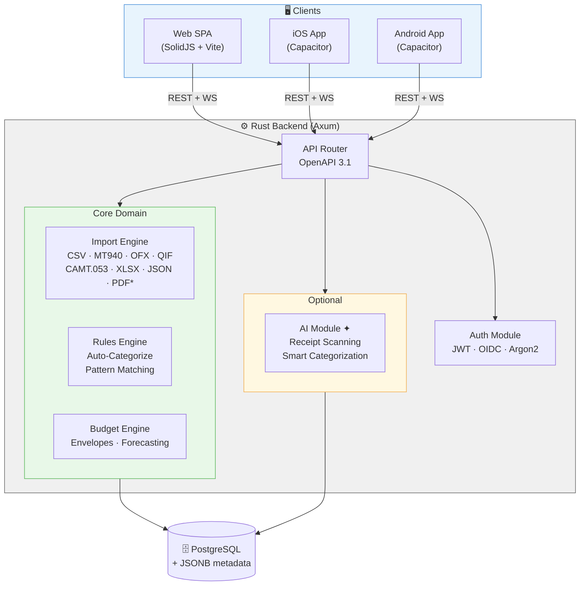

> **✦ AI-optional** — The AI module is disabled by default. The core app is fully functional without it.

### Request Flow

```
Client → HTTPS → API Router → Auth middleware (JWT verify)
                                    ↓
                              Route handler
                                    ↓
                          Domain module (import / budget / rules)
                                    ↓
                              PostgreSQL
```

### Core Principles

| # | Principle | What it means |
|:-:|-----------|---------------|
| 1 | **Import-first** | All data entry starts with bulk import; manual entry is a fallback, not the norm. |
| 2 | **Flexible taxonomy** | Categories, tags, and accounts are created on-the-fly during import — never block on missing metadata. |
| 3 | **Edit-friendly history** | Every transaction is editable post-import; an audit log tracks all changes. |
| 4 | **Automation over manual** | Auto-categorization rules, pattern matching, and AI enrichment reduce repetitive work. |
| 5 | **AI-optional** | Core app works without AI; receipt scanning and smart categorization are toggleable in settings. |
| 6 | **Multilingual** | Full i18n from day one; all strings externalized; locale-aware dates, numbers, and currencies. |
| 7 | **Documented-first** | Every feature ships with API docs, user guide, architecture decision record, and inline code docs. |


---

## 2. Tech Stack

| Layer | Choice |
|-------|--------|
| Language | **Rust** |
| HTTP framework | **Axum** |
| Database | **PostgreSQL** |
| ORM / Query | **SQLx** |
| Migrations | **SQLx migrate** |
| Auth | **argon2** (password) + **jsonwebtoken** (JWT) + **openidconnect** (OIDC) |
| Frontend | **SolidJS** + **TypeScript** |
| UI Components | **Kobalte** (headless) + **Tailwind CSS** |
| Charts | **Apache ECharts** (modular import, lazy-loaded) |
| Icons | **Lucide** (lucide-solid) |
| Typography | **Inter** + **JetBrains Mono** |
| Data table | **@tanstack/solid-table** + **@tanstack/solid-virtual** |
| Forms | **@modular-forms/solid** |
| Mobile | **Capacitor** |
| Build | **Vite** (frontend), **cargo** (backend) |
| Container | **Docker** (multi-stage) |
| File parsing | **csv**, **serde_json** crates; custom MT940 parser (see BACKEND_PLAN §9.3) |
| OFX/QFX parsing | **quick-xml** + custom OFX/SGML normalizer |
| CAMT.053 parsing | **quick-xml** |
| QIF parsing | Custom line-based parser |
| XLSX parsing | **calamine** crate |
| PDF parsing | **pdf-extract** crate or external service (optional) |
| Currency rates | **Open Exchange Rates** / **ECB feed** |
| i18n (backend) | **rust-i18n** or **fluent-rs** (Project Fluent) |
| i18n (frontend) | **@solid-primitives/i18n** + **ICU MessageFormat** |
| Locale formatting | **ICU4X** (Rust) / **Intl API** (browser) |
| Docs engine | **mdBook** (Rust) + **Storybook** (components) |
| API docs | **utoipa** (OpenAPI 3.1) + **Scalar** or **Swagger UI** |


---

## 3. Data Model

### 3.1 Core Entities

#### Entity Relationship Overview

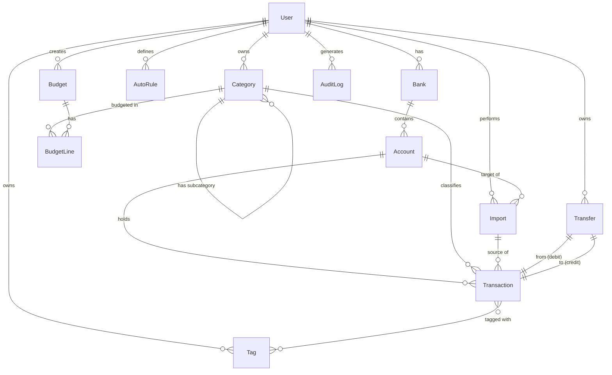

#### Entity Details

Below are the detailed schemas grouped by domain. Fields marked `FK` reference other entities; `JSONB` columns hold extensible metadata.

##### Identity & Auth

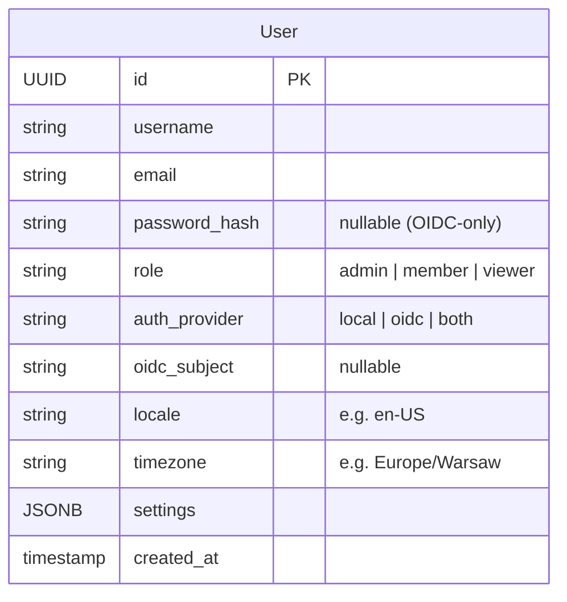

##### Banking Structure

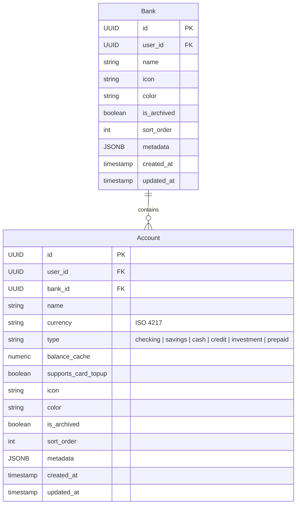

##### Transactions & Transfers

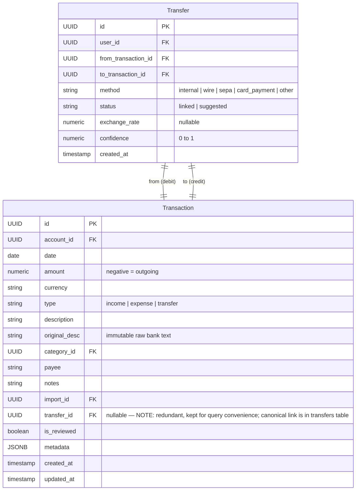

##### Taxonomy & Rules

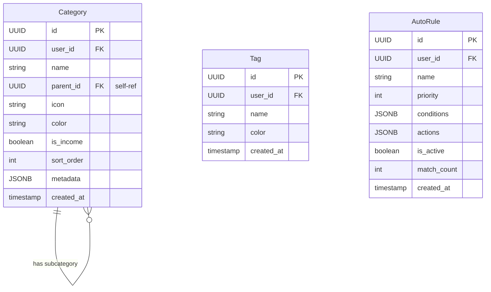

##### Budgeting

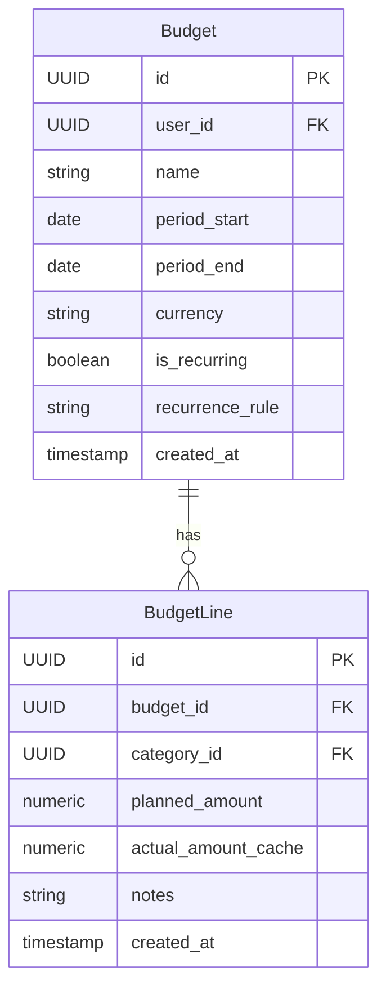

##### Import & Audit

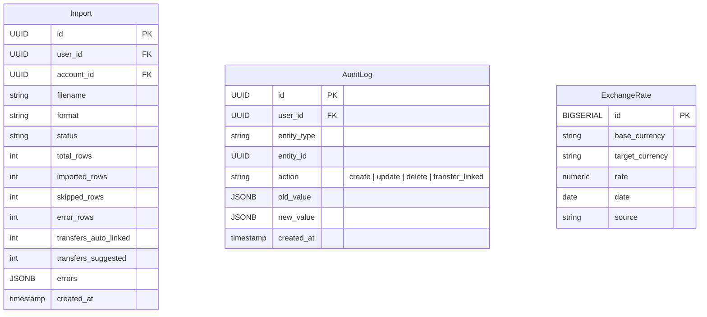

### 3.2 Key Design Decisions

- **Bank → Account hierarchy**: Banks are the top-level grouping entity. Each user defines their banks (Revolut, Lunar, Zen, etc.), and each bank contains one or more accounts. Default grouping in the UI is by bank. Accounts have a unique (bank_id, name) constraint.
- **Transfer as a first-class entity**: Internal transfers between the user's own accounts are modelled as a `Transfer` record linking two `Transaction` rows (one debit, one credit). This avoids double-counting in income/expense reports. The `Transfer.method` field distinguishes wire, SEPA, card payment top-ups, and internal moves.
- **`supports_card_topup` on Account**: Marks accounts that can receive card payment top-ups from other accounts (e.g., Zen debit card). Used as a hint for transfer detection — when a card payment matches an incoming transaction on a `supports_card_topup` account, the system suggests `card_payment` as the transfer method. Card top-up is a transfer method, not an account type.
- **Transfer detection during import**: The import pipeline scans newly imported transactions against existing ones across the user's other accounts, matching by amount (with tolerance), date (with tolerance), and direction (debit ↔ credit). High-confidence matches can be auto-linked; others are surfaced as suggestions.
- **`original_desc` on Transaction**: Preserve the raw bank description separately from user-edited `description`. Enables re-running auto-rules without losing source data.
- **`metadata` (JSONB) columns**: Extensible fields without schema migrations. AI module and future features store data here.
- **`is_reviewed` flag**: Imported transactions start as unreviewed. Users can bulk-review or edit individually. Dashboard highlights unreviewed count.
- **`AutoRule` with JSONB conditions/actions**: Rules like "if description contains 'SPOTIFY' → set category to 'Subscriptions', add tag 'entertainment'". No rigid schema — conditions are evaluated by a rule engine.
- **Hierarchical categories** via `parent_id`: Supports "Food > Groceries", "Food > Restaurants" without artificial limits.
- **Soft-create taxonomy**: Import pipeline creates missing categories/tags/accounts inline and flags them for user review (not rejection).
- **Dual auth model (local + OIDC)**: Users have an `auth_provider` field (`local`, `oidc`, or `both`). OIDC users are identified by `oidc_subject` (the OIDC `sub` claim), which is unique. `password_hash` is nullable — OIDC-only users have no local password. Users who sign up locally and later sign in via OIDC (matched by email) become `both` and can use either method. This avoids forced migration while keeping OIDC as a first-class auth path.


---

## 4. Security Architecture

> **Philosophy:** Financial data is among the most sensitive personal data. Security is not a final-phase afterthought — it is embedded in every phase from day one. The app should be secure by default, even for non-technical self-hosters.

### 4.1 Threat Model

#### External Threats

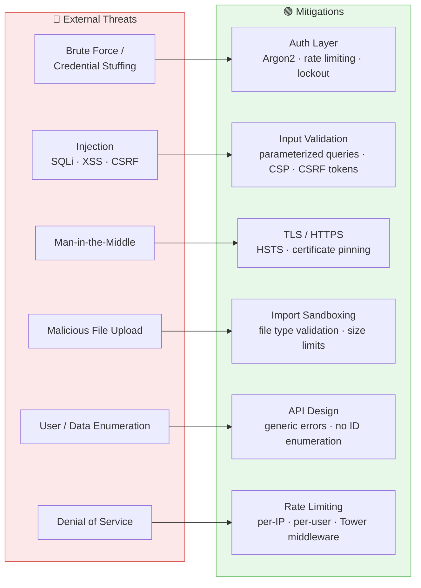

#### Internal / Insider Threats

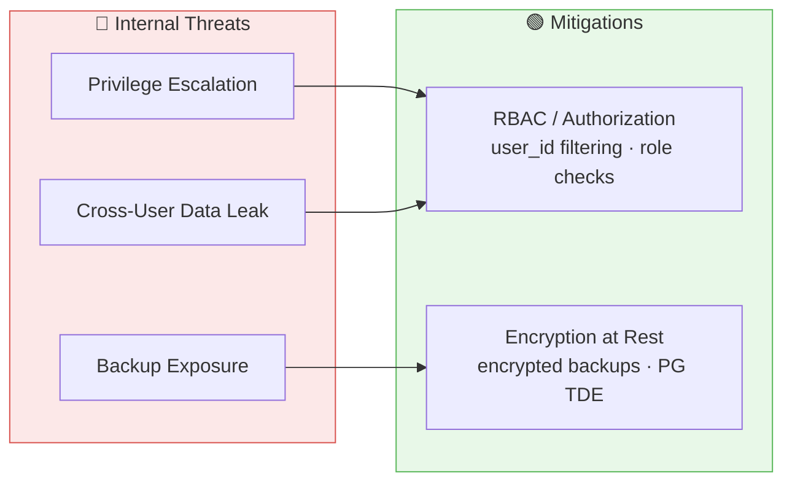

#### Infrastructure Threats

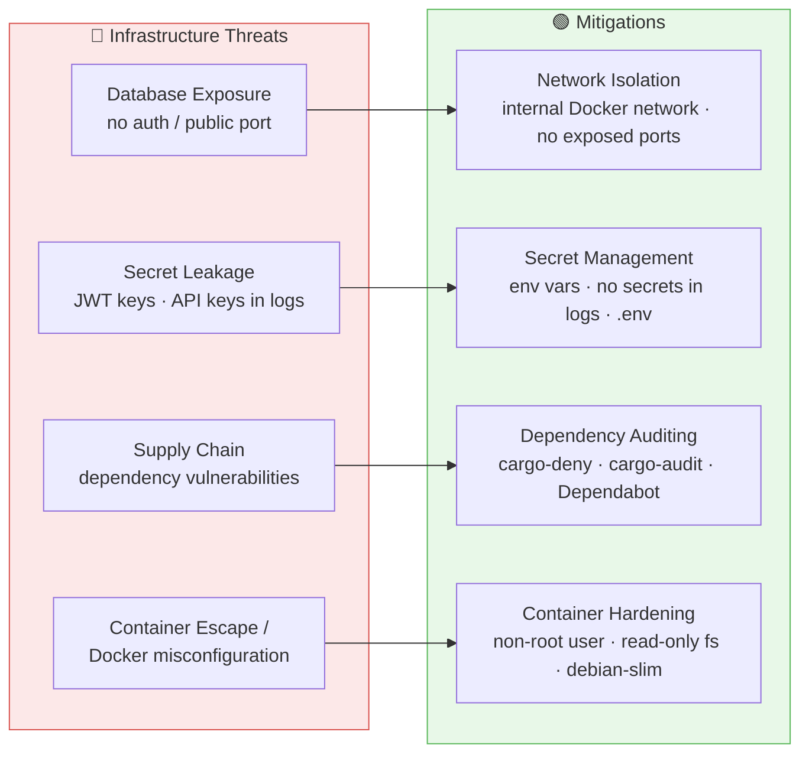

### 4.2 Security Measures by Layer

#### Authentication & Session Management

| Measure | Details | Phase |
|---------|---------|-------|
| **Password hashing** | Argon2id with recommended parameters (19 MiB memory, 2 iterations, 1 parallelism). Never store plaintext. | P1 |
| **JWT access tokens** | Short-lived (15 min), stored in memory only (never localStorage). Contains `user_id`, `role`, `iat`, `exp`. | P1 |
| **JWT refresh tokens** | Longer-lived (7 days), stored in `HttpOnly; Secure; SameSite=Strict` cookie. Server-side revocable via allowlist in DB. | P1 |
| **Token rotation** | Refresh token is single-use — each refresh returns a new refresh token. Old tokens are invalidated (rotation detection). | P1 |
| **Brute force protection** | Rate limit login: 5 attempts per IP per 15 min. Progressive lockout after failures. Account lockout after 20 failed attempts (admin unlock). | P1 |
| **Password policy** | Minimum 10 characters. Check against HaveIBeenPwned breached password list (k-anonymity API, privacy-safe). No maximum length (up to 128). | P1 |
| **Session management** | List active sessions (`GET /api/auth/sessions`). Revoke individual sessions. "Log out everywhere" button. | P2 |
| **Biometric auth (mobile)** | Capacitor Biometric plugin. Stores auth token in iOS Keychain / Android Keystore, not in SharedPreferences. | P6 |
| **OIDC / SSO** | Optional OIDC support via Authorization Code Flow with PKCE. Compatible with Authentik, Keycloak, Authelia, and any standard OIDC provider. OIDC users are auto-provisioned on first login and linked to local accounts by email. Core local auth remains standalone and always available. | P1 |

#### Authorization & Access Control

| Measure | Details | Phase |
|---------|---------|-------|
| **Row-level security** | Every DB query filters by `user_id` (or `household_id` for shared data). No global queries except admin endpoints. | P1 |
| **Role-Based Access Control** | Roles: `admin`, `member`, `viewer`. Enforced at middleware level, not in business logic. `viewer` = read-only access to shared household data. | P7 |
| **Resource ownership checks** | Every `PUT`/`DELETE` verifies the authenticated user owns the resource. 404 (not 403) for resources belonging to other users (prevents enumeration). | P1 |
| **Admin-only endpoints** | Backup/restore, user management — require `admin` role. | P7 |
| **Household data isolation** | Multi-user households share *explicitly shared* accounts only. Unshared data is invisible to other members. | P7 |

#### Input Validation & Injection Prevention

| Measure | Details | Phase |
|---------|---------|-------|
| **Parameterized queries** | SQLx compile-time checked queries — no string concatenation in SQL. | P1 |
| **Input validation** | All API inputs validated with `validator` crate (lengths, formats, ranges). Reject unknown fields. | P1 |
| **Type-safe deserialization** | Serde with `#[serde(deny_unknown_fields)]` on request types. Strong typing prevents type confusion. | P1 |
| **Output encoding** | All JSON responses are auto-escaped via Serde. No raw HTML rendering from user data. | P1 |
| **File upload validation** | Import engine: validate MIME type, max file size (50 MB default, configurable), filename sanitization, no path traversal. | P3 |
| **Import sandboxing** | Parsing runs in a separate tokio task with memory/time limits. Malformed files cannot crash the server. | P3 |
| **XSS prevention** | SolidJS auto-escapes rendered content. No `innerHTML` usage. CSP header blocks inline scripts. | P2 |
| **JSONB validation** | Metadata JSONB fields have max depth (5) and max size (64 KB) limits. | P1 |

#### Transport Security

| Measure | Details | Phase |
|---------|---------|-------|
| **TLS termination** | App expects TLS via reverse proxy (Nginx/Caddy/Traefik). Docs provide example configs with Let's Encrypt. | P7 |
| **HSTS header** | `Strict-Transport-Security: max-age=31536000; includeSubDomains` when served behind TLS. | P7 |
| **Secure cookies** | All cookies: `HttpOnly; Secure; SameSite=Strict; Path=/api`. | P1 |
| **CORS policy** | Strict allowlist of origins. Default: same-origin only. Configurable via `ALLOWED_ORIGINS` env var. | P1 |
| **WebSocket auth** | WS connections require valid JWT in initial handshake. Connections closed on token expiry. | P7 |

#### HTTP Security Headers

```
Content-Security-Policy: default-src 'self'; script-src 'self'; style-src 'self' 'unsafe-inline'; img-src 'self' data: blob:; connect-src 'self'; font-src 'self'; frame-ancestors 'none'; base-uri 'self'; form-action 'self'
X-Content-Type-Options: nosniff
X-Frame-Options: DENY
Referrer-Policy: strict-origin-when-cross-origin
Permissions-Policy: camera=(self), microphone=(), geolocation=(), payment=()
X-XSS-Protection: 0
Cross-Origin-Opener-Policy: same-origin
Cross-Origin-Resource-Policy: same-origin
```

#### CSRF Protection

| Measure | Details | Phase |
|---------|---------|-------|
| **SameSite cookies** | `SameSite=Strict` on refresh token cookie prevents cross-site requests from including credentials. | P1 |
| **Custom request header** | All API requests must include `X-Requested-With: RustVault` header. Simple CORS requests cannot forge this. | P1 |
| **No cookie-only auth** | Access tokens in `Authorization` header (not cookies) for API requests — inherently CSRF-resistant. | P1 |

#### Rate Limiting & DoS Protection

| Measure | Details | Phase |
|---------|---------|-------|
| **Global rate limit** | 100 requests/min per IP (configurable via `RATE_LIMIT_PER_MIN` env var). | P7 |
| **Auth rate limit** | Login/register: 5 requests/IP/15 min. Password reset: 3/IP/hour. | P1 |
| **Import rate limit** | 50 imports/user/hour. Max file size enforced at Axum body limit. | P3 |
| **Report rate limit** | Heavy aggregation endpoints: 20 requests/user/min. | P5 |
| **Body size limits** | Default 10 MB for API requests, 50 MB for file uploads. Configurable. | P1 |
| **Slowloris protection** | Axum/Hyper timeout configuration: 30s request timeout, 10s header read timeout. | P0 |
| **Connection limits** | Max concurrent connections per IP configurable via tower middleware. | P7 |

#### Secrets & Configuration Management

| Measure | Details | Phase |
|---------|---------|-------|
| **Environment variables** | All secrets via env vars. Never in config files, never committed. | P0 |
| **JWT signing key** | Min 256-bit key. Generated on first run if not provided. `JWT_SECRET` env var. | P1 |
| **Database credentials** | Via `DATABASE_*` env vars (`DATABASE_HOST`, `DATABASE_PORT`, `DATABASE_USER`, `DATABASE_PASSWORD`, `DATABASE_NAME`), mapped to standard PostgreSQL `PG*` env vars internally. | P0 |
| **Secret rotation** | JWT key rotation: support multiple valid keys (`JWT_SECRET` + `JWT_SECRET_OLD`) for zero-downtime rotation. | P7 |
| **No secrets in logs** | Middleware strips `Authorization` headers, passwords, tokens from log output. Structured logging with field filtering. | P1 |
| **AI module secrets** | AI module config may contain API keys (e.g., AI service). Stored encrypted in DB using app-level encryption key. Accessible only when AI features are enabled. | P7 |

#### Data Protection

| Measure | Details | Phase |
|---------|---------|-------|
| **Encryption at rest** | Recommend PostgreSQL with TDE or volume encryption in Docker guide. App-level encryption for sensitive AI module configs. | P7 |
| **Backup encryption** | Database dumps via backup endpoint are encrypted with a user-provided key before download. | P7 |
| **Data export** | Exports include only the requesting user's data. Admin export includes household data only. | P7 |
| **Data deletion** | "Delete my account" removes all user data permanently (hard delete). Audit logs anonymized after 90 days (configurable). | P7 |
| **Sensitive field handling** | `password_hash` never appears in API responses. User serialization explicitly excludes sensitive fields (`#[serde(skip)]`). | P1 |
| **Audit trail** | All data mutations logged in `audit_log` with actor, timestamp, old/new values. Immutable — no update/delete on audit_log. | P1 |

#### Container & Infrastructure Security

| Measure | Details | Phase |
|---------|---------|-------|
| **Non-root container** | Dockerfile uses non-root user (`USER rustvault:rustvault`, UID 1000). | P0 |
| **Minimal base image** | `debian:bookworm-slim` — ~28 MB, glibc, shell available for debugging. | P0 |
| **Read-only filesystem** | Container runs with `--read-only` flag. Only `/tmp` and data volume are writable. | P0 |
| **No capabilities** | Docker Compose: `cap_drop: [ALL]`. No privileged mode. | P0 |
| **Internal network** | PostgreSQL not exposed to host by default. Only app container connects to DB via internal Docker network. | P0 |
| **Health check** | `GET /api/health` (no auth required) for container orchestration. Does not leak version or internal info. | P1 |
| **Dependency scanning** | `cargo audit` in CI for known Rust vulnerabilities. `bun pm audit` for frontend. Dependabot/Renovate for auto-updates. | P0 |
| **Image scanning** | Trivy or Grype scan on Docker image in CI. Block publish on critical CVEs. | P7 |

#### File Upload Security (Import Pipeline)

| Measure | Details | Phase |
|---------|---------|-------|
| **File type validation** | Validate by content (magic bytes), not just extension. Allowlist: CSV, MT940, OFX, QFX, QIF, CAMT.053 (XML), XLSX, XLS, ODS, JSON, PDF. | P3 |
| **Filename sanitization** | Strip path components, special characters. Generate unique internal filename (UUID). | P3 |
| **Size limits** | Configurable per file type. Default: 50 MB for bank statements, 25 MB for receipts. | P3 |
| **Temporary storage** | Uploaded files stored in temp directory, deleted after import completes. Never served back to users. | P3 |
| **No server-side execution** | Files are strictly parsed, never executed. PDF processing uses sandboxed rendering. | P3 |
| **Zip/archive prevention** | Reject compressed archives to prevent zip bombs. Only flat files accepted. | P3 |

#### Logging & Monitoring

| Measure | Details | Phase |
|---------|---------|-------|
| **Structured logging** | `tracing` crate with JSON output. Fields: timestamp, request_id, user_id, method, path, status, duration. | P0 |
| **Security event logging** | Failed logins, token refresh failures, permission denials, rate limit hits — logged at WARN level with IP. | P1 |
| **No sensitive data in logs** | Middleware scrubs passwords, tokens, financial amounts from log output. | P1 |
| **Request ID tracing** | Every request gets a UUID, propagated through all log entries and returned in `X-Request-Id` response header. | P1 |
| **Audit log** | Business-level audit trail in DB (who changed what, when). Separate from operational logs. | P1 |
| **Alerting hooks** | Optional: webhook notification on security events (configurable in settings). | P7 |

### 4.3 Security Checklist per Phase

This checklist tracks which security measures are implemented in which phase:

| Phase | Security Tasks |
|-------|----------------|
| **P0** | Non-root Docker, minimal base image, read-only FS, internal network, `cargo audit` in CI, structured logging, env-based secrets |
| **P1** | Argon2id passwords, JWT with short-lived access + rotatable refresh, CORS, SameSite cookies, input validation, CSRF headers, row-level security, `password_hash` exclusion, audit log, health check, security event logging |
| **P2** | XSS prevention (auto-escape + CSP), no localStorage tokens, session management UI, secure API client |
| **P3** | File upload validation (type/size/name), import sandboxing, import rate limit, zip bomb prevention, temp file cleanup |
| **P5** | Report endpoint rate limiting |
| **P6** | Biometric auth via Keychain/Keystore, certificate pinning (optional), no sensitive data in app cache |
| **P7** | HSTS, full header hardening, global rate limit, RBAC enforcement, backup encryption, data deletion, secret rotation, image scanning, alerting |

### 4.4 Security Documentation

- [x] `docs/security/SECURITY.md` — Vulnerability disclosure policy (90-day coordinated disclosure, PGP key for encrypted reports).
- [x] `docs/security/threat-model.md` — Full threat model document (STRIDE methodology).
- [x] `docs/security/hardening-guide.md` — Production hardening checklist for self-hosters (TLS, firewall, DB auth, backups).
- [x] `docs/security/auth-architecture.md` — Detailed auth flow diagrams (login, refresh, revocation).
- [x] `docs/adr/0008-auth-jwt-design.md` — ADR on JWT strategy (why not session cookies, rotation design).


---

## 5. Frontend Performance Strategy

> **Goal:** The app must feel instant. Every interaction should respond in < 100ms, pages should load in < 1s, and large datasets (10k+ transactions) should scroll smoothly at 60fps.

### 5.1 Why SolidJS Is the Foundation

SolidJS was chosen specifically for performance. Unlike React's virtual DOM diffing, Solid compiles templates to direct DOM operations with fine-grained reactivity. This means:
- **No re-renders** — only the specific DOM node bound to a changed signal updates.
- **No virtual DOM overhead** — smaller memory footprint, faster updates.
- **Smaller bundle** — SolidJS core is ~7 KB gzipped (vs. React ~40 KB + ReactDOM).
- **Compiler-optimized** — Vite + SolidJS compiler produces minimal, tree-shaken output.

### 5.2 Performance Budget

| Metric | Target | Tool |
|--------|--------|------|
| **First Contentful Paint (FCP)** | < 1.0s | Lighthouse |
| **Largest Contentful Paint (LCP)** | < 1.5s | Lighthouse |
| **Time to Interactive (TTI)** | < 2.0s | Lighthouse |
| **Cumulative Layout Shift (CLS)** | < 0.05 | Lighthouse |
| **Interaction to Next Paint (INP)** | < 100ms | Web Vitals |
| **Total JS bundle (initial)** | < 150 KB gzipped | Vite build analyzer |
| **Per-route chunk** | < 30 KB gzipped | Vite build analyzer |
| **API response (p95)** | < 200ms | Backend metrics |
| **Transaction list scroll** | 60fps with 10k rows | Chrome DevTools |
| **Dashboard load** | < 2s with 1 year of data | E2E test |

### 5.3 Architecture Techniques

| Category | Techniques |
|----------|-----------|
| 🚀 **Fast Initial Load** | Code splitting (per route) · Preload critical route chunks · Inline critical CSS · Static shell (app skeleton) |
| 🎨 **Smooth Rendering** | Virtualized lists (@tanstack/virtual) · Fine-grained signals · Memoized computations · Batched DOM updates |
| 📡 **Smart Data Fetching** | Optimistic updates · Client-side cache · Route prefetching · Partial / incremental loading |
| 📦 **Asset Optimization** | Tree shaking · Brotli compression · Image optimization · Font subsetting |

### 5.4 Detailed Performance Measures

#### Code Splitting & Bundle Optimization

| Measure | Details | Phase |
|---------|---------|-------|
| **Route-based code splitting** | Every page is a lazy-loaded chunk via `lazy(() => import('./pages/...'))`. Only the current route's code is downloaded. | P2 |
| **Vendor chunk separation** | Split `node_modules` into a separate, long-cached vendor chunk. ECharts loaded only on dashboard/report routes. | P2 |
| **Tree shaking** | Vite's Rollup-based build eliminates dead code. Verify with `rollup-plugin-visualizer`. | P2 |
| **Dynamic imports for heavy libs** | ECharts, date-fns locale data, Kobalte components — loaded on demand, not in initial bundle. | P2 |
| **Bundle budget CI check** | CI step fails build if initial JS > 150 KB gzipped or any route chunk > 30 KB. Uses `bundlesize` or Vite plugin. | P0 |
| **Tailwind CSS purge** | Tailwind JIT mode + content configuration ensures only used classes ship. Typical CSS < 15 KB gzipped. | P0 |
| **Font optimization** | Self-host Inter (or chosen font). Subset to Latin Extended glyphs. Use `font-display: swap`. Preload WOFF2. | P2 |

#### Rendering Performance

| Measure | Details | Phase |
|---------|---------|-------|
| **Virtualized transaction list** | Use `@tanstack/solid-virtual` for the transaction list. Only renders visible rows + small overscan buffer. Handles 100k+ rows smoothly. | P3D |
| **Virtualized category tree** | Large category hierarchies use virtual tree rendering. | P2 |
| **Fine-grained signals** | Never store large objects in a single signal. Decompose into granular signals (e.g., per-row reactive state, not one big array signal). | P2 |
| **`createMemo` for derived data** | Filtered/sorted transaction lists, budget summaries — computed once per input change, not on every render. | P3D |
| **`batch()` for multi-update** | When import completes and updates multiple signals, wrap in `batch()` to produce a single DOM update. | P3D |
| **Skeleton screens** | Every page shows a content-shaped skeleton (not spinner) while data loads. Eliminates layout shift. | P2 |
| **CSS containment** | Apply `contain: content` to list items and chart containers. Limits browser layout/paint scope. | P2 |
| **`will-change` for animations** | Apply `will-change: transform` to elements with slide/fade transitions. Promotes to GPU layer. | P2 |
| **No layout thrashing** | Batch all DOM reads before DOM writes. Use `requestAnimationFrame` for measurements. | All |

#### Data Fetching & Caching

| Measure | Details | Phase |
|---------|---------|-------|
| **SolidJS resources with cache** | `createResource` with `initialValue` from cache. Show stale data immediately, refresh in background (stale-while-revalidate). | P2 |
| **Optimistic updates** | CRUD operations update UI immediately, roll back on API error. User never waits for server round-trip for basic actions. | P2 |
| **Route prefetching** | On hover/focus of nav links, prefetch the target route's JS chunk and API data. By the time user clicks, data is ready. | P2 |
| **Pagination over full loads** | Transaction list: cursor-based pagination (50 items/page). Never load all transactions at once. | P3D |
| **Infinite scroll** | Transaction list fetches next page as user scrolls near bottom (`IntersectionObserver`), with virtualization. | P3D |
| **Debounced search** | Search input debounces at 300ms. No API call per keystroke. Show loading indicator after 150ms. | P3D |
| **Parallel API calls** | Dashboard loads summary, recent transactions, and budget status in parallel (`Promise.all`), not sequentially. | P5 |
| **API response shaping** | Backend returns only needed fields (no over-fetching). List endpoints return lean DTOs. Detail endpoint returns full object. | P1 |
| **ETag / conditional requests** | Dashboard data endpoints return `ETag`. Frontend sends `If-None-Match` — 304 response skips body transfer. | P7 |
| **WebSocket for live updates** | Instead of polling, WebSocket pushes dashboard invalidation events. Frontend re-fetches only changed data. | P7 |

#### Chart Performance

| Measure | Details | Phase |
|---------|---------|-------|
| **Lazy-load ECharts** | ECharts loaded only on dashboard and report pages. Use `import('echarts/core')` + register only needed chart types (bar, line, pie — not the full 500 KB bundle). | P5 |
| **ECharts modular import** | Import individual components: `BarChart`, `LineChart`, `PieChart`, `TooltipComponent`, `GridComponent`. Saves ~300 KB vs. full import. | P5 |
| **Canvas renderer** | Use ECharts Canvas renderer (default) for performance. SVG renderer only if accessibility is needed for specific charts. | P5 |
| **Data downsampling** | For time series > 1000 points, downsample server-side (LTTB algorithm) before sending to frontend. | P5 |
| **Responsive resize** | Charts resize on `ResizeObserver`, debounced at 100ms. No jank on window resize. | P5 |
| **Chart animations** | Enable entry animations (smooth feel), but disable animation on data update (snappy refresh). | P5 |
| **Deferred chart rendering** | On dashboard, render above-the-fold charts first. Below-fold charts render when scrolled into view (`IntersectionObserver`). | P5 |

#### Perceived Performance

| Measure | Details | Phase |
|---------|---------|-------|
| **Skeleton screens** | Every data-loading state shows a skeleton matching the final layout shape. No empty white screens, no spinners for initial loads. | P2 |
| **Instant navigation** | Route transitions are instant (code is prefetched). Data loading shows skeleton within the new page. | P2 |
| **Optimistic feedback** | Button clicks show immediate state change (save button → checkmark). Form submits close the dialog immediately. | P2 |
| **Progress indicators** | File upload: real progress bar (not indeterminate). Large imports: percentage + row count. | P3D |
| **Toast notifications** | Non-blocking success/error notifications. Don't force user to dismiss before continuing. | P2 |
| **Transition animations** | Subtle 150ms transitions on page/panel changes. `CSS transition` only, no JS animation libraries. | P2 |
| **Loading priority** | Critical content (numbers, balances) loads first. Secondary content (charts, history) loads after. | P5 |

#### Mobile Performance (Capacitor)

| Measure | Details | Phase |
|---------|---------|-------|
| **Touch responsiveness** | All tap targets ≥ 44px. No 300ms tap delay (`touch-action: manipulation`). | P7 |
| **Reduced motion** | Respect `prefers-reduced-motion` — disable transitions for accessibility. | P2 |
| **Image optimization** | Icons as SVG inline (no network requests). User-uploaded receipt images: compressed, lazy-loaded with blur-up placeholder. | P7 |
| **Offline shell** | Cache app shell (HTML, CSS, JS) locally. On launch, show cached shell immediately, fetch data in background. | P7 |
| **Low-end device testing** | Performance tested on 4× CPU slowdown in Chrome DevTools. Target: 60fps scroll on mid-range Android. | P7 |

### 5.5 Performance Testing & Monitoring

| Tool | Purpose | When |
|------|---------|------|
| **Lighthouse CI** | Automated performance scoring on every PR. Fail if score < 90. | CI |
| **`bundlesize`** | Enforce JS/CSS bundle size budgets. Fail CI on budget breach. | CI |
| **`rollup-plugin-visualizer`** | Visual treemap of bundle contents. Run on demand to find bloat. | Dev |
| **Chrome DevTools Performance** | Profile render performance, identify jank, trace long tasks. | Dev |
| **`web-vitals` library** | Collect FCP, LCP, CLS, INP, TTFB in production. Log to console in dev, optional analytics in prod. | P2 |
| **SolidJS DevTools** | Signal tracking, component tree inspection, reactivity graph. | Dev |
| **Network throttling tests** | Test on Slow 3G / Fast 3G profiles. App must be usable on slow connections. | P7 |
| **Memory profiling** | Monitor heap size after navigating through all pages. No memory leaks from unmounted components. | P7 |

### 5.6 Performance Checklist per Phase

| Phase | Performance Tasks |
|-------|-------------------|
| **P0** | Vite config: code splitting, Tailwind JIT purge, bundle budget CI check, font optimization setup |
| **P2** | Route-based lazy loading, skeleton screens, optimistic updates, prefetch on hover, fine-grained signals, CSS containment, `web-vitals` integration, vendor chunk splitting |
| **P3D** | Virtualized transaction list (`@tanstack/solid-virtual`), cursor-based pagination, infinite scroll, debounced search (300ms), batch signal updates on import, progress bars |
| **P5** | Modular ECharts import (lazy), canvas renderer, data downsampling (LTTB), deferred below-fold charts, parallel API calls, responsive chart resize |
| **P6** | Capacitor setup, bottom nav, pull-to-refresh, swipe actions, camera FAB |
| **P7** | ETag/conditional requests, Lighthouse CI gate, network throttle testing, memory leak profiling, Brotli compression, global performance audit |


---

## 6. Internationalization (i18n) Architecture

### 6.1 Design Principles

- **No hardcoded strings**: Every user-facing string (backend errors, UI labels, email templates) is externalized into locale files.
- **Locale-aware formatting**: Dates, numbers, currencies, and plurals adapt to the user's locale automatically.
- **Fallback chain**: `user-preferred locale → browser locale → instance default → en-US`.
- **Lazy loading**: Only the active locale's translations are loaded; others are fetched on demand.

### 6.2 Architecture

| Layer | Strings / Messages | Formatting (dates, numbers, currency) |
|-------|-------------------|---------------------------------------|
| **Rust Backend** | Fluent / rust-i18n (`.ftl` locale files) → localized API error messages | ICU4X (with CLDR data) |
| **SolidJS Frontend** | ICU MessageFormat (`.json` locale files) → `I18nProvider` context | Browser `Intl` API (with CLDR data) |

Locale resolution: `Accept-Language` header → `user.locale` preference → fallback to `en-US`.

### 6.3 File Structure

```
locales/
├── en-US/
│   ├── common.ftl          # Shared terms (Save, Cancel, Delete…)
│   ├── auth.ftl             # Login, register, password
│   ├── transactions.ftl     # Transaction-related strings
│   ├── import.ftl           # Import pipeline strings
│   ├── budget.ftl           # Budgeting strings
│   ├── reports.ftl          # Visualization & reports
│   ├── settings.ftl         # Settings page
│   ├── ai.ftl               # AI features strings
│   └── errors.ftl           # API error messages
├── {locale}/                # Community-contributed locales (e.g. de-DE, fr-FR)
│   └── ... (same structure)
└── _meta.toml               # Supported locales, completeness %

web/src/locales/
├── en-US/
│   ├── common.json
│   ├── auth.json
│   ├── transactions.json
│   ├── import.json
│   ├── budget.json
│   ├── reports.json
│   ├── settings.json
│   └── ai.json
├── {locale}/               # Community-contributed locales
│   └── ...
└── index.ts                 # Locale registry, lazy loader
```

### 6.4 Key Implementation Details

| Aspect | Approach |
|--------|----------|
| **String keys** | Namespaced dot notation: `transactions.import.preview_title` |
| **Plurals** | ICU plural rules: `{count, plural, one {# transaction} other {# transactions}}` |
| **Currency** | `Intl.NumberFormat` (frontend) / ICU4X (backend) with currency code from transaction |
| **Dates** | `Intl.DateTimeFormat` (frontend) / ICU4X (backend) respecting user's date format preference |
| **RTL support** | CSS logical properties (`margin-inline-start` not `margin-left`), `dir="auto"` |
| **Locale detection** | `Accept-Language` header → user setting → instance default |
| **Translation workflow** | English as source of truth → export to Weblate/Crowdin (optional) → import `.json`/`.ftl` |
| **Missing translation** | Fall back to `en-US`, log warning in dev mode |
| **Dynamic content** | User-created data (category names, notes) is NOT translated — only UI chrome is |
| **Backend errors** | API returns error `code` (machine-readable) + `message` (localized per `Accept-Language`) |

### 6.5 Initial Locale Support

Ship with full support for:
1. **en-US** (English, source locale)

Additional locales (e.g., pl-PL, de-DE) can be added later by dropping files into `locales/` and registering in `_meta.toml`. Community contributions welcome.


---

## 7. Documentation Strategy

> **Philosophy:** Documentation is a first-class deliverable, not an afterthought. Every feature ships with docs. Docs are versioned, searchable, and multilingual.

### 7.1 Documentation Layers

| Layer | Audience | Contents |
|-------|----------|----------|
| 📖 **User-Facing** | End users | User guide (mdBook) · Quick start guide · FAQ & troubleshooting · Import format reference · Walkthrough screencasts |
| 🛠️ **Developer** | Contributors | API reference (OpenAPI · Scalar) · Architecture decision records · Contributing guide · Inline code docs (rustdoc · TSDoc) |
| 🚀 **Operations** | Self-hosters | Self-hosting guide · Backup & recovery · Upgrade guide · Security policy |
| 🔄 **Process** | All | Changelog (keep-a-changelog) · ADR log · Translation guide |

### 7.2 Documentation Standards

| Standard | Requirement |
|----------|-------------|
| **Rust code** | Every `pub` item has a `///` doc comment with description, examples, and `# Errors` section. `#![warn(missing_docs)]` enforced. |
| **TypeScript** | Every exported function/component has TSDoc. Props interfaces are documented. |
| **API endpoints** | Every endpoint has OpenAPI schema with description, request/response examples, error codes, and auth requirements. |
| **SQL migrations** | Each migration file has a header comment explaining *why* the schema change is needed. |
| **Config options** | Every `.env` variable is documented in `.env.example` with type, default, and description. |
| **Commits** | Conventional Commits format (`feat:`, `fix:`, `docs:`, `refactor:`, etc.) for auto-changelog generation. |
| **ADRs** | Major technical decisions documented as Architecture Decision Records in `docs/adr/`. |

### 7.3 Documentation File Structure

```
docs/
├── book/                        # mdBook source (user guide)
│   ├── book.toml
│   ├── src/
│   │   ├── SUMMARY.md
│   │   ├── getting-started/
│   │   │   ├── installation.md
│   │   │   ├── first-import.md
│   │   │   ├── setting-up-accounts.md
│   │   │   └── quick-tour.md
│   │   ├── features/
│   │   │   ├── transactions.md
│   │   │   ├── import-pipeline.md
│   │   │   ├── auto-rules.md
│   │   │   ├── budgeting.md
│   │   │   ├── reports.md
│   │   │   ├── multi-currency.md
│   │   │   └── multi-user.md
│   │   ├── import-formats/
│   │   │   ├── csv.md
│   │   │   ├── mt940.md
│   │   │   ├── ofx-qfx.md
│   │   │   ├── qif.md
│   │   │   ├── camt053.md
│   │   │   ├── xlsx.md
│   │   │   ├── json.md
│   │   │   └── custom-mapping.md
│   │   ├── self-hosting/
│   │   │   ├── docker.md
│   │   │   ├── reverse-proxy.md
│   │   │   ├── backup-restore.md
│   │   │   ├── upgrading.md
│   │   │   └── environment-variables.md
│   │   └── faq.md
│   └── i18n/                    # Translated books (added later)
│       └── {locale}/
├── api/                         # Auto-generated OpenAPI
│   └── openapi.json
├── adr/                         # Architecture Decision Records
│   ├── 0001-backend.md
│   ├── 0002-frontend.md
│   ├── 0003-api.md
│   ├── 0004-data-model.md
│   ├── 0005-user-experience.md
│   ├── 0006-error-handling.md
│   ├── 0007-testing.md
│   └── template.md
├── contributing/
│   ├── CONTRIBUTING.md
│   ├── code-style.md
│   ├── testing-guide.md
│   ├── translation-guide.md
│   └── release-process.md
├── security/
│   └── SECURITY.md
└── changelog/
    └── CHANGELOG.md
```

### 7.4 Documentation Tooling

| Tool | Purpose |
|------|----------|
| **mdBook** | User guide, self-hosting guide — compiles to static HTML, easy to host alongside the app |
| **mdbook-i18n-helpers** | Multilingual mdBook support (gettext-based translation workflow) |
| **utoipa** | Auto-generate OpenAPI 3.1 spec from Rust types and handler annotations |
| **Scalar** | Beautiful, interactive API documentation UI served at `/api/docs` |
| **rustdoc** | Inline Rust code documentation, published per crate |
| **Storybook** | Interactive component catalog with usage examples |
| **cargo-readme** | Generate crate-level READMEs from doc comments |
| **git-cliff** | Auto-generate CHANGELOG from Conventional Commits |
| **vale** | Prose linter for consistent writing style across docs |
| **mdbook-linkcheck** | CI check for broken links in documentation |

### 7.5 Documentation CI Pipeline

- **On every PR:**
  - `vale` lints prose for style/grammar.
  - `mdbook-linkcheck` verifies all links.
  - `rustdoc` builds without warnings.
  - OpenAPI spec is regenerated and diffed.
- **On merge to main:**
  - mdBook builds and deploys to GitHub Pages / embedded in Docker image.
  - Storybook builds and deploys.
  - CHANGELOG auto-updates via `git-cliff`.
  - OpenAPI spec published.


---

## Phase 0 — Project Scaffolding

> **Goal:** Repository structure, CI, dev environment, Docker skeleton.

### Tasks

- [ ] **P0.1** Initialize Cargo workspace with the following crate structure:
  ```
  /
  ├── Cargo.toml              (workspace)
  ├── crates/
  │   ├── rustvault-server/    (binary — Axum HTTP server)
  │   ├── rustvault-core/      (library — domain logic, services)
  │   ├── rustvault-db/        (library — SQLx queries, migrations)
  │   ├── rustvault-import/    (library — file parsers & import engine)
  │   └── rustvault-ai/        (library — AI features, toggleable)
  ├── web/                     (SolidJS frontend)
  ├── mobile/                  (Capacitor project)
  ├── docker/
  │   ├── Dockerfile
  │   └── docker-compose.yml
  └── docs/
  ```
- [ ] **P0.2** Set up `docker-compose.yml` with PostgreSQL 18 + the app (multi-stage build).
- [ ] **P0.3** Create Dockerfile: stage 1 = Rust build (cargo-chef for caching), stage 2 = Node build (Vite), stage 3 = minimal runtime (distroless/debian-slim) serving static + binary.
- [ ] **P0.4** Initialize SolidJS project in `web/` with Vite, TypeScript, Tailwind CSS, Kobalte.
- [ ] **P0.5** Configure `rust-toolchain.toml` (stable), `clippy.toml`, `rustfmt.toml`.
- [ ] **P0.6** Add `justfile` or `Makefile` with common commands: `dev`, `build`, `test`, `migrate`, `lint`, `docker-build`.
- [ ] **P0.7** Set up GitHub Actions CI: Rust (check, clippy, test), Frontend (lint, build), Docker image build.
- [ ] **P0.8** Create `.env.example` with all config variables (DB URL, JWT secret, OIDC config, AI provider config, etc.).
- [ ] **P0.9** Set up i18n infrastructure:
  - Create `locales/en-US/` directory with initial `.ftl` files (empty placeholders for each namespace).
  - Create `web/src/locales/en-US/` directory with initial `.json` files.
  - Add `locales/_meta.toml` listing supported locales.
  - Configure `rust-i18n` or `fluent-rs` in `rustvault-core`.
  - Set up `@solid-primitives/i18n` in the SolidJS project with lazy locale loading.
- [ ] **P0.10** Set up documentation infrastructure:
  - Initialize `mdBook` in `docs/book/` with `book.toml` and `SUMMARY.md` skeleton.
  - Create `docs/adr/template.md` (ADR template).
  - Write **ADR-0001**: Backend. **ADR-0002**: Frontend. **ADR-0003**: API. **ADR-0004**: Data Model. *(ADRs 0005–0008 already exist: UX, Error Handling, Testing, Auth/JWT.)*
  - Create `docs/contributing/CONTRIBUTING.md` with initial structure.
  - Create `docs/security/SECURITY.md` with vulnerability reporting process.
  - Create `docs/changelog/CHANGELOG.md` (empty, keep-a-changelog format).
  - Add `vale` config (`.vale.ini`) and writing style rules.
  - Add `mdbook-linkcheck` to CI pipeline.
  - Add `#![warn(missing_docs)]` to all Rust crate roots.
  - Configure `rustdoc` in CI to fail on warnings.

### Documentation Deliverables (P0)
- [ ] README.md with project overview, badges, quick start.
- [ ] CONTRIBUTING.md with dev environment setup.
- [ ] ADR-0001 through ADR-0008 written.
- [ ] `docs/book/src/SUMMARY.md` with full planned chapter structure (chapters as stubs).
- [ ] `.env.example` fully annotated with descriptions.

### Acceptance Criteria
- `docker compose up` starts Postgres + app container.
- `cargo test` passes (empty tests).
- `bun dev` in `web/` serves a "Hello RustVault" page.
- CI pipeline runs green.

---

## Phase 1 — Core Backend

> **Goal:** Auth, user/account CRUD, API foundation.

### Tasks

- [ ] **P1.1** Write PostgreSQL migration 001: `users` (with `auth_provider`, `oidc_subject` columns, unique index on `oidc_subject`), `banks`, `accounts`, `categories`, `tags` tables. Account references `bank_id` FK. Add unique constraint `(bank_id, name)` on accounts.
- [ ] **P1.2** Implement user registration & login endpoints:
  - `POST /api/auth/register` — create user (argon2 password hash).
  - `POST /api/auth/login` — return JWT (access + refresh tokens).
  - `POST /api/auth/refresh` — rotate refresh token.
  - `GET /api/auth/me` — current user info.
- [ ] **P1.3** Implement JWT middleware for Axum (extract user from `Authorization` header).
- [ ] **P1.3b** Implement **OIDC / SSO support** (Authentik, Keycloak, Authelia, any OIDC provider):
  - Add `openidconnect` crate to `rustvault-core`.
  - Add OIDC configuration to `config.toml` and env vars:
    ```toml
    [auth.oidc]
    enabled = false
    display_name = ""         # Button label, e.g. "Sign in with Authentik"
    scopes = ["openid", "profile", "email"]
    auto_register = true      # Auto-create user on first OIDC login
    ```
    ```bash
    # Env vars (secrets — ALWAYS env vars, never in config.toml)
    OIDC_CLIENT_SECRET=<secret>                    # Required if OIDC enabled
    OIDC_ISSUER_URL=https://auth.example.com/...   # Required if OIDC enabled
    OIDC_CLIENT_ID=rustvault                       # Required if OIDC enabled
    ```
  - Implement OIDC discovery: fetch `.well-known/openid-configuration` on startup, cache provider metadata.
  - Implement Authorization Code Flow with PKCE:
    - `GET /api/auth/oidc/authorize` — generate `state` + `code_verifier`, store in server-side session (or signed cookie), redirect to provider's authorization endpoint.
    - `GET /api/auth/oidc/callback` — exchange `code` for tokens via provider's token endpoint, validate `id_token` (signature, issuer, audience, nonce, expiry), extract claims (`sub`, `email`, `preferred_username`, `name`).
  - Implement user provisioning on OIDC callback:
    - Look up user by `(auth_provider='oidc', oidc_subject=sub)` first.
    - If not found, look up by `email` — if local user exists with same email, link OIDC identity (set `oidc_subject`, keep `password_hash` for dual auth).
    - If not found at all and `auto_register = true`, create new user with `auth_provider='oidc'`, `password_hash=NULL`.
    - If `auto_register = false` and user not found, return 403 "User not pre-registered".
  - After successful OIDC auth, issue RustVault JWT tokens (same as local login) — the rest of the app uses the local JWT session.
  - Implement `GET /api/auth/oidc/config` (public) — returns `{ enabled, display_name, authorize_url }` for the frontend to show/hide the OIDC login button.
  - Add `auth_provider` field to `User` model (`local` | `oidc` | `both`).
  - Add `oidc_subject` (nullable, unique) field to `users` table.
  - OIDC-only users (`password_hash=NULL`) cannot use `POST /api/auth/login` — return 400 "Use SSO to sign in".
  - Users with `auth_provider='both'` can sign in via either method.
  - Write `docs/book/src/self-hosting/oidc-setup.md` — Authentik setup guide with screenshots (create provider, create application, configure redirect URI `https://<host>/api/auth/oidc/callback`).
  - Write `docs/adr/0009-oidc-design.md` — ADR for OIDC architecture decisions.
- [ ] **P1.4** Implement CRUD for **Banks**:
  - `GET /api/banks` — list user's banks with nested accounts and total balance per currency.
  - `POST /api/banks` — create bank (name, icon, color).
  - `PUT /api/banks/:id` — update.
  - `PUT /api/banks/:id/archive` — soft-archive (also archives all accounts within).
- [ ] **P1.5** Implement CRUD for **Accounts**:
  - `GET /api/accounts` — list user's accounts (filterable by bank_id, type, currency, is_archived; group_by bank/type/currency).
  - `POST /api/accounts` — create account (bank_id required, name, currency, type, supports_card_topup).
  - `PUT /api/accounts/:id` — update.
  - `PUT /api/accounts/:id/archive` — soft-archive.
- [ ] **P1.6** Implement CRUD for **Categories**:
  - `GET /api/categories` — list (hierarchical tree).
  - `POST /api/categories` — create (with optional `parent_id`).
  - `PUT /api/categories/:id` — update (rename, re-parent, change icon/color).
  - `DELETE /api/categories/:id` — merge into another category or make uncategorized.
  - `POST /api/categories/bulk` — create multiple at once (for import flow).
- [ ] **P1.7** Implement CRUD for **Tags**:
  - `GET /api/tags` — list.
  - `POST /api/tags` — create.
  - `PUT /api/tags/:id` — update.
  - `DELETE /api/tags/:id` — remove from all transactions.
  - `POST /api/tags/bulk` — create multiple.
- [ ] **P1.8** Implement **Audit Log** middleware: intercept create/update/delete on core entities, write to `audit_log` table.
- [ ] **P1.9** Add API error handling layer: consistent JSON error format, proper HTTP status codes.
- [ ] **P1.10** Implement **Settings** endpoint:
  - `GET /api/settings` — user preferences (default currency, locale, date format, AI features toggle).
  - `PUT /api/settings` — update preferences.
- [ ] **P1.11** Implement **i18n for backend**:
  - Set up Fluent bundle loading from `locales/{locale}/` files.
  - Implement `Accept-Language` header parsing middleware to resolve user locale.
  - Localize all API error messages (return `code` + localized `message`).
  - Implement `GET /api/i18n/locales` endpoint — list available locales with completeness percentage.
  - Write `locales/en-US/auth.ftl`, `common.ftl`, `errors.ftl` with all strings from P1 endpoints.
- [ ] **P1.12** Write integration tests for all endpoints (use `sqlx::test` with test database).

### Documentation Deliverables (P1)
- [ ] All `pub` items in `rustvault-core` and `rustvault-db` have `///` doc comments.
- [ ] Each migration file has a header comment explaining the schema design rationale.
- [ ] OpenAPI annotations (`utoipa`) on all P1 endpoints with request/response examples.
- [ ] Write `docs/book/src/getting-started/installation.md` — Docker setup instructions.
- [ ] Write `docs/book/src/getting-started/setting-up-accounts.md` — first account creation walkthrough.
- [ ] Write `docs/book/src/self-hosting/environment-variables.md` — all config options documented (including OIDC env vars).
- [ ] Write `docs/book/src/self-hosting/oidc-setup.md` — OIDC provider setup guide (Authentik walkthrough, generic OIDC instructions, redirect URI, scopes, troubleshooting).
- [ ] Write `docs/adr/0009-oidc-design.md` — ADR: OIDC architecture (Authorization Code + PKCE, user provisioning strategy, dual-auth, token exchange).
- [ ] Write `docs/contributing/code-style.md` — Rust and TypeScript style guide.
- [ ] Write `docs/contributing/testing-guide.md` — how to run tests, write tests, test DB setup.

### Acceptance Criteria
- A user can register, log in, and manage banks/accounts/categories/tags via API.
- A user can sign in via OIDC (when configured) and is auto-provisioned on first login.
- OIDC-only users cannot use password login; dual-auth users can use either method.
- Banks group accounts; accounts reference a bank.
- All mutations are logged in the audit log.
- Unauthorized requests return 401.
- Tests cover happy path + error cases.

---

## Phase 2 — Web UI Shell

> **Goal:** App shell with navigation, auth pages, account/category management.

### Tasks

- [ ] **P2.1** Set up SolidJS routing (`@solidjs/router`) with layout:
  - Sidebar nav (Dashboard, Transactions, Import, Budget, Reports, Settings).
  - Top bar (user menu, notifications bell for unreviewed transactions).
  - Mobile-responsive: bottom tab bar on small screens.
- [ ] **P2.2** Build authentication pages:
  - Login page.
  - Registration page.
  - **OIDC login button**: if OIDC is configured (detected via `GET /api/auth/oidc/config`), show a "Sign in with {display_name}" button below the local login form. Clicking redirects to the OIDC provider. Button is hidden if OIDC is not enabled.
  - OIDC callback handler: frontend route `/auth/oidc/callback` that receives the redirect from the OIDC provider, extracts `code` + `state` from URL params, and forwards to the backend callback endpoint. On success, stores the returned JWT and redirects to dashboard.
  - JWT token management (store in memory, refresh in background).
- [ ] **P2.3** Create API client layer:
  - Typed fetch wrapper with auto-refresh on 401.
  - SolidJS resources/store for server state.
  - Optimistic updates pattern for CRUD operations.
- [ ] **P2.4** Build **Bank & Account Management** page:
  - List banks with nested accounts, total balance per currency.
  - Create/edit bank dialog (name, icon, color).
  - Archive bank action (cascades to accounts).
  - Within each bank: list accounts with balances.
  - Create/edit account dialog (name, type, currency, icon, color, supports_card_topup).
  - Archive account action.
  - Default grouping by bank; toggle to group by account type or currency.
- [ ] **P2.5** Build **Category Management** page:
  - Tree view of hierarchical categories.
  - Drag-and-drop to re-parent.
  - Inline create (click "+" next to parent to add child).
  - Color/icon picker.
- [ ] **P2.6** Build **Tag Management** page:
  - Tag cloud / list view.
  - Inline create, edit, delete.
- [ ] **P2.7** Build **Settings** page:
  - Preferences (currency, locale, date format).
  - **Language selector**: dropdown with flag icons, switches locale in real-time without page reload.
  - AI features toggle (enable/disable AI receipt scanning and smart categorization).
  - Account section (change password, sessions).
- [ ] **P2.8** Implement dark/light theme toggle (Tailwind dark mode).
- [ ] **P2.9** Implement **frontend i18n**:
  - Wrap app root in `I18nProvider` with locale from user settings / browser detection.
  - Replace all hardcoded strings with `t('namespace.key')` calls.
  - Implement locale-aware date/time display (via `Intl.DateTimeFormat`).
  - Implement locale-aware number/currency display (via `Intl.NumberFormat`).
  - Write `web/src/locales/en-US/common.json`, `auth.json`, `settings.json` with all P2 strings.
  - Add locale switch test: verify all visible text changes when switching locale.
- [ ] **P2.10** Set up Storybook or equivalent for component development in isolation.
- [ ] **P2.11** Implement **frontend performance foundations** (see [Section 6](#6-frontend-performance-strategy)):
  - Configure Vite route-based code splitting: every page uses `lazy(() => import(...))`.
  - Set up vendor chunk separation (SolidJS runtime, Kobalte, utilities in one long-cached chunk).
  - Implement skeleton screen components (generic `Skeleton` primitive: lines, circles, rectangles, configurable).
  - Implement optimistic update pattern in API client (update store → fire request → rollback on error).
  - Implement route prefetch: on `mouseenter`/`focus` of nav links, start loading target chunk + API data.
  - Add `web-vitals` library: log FCP, LCP, CLS, INP to console in dev mode.
  - Create `<PageSkeleton>` variants for each page layout (list, detail, dashboard grid).
  - Ensure all signals are granular (no monolithic state objects); use `createMemo` for derived data.
  - Add CSS containment (`contain: content`) to list items and card components.
  - Set up `bundlesize` check in CI (initial JS < 150 KB, per-route < 30 KB).
  - Configure font subsetting and `font-display: swap` with WOFF2 preload.

### Documentation Deliverables (P2)
- [ ] Storybook deployed with all reusable components documented (props, usage examples, variants).
- [ ] Write `docs/book/src/getting-started/quick-tour.md` — UI walkthrough with screenshots.
- [ ] Write `docs/contributing/translation-guide.md` — how to add a new locale (file structure, key naming, plurals, testing).
- [ ] TSDoc comments on all exported SolidJS components and hooks.
- [ ] Write `docs/adr/0010-i18n-fluent-icu.md` — why Fluent + ICU MessageFormat.

### Acceptance Criteria
- User can log in (local or OIDC), navigate between pages, manage banks/accounts/categories/tags.
- OIDC login button is shown when OIDC is configured; hidden otherwise.
- Responsive layout works from 375px (mobile) to desktop.
- Theme toggle persists across sessions.

---

## Phase 3 — Transaction Engine & Import Pipeline

> **Goal:** The core differentiator — automated, flexible data import with on-the-fly taxonomy creation and auto-categorization.

### 3A — Transaction & Transfer Backend

- [ ] **P3A.1** Write migration 002: `transactions`, `transfers`, `imports`, `auto_rules`, `transaction_tags` (junction table) tables. Transaction has `type` (`income`/`expense`/`transfer`). Transfer links two transaction IDs with `method`, `status`, `exchange_rate`, `confidence`.
- [ ] **P3A.2** Implement Transaction CRUD:
  - `GET /api/transactions` — paginated, filterable (date range, account, bank, category, tag, type, search text, reviewed status, exclude_transfers, transfer_status), sortable. Response includes `transfer` object when linked.
  - `POST /api/transactions` — manual create (income/expense only; for transfers use `/api/transfers`).
  - `PUT /api/transactions/:id` — edit (any field, including category reassignment). Warns if part of a linked transfer.
  - `DELETE /api/transactions/:id` — soft-delete. If part of a transfer, unlinks the counterpart.
  - `PATCH /api/transactions/bulk` — bulk update (set category, add tag, mark reviewed) for selected transaction IDs.
- [ ] **P3A.3** Implement **Transfer endpoints**:
  - `POST /api/transfers` — create a transfer between two accounts. Auto-creates linked debit + credit transactions.
  - `POST /api/transfers/link` — manually link two existing transactions as a transfer pair.
  - `DELETE /api/transfers/:transfer_id` — unlink a transfer (transactions remain as standalone income/expense).
  - `POST /api/transfers/detect` — scan unlinked transactions across user's accounts for potential transfer matches. Supports date/amount tolerance, auto-link option for high-confidence matches.
- [ ] **P3A.4** Implement **transfer detection algorithm**:
  - Match debit on Account A with credit on Account B: same user, close dates (within tolerance), matching amounts (within tolerance), opposite signs.
  - Confidence scoring: exact amount + same date = 95%+, small date difference = lower confidence, amount with fee tolerance = lower confidence.
  - Detect card top-ups: when destination account has `supports_card_topup`, suggest `card_payment` method.
  - De-duplicate suggestions: one transaction can only be in one suggested pair.
- [ ] **P3A.5** Implement full-text search on transaction `description`, `original_desc`, `payee`, `notes` using PostgreSQL `tsvector`.
- [ ] **P3A.6** Implement **duplicate detection**: on import, check for transactions with same date, amount, and similar description within the same account. Flag as potential duplicates rather than silently skipping.

### 3B — Import Engine (`rustvault-import` crate)

- [ ] **P3B.1** Define `ImportParser` trait:
  ```rust
  pub trait ImportParser: Send + Sync {
      fn name(&self) -> &str;
      fn supported_extensions(&self) -> &[&str];
      fn parse(&self, reader: impl Read) -> Result<Vec<RawTransaction>, ImportError>;
  }
  
  pub struct RawTransaction {
      pub date: NaiveDate,
      pub amount: Decimal,
      pub currency: Option<String>,
      pub description: String,
      pub payee: Option<String>,
      pub reference: Option<String>,
      pub metadata: HashMap<String, Value>,
  }
  ```
- [ ] **P3B.2** Implement **CSV parser** with:
  - Auto-detect delimiter (comma, semicolon, tab).
  - Auto-detect date format via heuristic (try common formats).
  - Column mapping UI: user maps columns on first import, mapping is saved per account for reuse.
  - Handle different decimal separators (`.` vs `,`).
- [ ] **P3B.3** Implement **MT940 parser** using `mt940` crate or custom parser.
- [ ] **P3B.4** Implement **OFX/QFX parser**:
  - Normalize OFX 1.x SGML to XML before parsing (strip SGML header, close unclosed tags).
  - Parse OFX 2.x natively as XML via `quick-xml`.
  - Extract `STMTTRN` entries (date `DTPOSTED`, amount `TRNAMT`, `NAME`/`MEMO`, `FITID` for dedup).
  - Support both checking (`BANKMSGSRSV1`) and credit card (`CREDITCARDMSGSRSV1`) statement types.
- [ ] **P3B.5** Implement **QIF parser**:
  - Line-based parser for Quicken Interchange Format.
  - Handle record types: `D` (date), `T` (amount), `P` (payee), `M` (memo), `L` (category), `N` (check number).
  - Auto-detect date format (US `MM/DD/YYYY` vs EU `DD/MM/YYYY`).
- [ ] **P3B.6** Implement **CAMT.053 parser** (ISO 20022):
  - Parse XML via `quick-xml` — extract `Ntry` (entries) with `Amt`, `BookgDt`, `RmtInf` (remittance info), `Cdtr`/`Dbtr` (creditor/debtor).
  - Preserve rich metadata: IBAN, BIC, end-to-end ID, mandate reference.
  - Handle batch entries (`NtryDtls/TxDtls`) — one `Ntry` can contain multiple individual transactions.
  - Critical for EU/SEPA banks; replacement for MT940 (mandatory in many countries by 2025).
- [ ] **P3B.7** Implement **XLSX/XLS/ODS parser**:
  - Use `calamine` crate to read spreadsheet files.
  - Auto-detect header row (first row with text in most columns).
  - Column mapping UI (same as CSV) — user maps columns on first import, saved per account.
  - Handle multiple sheets: let user pick which sheet to import.
  - Handle merged cells, empty rows gracefully.
- [ ] **P3B.8** Implement **JSON parser** (flexible schema, user maps fields).
- [ ] **P3B.9** Register parsers in a `ParserRegistry` (registry pattern — easy to add more).

### 3C — Import Pipeline (orchestration)

- [ ] **P3C.1** Implement import endpoint:
  - `POST /api/import/upload` — upload file, detect format, return preview (first 10 rows parsed).
  - `POST /api/import/configure` — submit column mapping (if CSV/JSON), target account.
  - `POST /api/import/execute` — run full import with the following pipeline:
    ```
    File → Parse → Deduplicate → Auto-Categorize → Detect Transfers → Persist → Summary
    ```
  - `GET /api/imports` — list past imports.
  - `GET /api/imports/:id` — import details (stats, errors, linked transactions).
  - `DELETE /api/imports/:id` — rollback import (delete all transactions from this import).
- [ ] **P3C.2** **On-the-fly taxonomy creation** during import:
  - If a bank statement contains a field that could map to a category/tag not yet in the system, **create it automatically** and tag with `auto_created: true`.
  - Never reject an import because of missing metadata.
  - After import, show a "Review new entities" prompt listing auto-created categories/tags for user to confirm/rename/merge.
- [ ] **P3C.3** Implement **Auto-Categorization Rules Engine**:
  - Rules are user-defined (CRUD endpoints):
    - `GET /api/rules` — list.
    - `POST /api/rules` — create rule.
    - `PUT /api/rules/:id` — update.
    - `DELETE /api/rules/:id` — delete.
    - `POST /api/rules/test` — test a rule against existing transactions (preview matches).
  - Rule conditions (JSONB, evaluated in order of priority):
    - `description_contains` / `description_regex`
    - `payee_equals` / `payee_contains`
    - `amount_range` (min/max)
    - `account_id`
    - Combinable with AND/OR logic.
  - Rule actions:
    - Set `category_id`.
    - Add `tags`.
    - Set `payee` (normalize payee names).
    - Set custom `metadata` fields.
  - Rules apply automatically on import; user can also "re-run rules" on existing transactions.
- [ ] **P3C.4** Implement **"Suggest Rule"** feature: when a user manually categorizes a transaction, prompt "Create a rule for similar transactions?" pre-filling conditions from the transaction's `original_desc`.

### 3D — Import & Transaction UI

- [ ] **P3D.1** Build **Import Wizard** (multi-step dialog):
  1. **Upload**: drag-and-drop / file picker. Show format auto-detection result.
  2. **Configure**: if CSV/JSON, show column mapping UI with preview table. Save mapping per account.
  3. **Preview**: show parsed transactions with auto-categorization applied. Highlight:
     - New categories/tags to be created (yellow badge).
     - Potential duplicates (orange badge).
     - Parsing errors (red badge).
     User can fix issues inline before confirming.
  4. **Confirm**: execute import, show summary (imported, skipped, duplicates, errors).
- [ ] **P3D.2** Build **Transaction List** page:
  - **Virtualized list** using `@tanstack/solid-virtual`: only visible rows rendered, handles 100k+ transactions at 60fps.
  - Cursor-based pagination (50 items/page) with infinite scroll (`IntersectionObserver` trigger near bottom).
  - Filterable table/list (date range, account, category, tag, reviewed status, amount range, text search).
  - **Debounced search** (300ms delay, loading indicator after 150ms).
  - Inline quick-edit: click category → dropdown to change, click to add tag.
  - Bulk select → bulk categorize / tag / mark reviewed / delete.
  - "Unreviewed" filter as a primary quick-action button.
  - Skeleton rows shown while pages load.
- [ ] **P3D.3** Build **Transaction Detail** page/panel:
  - All fields editable.
  - Show `original_desc` vs. user-edited `description` diff.
  - Audit history (changes over time from audit log).
  - "Create rule from this" button.
  - Split transaction support (one bank entry → multiple category allocations). *(Future: requires `transaction_splits` table — `parent_transaction_id`, `category_id`, `amount`. Data model to be designed in a dedicated ADR.)*
  - Transfer details: linked counterpart transaction, bank/account, method badge.
- [ ] **P3D.4** Build **Transfer Management** UI:
  - Transfer suggestions panel: review detected transfer pairs, confirm or dismiss.
  - Manual link: select two transactions to link as a transfer.
  - Transfer badge on transaction list rows (shows counterpart bank/account).
  - Unlink transfer action.
  - After import: "Transfer matches found" summary with review/confirm flow.
- [ ] **P3D.5** Build **Auto-Rules Management** page:
  - List rules with priority ordering (drag to reorder).
  - Rule editor with condition builder UI (visual AND/OR groups).
  - Test rule: show matching transactions count + preview.
  - "Re-run all rules" action with preview of changes.

### Acceptance Criteria
- User can upload CSV/MT940/OFX/QIF/CAMT.053/XLSX/JSON file, map columns (where applicable), preview, and import transactions.
- Auto-categorization rules apply during import.
- Transfer detection runs during import; matches are suggested or auto-linked.
- Card top-up transfers (e.g., Revolut → Zen) are detected with correct `card_payment` method.
- Internal transfers are excluded from income/expense totals (with toggle).
- Duplicate transactions are flagged, not silently created or rejected.
- Missing categories/tags are auto-created, not import-blocking.
- Imported transactions can be edited individually or in bulk.
- Import can be rolled back entirely.
- Full-text search works across all transaction fields.
- All import wizard steps, transaction list, transfer management, and rule editor are fully localized.

### i18n Tasks (Phase 3)
- [ ] **P3.i18n.1** Write `locales/en-US/transactions.ftl` and `import.ftl` — all backend error messages, validation messages, import status strings.
- [ ] **P3.i18n.2** Write `web/src/locales/en-US/transactions.json` and `import.json` — all UI strings for transaction list, detail, import wizard, rule editor.
- [ ] **P3.i18n.3** Locale-aware transaction formatting: amounts use user's number format, dates use user's date format throughout all transaction views.
- [ ] **P3.i18n.4** Import date parsing: respect locale hints (e.g., `DD/MM/YYYY` vs `MM/DD/YYYY`) with user-overridable format in column mapping.

### Documentation Deliverables (P3)
- [ ] Write `docs/book/src/features/transactions.md` — transaction management user guide (create, edit, bulk ops, search).
- [ ] Write `docs/book/src/features/import-pipeline.md` — end-to-end import walkthrough with screenshots of each wizard step.
- [ ] Write `docs/book/src/features/auto-rules.md` — rule engine user guide (creating rules, conditions reference, testing, re-running).
- [ ] Write `docs/book/src/import-formats/csv.md` — CSV format reference (delimiters, date formats, decimal separators, column mapping).
- [ ] Write `docs/book/src/import-formats/mt940.md` — MT940 format guide.
- [ ] Write `docs/book/src/import-formats/ofx-qfx.md` — OFX/QFX format guide (OFX 1.x SGML vs 2.x XML, supported statement types).
- [ ] Write `docs/book/src/import-formats/qif.md` — QIF format reference (record types, date format handling).
- [ ] Write `docs/book/src/import-formats/camt053.md` — CAMT.053 (ISO 20022) guide (EU/SEPA standard, entry structure, batch transactions).
- [ ] Write `docs/book/src/import-formats/xlsx.md` — XLSX/XLS/ODS spreadsheet import guide (sheet selection, header detection, column mapping).
- [ ] Write `docs/book/src/import-formats/json.md` — JSON schema reference.
- [ ] Write `docs/book/src/import-formats/custom-mapping.md` — how to create and save column mappings.
- [ ] OpenAPI annotations on all P3 endpoints (imports, transactions, rules) with examples.
- [ ] Document `ImportParser` trait in rustdoc with examples for implementing a custom parser.
- [ ] Write `docs/book/src/getting-started/first-import.md` — beginner tutorial: import your first bank statement.

---

## Phase 4 — Budgeting & Forecasting

> **Goal:** Create budgets for upcoming months, compare actuals against planned amounts.

### Tasks

- [ ] **P4.1** Write migration 003: `budgets`, `budget_lines` tables.
- [ ] **P4.2** Implement Budget CRUD:
  - `GET /api/budgets` — list budgets (optionally filter by date range).
  - `POST /api/budgets` — create budget for a period (month, quarter, custom range).
  - `PUT /api/budgets/:id` — update budget metadata.
  - `DELETE /api/budgets/:id` — delete.
  - `GET /api/budgets/:id` — full budget with lines and actual vs. planned.
- [ ] **P4.3** Implement Budget Lines CRUD:
  - `POST /api/budgets/:id/lines` — add planned amount for a category.
  - `PUT /api/budgets/:id/lines/:line_id` — update planned amount.
  - `DELETE /api/budgets/:id/lines/:line_id` — remove.
  - `POST /api/budgets/:id/lines/bulk` — set multiple lines at once.
- [ ] **P4.4** Implement **actual amount computation**: query transactions for the budget's date range grouped by category, compute sum, populate `actual_amount_cache` (refreshable endpoint).
- [ ] **P4.5** Multi-currency & exchange rates:
  - Write migration 004: `exchange_rates` table.
  - Fetch daily exchange rates (ECB XML feed or Open Exchange Rates API).
  - Store rates in `exchange_rates` table.
  - Convert amounts at transaction date rate for reports.
  - User can set "reporting currency" — all aggregations convert to this.
  - Scheduled task for daily rate fetch.
- [ ] **P4.6** Implement **recurring budgets**: when `is_recurring = true`, auto-generate next period's budget based on previous period's planned amounts (adjustable before locking).
- [ ] **P4.7** Implement **copy budget** endpoint: `POST /api/budgets/:id/copy` — duplicate planned amounts to a new period.
- [ ] **P4.8** Implement **budget summary** endpoint: `GET /api/budgets/:id/summary` — returns:
  - Total planned income vs. actual income.
  - Total planned expenses vs. actual expenses.
  - Net planned vs. net actual.
  - Per-category variance (planned - actual, % of budget used).
  - Over-budget categories list.
- [ ] **P4.9** Build **Budget Creation** UI:
  - Select period (month picker, custom range).
  - Category list with input fields for planned amounts.
  - "Copy from previous month" button.
  - Drag categories to reorder or group.
- [ ] **P4.10** Build **Budget Overview** dashboard:
  - Progress bars per category (actual / planned, color-coded green/yellow/red).
  - Donut chart: expense distribution planned vs. actual.
  - Table: category | planned | actual | remaining | % used.
  - Highlight over-budget categories.
  - Trend line: daily cumulative spend vs. even-pace budget line.
- [ ] **P4.11** Build **Budget Comparison** view:
  - Side-by-side months comparison.
  - Variance chart (how much over/under budget per category over time).

### Acceptance Criteria
- User can create a monthly budget with per-category planned amounts.
- After importing that month's transactions, the budget view shows actual vs. planned with variances.
- Recurring budgets auto-create next month's shell.
- Visual dashboard clearly highlights over-budget categories.
- All budget UI is fully localized (amounts in user's currency format, dates in user's format).
- Exchange rates update daily; reports show correct converted amounts.

### i18n Tasks (Phase 4)
- [ ] **P4.i18n.1** Write `locales/en-US/budget.ftl` and `web/src/locales/en-US/budget.json` — all budget-related strings.
- [ ] **P4.i18n.2** Budget amounts formatted per user's locale (currency symbol placement, thousand separators, decimal separators).
- [ ] **P4.i18n.3** Date period labels localized (e.g., "March 2026" format per user's locale setting).

### Documentation Deliverables (P4)
- [ ] Write `docs/book/src/features/budgeting.md` — budget user guide (creating budgets, planned vs. actual, recurring, copying, comparison).
- [ ] OpenAPI annotations on all budget endpoints with request/response examples.
- [ ] All `pub` items in budget module have rustdoc comments.

---

## Phase 5 — Visualization & Analysis

> **Goal:** Rich, readable financial charts and reports.

### Tasks

- [ ] **P5.1** Implement **Dashboard** page with summary widgets:
  - Net worth over time (line chart, all accounts).
  - Monthly income vs. expenses (bar chart, last 12 months).
  - Current month spending by category (donut/sunburst chart).
  - Cash flow trend (rolling 30/60/90 day average).
  - Unreviewed transactions badge.
  - Quick stats: total income, total expenses, savings rate (this month + trend).
  - **Performance**: Load all dashboard API calls in parallel (`Promise.all`). Above-the-fold widgets render first; below-fold charts deferred via `IntersectionObserver`. Skeleton dashboard shown during load.
- [ ] **P5.1.perf** Implement **ECharts performance optimization**:
  - Lazy-load ECharts only on dashboard/report routes: `import('echarts/core')` + register only needed renderers and chart types.
  - Use modular imports: `BarChart`, `LineChart`, `PieChart`, `TooltipComponent`, `GridComponent` only. Never import full `echarts` package.
  - Canvas renderer for performance (not SVG).
  - Data downsampling: backend uses LTTB algorithm for time series > 1000 data points.
  - Enable entry animations, disable animation on data refresh for snappy updates.
  - Debounced chart resize on `ResizeObserver` (100ms).
- [ ] **P5.2** Implement **Income vs. Expense Report**:
  - Stacked bar chart by month.
  - Drill-down: click a month's bar → see category breakdown.
  - Toggle between expense categories and income sources.
  - Date range selector.
- [ ] **P5.3** Implement **Category Analysis**:
  - Treemap or sunburst chart showing expense distribution.
  - Historical trend per category (line chart).
  - Top merchants/payees per category.
  - Anomaly highlight: months where a category is significantly above average.
- [ ] **P5.4** Implement **Account Balance History**:
  - Line chart per account over time.
  - Overlay multiple accounts.
  - Combined net worth line.
- [ ] **P5.5** Implement **Cash Flow Forecast** (simple):
  - Based on last N months' average income/expense, project next 1–3 months.
  - Overlay with budget if defined.
- [ ] **P5.6** Implement **Custom Report Builder** (stretch goal):
  - Pick dimensions (time, category, account, tag).
  - Pick metrics (sum, average, count).
  - Choose chart type (bar, line, pie, table).
  - Save reports as bookmarks.
- [ ] **P5.7** Implement **Export**: all reports exportable as CSV or PDF.
- [ ] **P5.8** Implement backend aggregation endpoints:
  - `GET /api/reports/summary` — dashboard summary data.
  - `GET /api/reports/income-expense` — monthly I/E with category breakdown.
  - `GET /api/reports/category/:id/trend` — category spending over time.
  - `GET /api/reports/balance-history` — account balance time series.
  - `GET /api/reports/cash-flow` — cash flow analysis.
  - All endpoints support date range, currency conversion, and account filtering.

### Acceptance Criteria
- Dashboard loads in < 2s with a year's worth of data.
- Charts are interactive (hover tooltips, click to drill).
- All visualizations are responsive and render well on mobile.
- Reports can be exported.
- Chart labels, axis labels, tooltips, and legends are fully localized.

### i18n Tasks (Phase 5)
- [ ] **P5.i18n.1** Write `locales/en-US/reports.ftl` and `web/src/locales/en-US/reports.json` — all chart labels, report titles, widget names, export strings.
- [ ] **P5.i18n.2** ECharts locale configuration: number formatting, month/day names on axes, tooltip currency formatting per user locale.
- [ ] **P5.i18n.3** PDF export with locale-aware formatting (date headers, currency columns).

### Documentation Deliverables (P5)
- [ ] Write `docs/book/src/features/reports.md` — reports user guide (each chart type, how to read it, drill-down, date range selection).
- [ ] Write `docs/book/src/features/multi-currency.md` — how currency conversion works in reports.
- [ ] Write interactive tooltip help within the dashboard ("? " icon on each widget with explanation).
- [ ] OpenAPI annotations on all report endpoints.
- [ ] Screenshots/GIFs of each chart type in the user guide.

---

## Phase 6 — Mobile (Capacitor)

> **Goal:** Wrap the SolidJS web app into native iOS and Android apps.

### Tasks

- [ ] **P6.1** Initialize Capacitor project in `mobile/`:
  - `npx @capacitor/cli init`.
  - Add iOS and Android platforms.
  - Configure to build from `web/dist`.
- [ ] **P6.2** Configure Capacitor plugins:
  - **Camera** (for receipt photo capture → send to AI module).
  - **Filesystem** (for importing files from device).
  - **Share** (receive shared bank statement files from other apps).
  - **Push Notifications** (optional, for budget alerts).
  - **Biometric Auth** (fingerprint/face to unlock app).
- [ ] **P6.3** Adapt UI for mobile:
  - Bottom tab navigation on small screens.
  - Pull-to-refresh on transaction list.
  - Swipe actions on transactions (quick categorize, delete).
  - Camera FAB for receipt capture (visible only if AI features are enabled in settings).
- [ ] **P6.4** Implement **offline support** (stretch):
  - Cache recent data in local storage.
  - Queue mutations when offline, sync when reconnected.
- [ ] **P6.5** Configure app icons, splash screens, and native metadata.
- [ ] **P6.6** Set up Fastlane for automated iOS/Android builds (CI).

### Acceptance Criteria
- App builds and runs on iOS simulator and Android emulator.
- Can log in, view transactions, import a file from device storage.
- Camera capture works (sends photo to API).
- Biometric unlock works.
- App respects device locale and allows override in settings.

### i18n Tasks (Phase 6)
- [ ] **P6.i18n.1** Configure Capacitor to detect device locale and pass to SolidJS app.
- [ ] **P6.i18n.2** Ensure all mobile-specific UI (native dialogs, permission prompts) use localized strings.
- [ ] **P6.i18n.3** App Store / Play Store metadata in multiple languages (title, description, screenshots).
- [ ] **P6.i18n.4** Test RTL layout on both iOS and Android simulators.

### Documentation Deliverables (P6)
- [ ] Write mobile setup guide in `docs/book/src/self-hosting/` — how to connect mobile app to self-hosted backend.
- [ ] Document Capacitor build process for contributors in `docs/contributing/`.
- [ ] App Store / Play Store listing copy in en-US.

---

## Phase 7 — Polish, Security & Release

> **Goal:** Harden, optimize, document, and prepare for self-hosting distribution.

### Tasks

- [ ] **P7.1** Security hardening (see [Section 4 — Security Architecture](#4-security-architecture) for full details):
  - Implement all HTTP security headers (CSP, HSTS, X-Content-Type-Options, etc.).
  - Implement global rate limiting via `tower` middleware (configurable requests/min/IP).
  - Implement connection limits per IP.
  - Input validation audit: verify all endpoints use `validator` crate, `deny_unknown_fields`, length limits.
  - SQL injection audit: verify no raw SQL, all queries via SQLx parameterized.
  - Secret rotation: implement dual JWT key support (`JWT_SECRET` + `JWT_SECRET_OLD`).
  - Implement backup encryption (AES-256-GCM with user-provided key).
  - Implement "Delete my account" with full data purge.
  - Anonymize audit logs older than retention period (configurable, default 90 days).
  - Security alerting webhooks (notify on failed logins, rate limit hits).
  - Run `cargo audit`, `bun pm audit`, Trivy image scan in CI — block deploy on critical CVEs.
  - Penetration testing: run OWASP ZAP against API, document findings.
  - Write `docs/security/hardening-guide.md` for self-hosters.
- [ ] **P7.2** Performance optimization (see [Section 5](#5-frontend-performance-strategy) for full frontend strategy):
  - **Backend**:
    - Add composite DB indexes for hot query patterns (transactions by `(account_id, date)`, `(user_id, category_id)`, `(account_id, amount, date)` for duplicate detection).
    - Server-side response caching: cache dashboard aggregation queries (invalidate on transaction mutation via PostgreSQL `LISTEN`/`NOTIFY`).
    - Enable Brotli compression for API responses via tower middleware (fallback to gzip).
    - Implement ETag/`If-None-Match` on dashboard and report endpoints — 304 response skips body transfer.
    - API response shaping: list endpoints return lean DTOs; detail endpoints return full objects. No over-fetching.
    - Implement LTTB (Largest-Triangle-Three-Buckets) downsampling for time series report endpoints with > 1000 data points.
    - Connection pooling: tune SQLx pool size (`max_connections`, `min_connections`, `acquire_timeout`).
  - **Frontend**:
    - Lazy load all routes (verify every page uses `lazy()`).
    - Run Lighthouse CI gate on every PR: fail build if performance score < 90.
    - Run `bundlesize` check: fail build if initial JS > 150 KB gzipped.
    - Memory leak profiling: navigate all routes, verify heap returns to baseline.
    - Test under network throttling (Slow 3G): app must be usable.
    - Test under CPU throttling (4× slowdown): 60fps scroll on transaction list.
    - Final bundle audit with `rollup-plugin-visualizer` — identify and eliminate any bundle bloat.
- [ ] **P7.3** Multi-user features:
  - Invite user to household (email or link).
  - Role-based access: admin (full control), member (own transactions, shared reports), viewer (read-only).
  - Shared accounts (both users see transactions).
  - Per-user vs. household-level budgets.
  - **Data model** (migration added in P7):
    - `households` table: `id`, `name`, `created_by` (FK → users), `created_at`.
    - `household_members` table: `household_id` (FK → households), `user_id` (FK → users), `role` (admin/member/viewer), `joined_at`. PK = `(household_id, user_id)`.
    - Add nullable `household_id` (FK → households) to `accounts` and `budgets` — NULL = personal, non-NULL = shared.
    - All queries for shared data filter by `household_id` + membership check, not just `user_id`.
- [ ] **P7.4** Write comprehensive API documentation (OpenAPI/Swagger via `utoipa`):
  - Every endpoint has description, parameters, request body schema, response schemas (success + all error codes).
  - Include `curl` examples for every endpoint.
  - Serve interactive docs at `/api/docs` using Scalar.
- [ ] **P7.5** Write user-facing documentation (finalize mdBook):
  - Complete all stub chapters created in earlier phases.
  - Add screenshots for every major feature.
  - Write FAQ with top 20 anticipated questions.
  - Proofread entire book with `vale`.
- [ ] **P7.6** Write operations documentation:
  - `docs/book/src/self-hosting/docker.md` — complete Docker setup (compose, volumes, networking).
  - `docs/book/src/self-hosting/reverse-proxy.md` — Nginx/Caddy/Traefik examples with TLS.
  - `docs/book/src/self-hosting/backup-restore.md` — backup strategy, automated backups, restore procedure.
  - `docs/book/src/self-hosting/upgrading.md` — version upgrade guide, migration notes.
  - `docs/book/src/self-hosting/environment-variables.md` — finalize with all vars from all phases.
- [ ] **P7.7** Write developer documentation:
  - `docs/contributing/release-process.md` — versioning, branching, release checklist.
  - Publish rustdoc for all crates to GitHub Pages.
  - Complete Storybook with all components.
  - Record 2–3 walkthrough screencasts (getting started, import flow, AI features).
- [ ] **P7.8** i18n finalization:
  - Audit all `en-US` locale files for completeness (scripted check: every key used in code exists in locale files).
  - Write `docs/contributing/translation-guide.md` — how community members can contribute translations.
  - Set up Weblate/Crowdin integration (optional) for crowdsourced translations.
- [ ] **P7.9** Add WebSocket support for real-time updates:
  - When one user imports transactions, others see dashboard update.
  - Import progress (for large files).
- [ ] **P7.10** Implement **data export**: full account history as CSV/JSON/QIF for portability.
- [ ] **P7.11** Implement **backup & restore**: DB dump/restore endpoint (admin only).
- [ ] **P7.12** Set up Docker Hub / GHCR image publishing in CI.

### Documentation Deliverables (P7 — Final)
- [ ] Complete mdBook user guide — all chapters written, screenshots included, proofread.
- [ ] API docs live at `/api/docs` with every endpoint documented.
- [ ] CHANGELOG complete from all phases.
- [ ] rustdoc published for all 4 crates.
- [ ] Storybook published with all components.
- [ ] README with badges (CI, docs, locale coverage, Docker pulls).
- [ ] SECURITY.md complete with disclosure process.
- [ ] Architecture Decision Records complete (all major decisions).

### Acceptance Criteria
- `docker compose up` with a single env file gives a working instance.
- API documentation is browsable at `/api/docs`.
- Multi-user household works end-to-end.
- Switching locale changes all UI text, date formats, and number formats.
- mdBook user guide is published and accessible.
- All Rust crates pass `#![warn(missing_docs)]` with zero warnings.

---

## AI Features

> AI features are a **built-in, toggleable module** in the `rustvault-ai` crate. They are compiled into the core binary but can be disabled entirely via user settings (`settings.ai_enabled = false`). When disabled, all AI-related UI elements, API endpoints, and background processing are hidden/inactive — zero overhead.

### Overview

AI features enhance the finance workflow through intelligent automation:
- **Receipt scanning**: User takes a photo of a receipt (mobile camera or file upload). AI extracts merchant name, date, total, line items, and category guess. Creates a draft transaction for review.
- **Smart categorization suggestions**: When a user manually categorizes a transaction, AI can suggest categories for similar uncategorized transactions.
- **Import enrichment**: During the import pipeline, AI can enrich parsed transactions with payee normalization and category suggestions based on description patterns.

### Model Strategy

> **Philosophy:** Use generic, off-the-shelf models — no fine-tuning or custom training. The app guides the model via carefully crafted system prompts and structured output schemas. Target the smallest models that can reliably extract structured financial data. These tasks are **extraction and classification**, not deep reasoning — small models excel here.

#### Provider Tiers

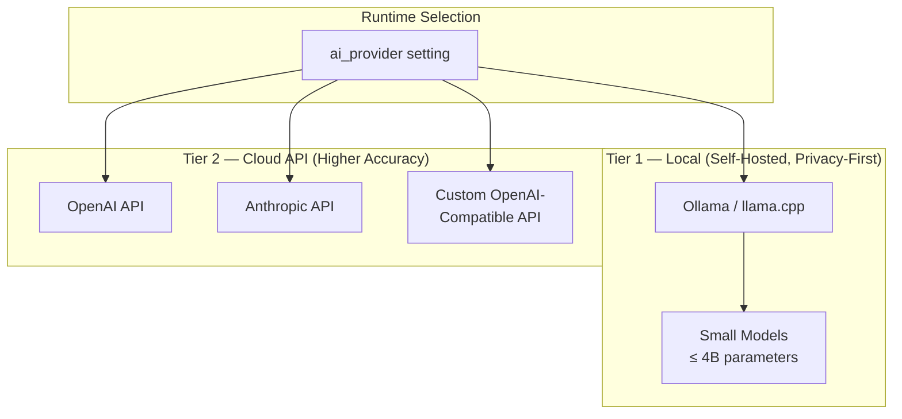

#### Recommended Local Models (< 8 GB VRAM)

These models are **generic instruction-following models** — no finance-specific training needed. The app provides domain context via system prompts.

| Model | Size | VRAM (Q4_K_M) | Best For | Notes |
|-------|------|----------------|----------|-------|
| **Phi-3.5 Mini** | 3.8B | ~3 GB | Receipt parsing, categorization | Microsoft. Excellent structured output for its size. Strong at extraction tasks. |
| **Gemma 2 2B** | 2.6B | ~2 GB | Categorization, payee normalization | Google. Fast inference, good at short classification tasks. |
| **Qwen 2.5 3B** | 3B | ~2.5 GB | Receipt parsing, multilingual | Alibaba. Strong multilingual support (Polish receipts). |
| **Llama 3.2 3B** | 3.2B | ~2.5 GB | General-purpose fallback | Meta. Well-rounded, widely supported. |
| **Mistral 7B** | 7.2B | ~5 GB | Best local accuracy | Mistral AI. Noticeably better at complex receipts but needs more VRAM. |
| **Moondream 2** | 1.9B | ~1.5 GB | Receipt image → text (vision) | Tiny vision model. Pairs with text model for full pipeline. |
| **SmolVLM 2 2B** | 2.2B | ~2 GB | Receipt image → text (vision) | HuggingFace. Small vision-language model, good at document understanding. |

**Default recommendation**: **Phi-3.5 Mini (Q4_K_M)** for text tasks + **SmolVLM 2 2B** or **Moondream 2** for vision — total < 5 GB VRAM. Runs on any GPU with 6+ GB, or CPU-only (slower but functional).

#### Recommended Cloud Models

| Provider | Model | Best For | Cost Tier |
|----------|-------|----------|-----------|
| **OpenAI** | `gpt-4o-mini` | Receipt scanning (vision), categorization | Low (~$0.15/1M input tokens) |
| **OpenAI** | `gpt-4o` | Complex receipts, multi-page statements | Medium |
| **Anthropic** | `claude-sonnet-4-20250514` | Receipt scanning, nuanced categorization | Medium |
| **Anthropic** | `claude-haiku-3-20240307` | Fast categorization, payee normalization | Low |
| **Any** | OpenAI-compatible API | Self-hosted via vLLM, LocalAI, text-gen-webui | Free (own hardware) |

#### Local Inference Architecture

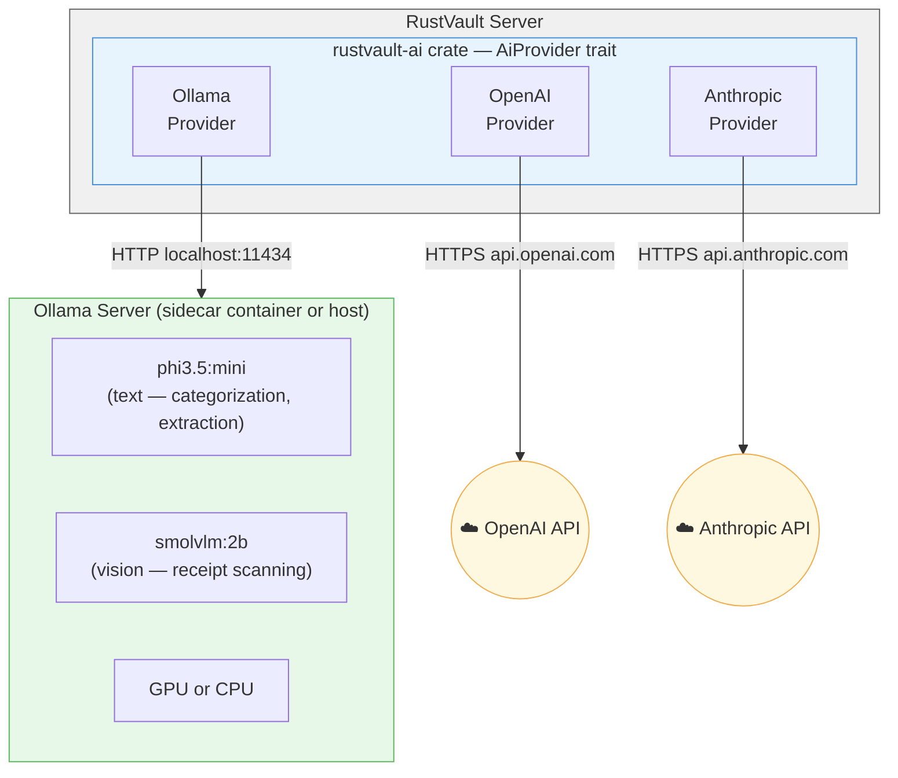

**Docker Compose sidecar** (optional):
```yaml
services:
  ollama:
    image: ollama/ollama:latest
    ports:
      - "11434:11434"
    volumes:
      - ollama_data:/root/.ollama
    deploy:
      resources:
        reservations:
          devices:
            - driver: nvidia    # Optional: GPU passthrough
              count: 1
              capabilities: [gpu]
    # CPU-only works too — just remove the deploy.resources block
```

#### Why Small Generic Models Work

The tasks RustVault needs are **shallow extraction**, not deep reasoning:

| Task | What the Model Does | Why Small Models Suffice |
|------|---------------------|--------------------------|
| Receipt scanning | Extract merchant, date, total from image/text | Pattern matching on structured documents — predictable layouts |
| Categorization | Map "SPOTIFY AB" → "Subscriptions" | Simple text classification with examples in prompt |
| Payee normalization | "SPOTIFY AB STOCKHOLM SE" → "Spotify" | String cleanup with known patterns |
| Import enrichment | Suggest category for bank descriptions | Few-shot classification from user's existing categories |

None of these require chain-of-thought reasoning, code generation, or creative output. A 3B parameter model with good instruction following is sufficient.

### System Prompts & Structured Output

> All AI interactions use **system prompts** that constrain the model to financial data extraction. Responses are requested as **JSON** with a defined schema — the app validates and rejects malformed output, retrying once if needed.

#### Receipt Scanning Prompt

```
SYSTEM:
You are a financial receipt data extractor. Extract structured data from the
receipt image or text provided. Return ONLY valid JSON matching the schema below.

Rules:
- Extract the merchant/store name exactly as printed.
- Extract the date in ISO 8601 format (YYYY-MM-DD).
- Extract the total amount as a decimal number (e.g., 42.50).
- Extract the currency code (e.g., PLN, USD, EUR). Infer from currency symbols
  (zł = PLN, $ = USD, € = EUR).
- Extract individual line items if visible (description + amount).
- Suggest ONE category from the provided list that best matches this receipt.
- Set confidence between 0.0 and 1.0.
- If a field cannot be determined, set it to null.
- Do NOT hallucinate or invent data not present in the receipt.

Available categories: {user_categories_json}

Response schema:
{
  "merchant": "string | null",
  "date": "YYYY-MM-DD | null",
  "total": number | null,
  "currency": "string | null",
  "items": [{"description": "string", "amount": number}],
  "suggested_category": "string | null",
  "confidence": number
}

USER:
[receipt image or OCR text]
```

#### Transaction Categorization Prompt

```
SYSTEM:
You are a financial transaction categorizer. Given a bank transaction description
and the user's existing categories, suggest the best matching category.

Rules:
- Choose ONLY from the provided category list. Never invent new categories.
- Base your decision on the merchant/payee name and transaction description.
- If multiple categories could match, choose the most specific one.
- Set confidence between 0.0 and 1.0.
- If no category is a reasonable match, set suggested_category to null.
- Respond with ONLY valid JSON.

User's categories: {user_categories_json}

Recent categorization examples by this user (learn from these patterns):
{recent_categorized_transactions_json}

Response schema:
{
  "suggested_category": "string | null",
  "confidence": number,
  "reasoning": "string"  // one sentence explaining the match
}

USER:
Transaction: {description}
Payee: {payee}
Amount: {amount} {currency}
Date: {date}
```

#### Batch Categorization Prompt

```
SYSTEM:
You are a financial transaction categorizer. Categorize each transaction from the
batch below into the user's existing categories.

Rules:
- Choose ONLY from the provided category list.
- Process each transaction independently.
- Respond with a JSON array, one entry per transaction, in the same order.
- Set confidence between 0.0 and 1.0. Set to null if no match.

User's categories: {user_categories_json}

Response schema:
[
  {
    "transaction_index": number,
    "suggested_category": "string | null",
    "confidence": number
  }
]

USER:
Transactions to categorize:
{transactions_json}
```

#### Payee Normalization Prompt

```
SYSTEM:
You are a payee name cleaner. Given raw bank transaction payee strings, return
the clean, human-readable merchant/payee name.

Rules:
- Remove location suffixes, country codes, transaction IDs, terminal numbers.
- Capitalize properly (e.g., "SPOTIFY AB STOCKHOLM SE" → "Spotify").
- Keep the core brand/merchant name recognizable.
- If unsure, return the original string with minimal cleanup.
- Respond with ONLY valid JSON.

Response schema:
[
  {
    "original": "string",
    "normalized": "string"
  }
]

USER:
Payees to normalize:
{payee_list_json}
```

### Architecture

```
rustvault-ai crate:
├── src/
│   ├── lib.rs              # Feature gate: all exports gated behind settings check
│   ├── config.rs            # AI provider configuration
│   ├── receipt.rs           # Receipt scanning & OCR
│   ├── categorize.rs        # Smart categorization suggestions
│   ├── enrichment.rs        # Import pipeline enrichment hooks
│   ├── normalize.rs         # Payee normalization
│   ├── prompts/
│   │   ├── mod.rs           # Prompt template engine (variable substitution)
│   │   ├── receipt.rs       # Receipt scanning prompt template
│   │   ├── categorize.rs    # Categorization prompt template
│   │   ├── batch.rs         # Batch categorization prompt template
│   │   └── normalize.rs     # Payee normalization prompt template
│   └── providers/
│       ├── trait.rs         # AiProvider trait (swappable)
│       ├── ollama.rs        # Ollama provider (local inference)
│       ├── openai.rs        # OpenAI API provider
│       ├── anthropic.rs     # Anthropic API provider
│       └── openai_compat.rs # Generic OpenAI-compatible API provider
```

### AiProvider Trait

```rust
#[async_trait]
pub trait AiProvider: Send + Sync {
    /// Provider identifier (e.g., "ollama", "openai", "anthropic")
    fn id(&self) -> &str;

    /// Check if the provider is configured and reachable
    async fn health_check(&self) -> Result<ProviderStatus>;

    /// Send a text completion request (chat format)
    async fn chat(&self, request: ChatRequest) -> Result<ChatResponse>;

    /// Send a vision request (image + text prompt)
    /// Returns None if the provider doesn't support vision
    async fn vision(&self, request: VisionRequest) -> Result<Option<ChatResponse>>;

    /// List available models for this provider
    async fn list_models(&self) -> Result<Vec<ModelInfo>>;
}

pub struct ChatRequest {
    pub system_prompt: String,
    pub user_message: String,
    pub model: Option<String>,          // Override default model
    pub temperature: f32,               // Default 0.1 (deterministic for extraction)
    pub max_tokens: u32,                // Default 1024
    pub response_format: ResponseFormat, // JSON mode when supported
}

pub struct VisionRequest {
    pub system_prompt: String,
    pub user_message: String,
    pub images: Vec<ImageData>,         // Base64 or URL
    pub model: Option<String>,
    pub temperature: f32,
    pub max_tokens: u32,
}

pub enum ResponseFormat {
    Text,
    Json,  // Request JSON mode from provider (OpenAI, Ollama support this)
}
```

### AI Configuration (User Settings)

| Setting | Type | Default | Description |
|---------|------|---------|-------------|
| `ai_enabled` | `bool` | `false` | Master toggle for all AI features |
| `ai_provider` | `enum` | `ollama` | Provider: `ollama`, `openai`, `anthropic`, `openai_compat` |
| `ai_api_key` | `string` (encrypted) | — | API key for cloud providers (not needed for Ollama) |
| `ai_api_base_url` | `string` | — | Custom API base URL (for `openai_compat` provider or self-hosted) |
| `ai_model_text` | `string` | `phi3.5:mini` | Model for text tasks (categorization, normalization) |
| `ai_model_vision` | `string` | `smolvlm:2b` | Model for vision tasks (receipt scanning) |
| `ai_confidence_threshold` | `f64` | `0.7` | Minimum confidence for auto-applying AI suggestions |
| `ai_receipt_scanning` | `bool` | `true` | Enable receipt photo scanning (requires `ai_enabled`) |
| `ai_categorization_suggestions` | `bool` | `true` | Enable smart categorization (requires `ai_enabled`) |
| `ai_import_enrichment` | `bool` | `false` | Enable AI enrichment during import (requires `ai_enabled`) |
| `ai_payee_normalization` | `bool` | `true` | Enable AI payee name cleanup (requires `ai_enabled`) |
| `ai_max_batch_size` | `u32` | `20` | Max transactions per batch categorization request |
| `ai_timeout_seconds` | `u32` | `30` | Timeout for AI requests (local models may need more) |

#### Provider Presets

When the user selects a provider, the settings panel auto-fills recommended defaults:

| Preset | `ai_model_text` | `ai_model_vision` | `ai_api_base_url` | Notes |
|--------|------------------|--------------------|---------------------|-------|
| **Ollama (Local)** | `phi3.5:mini` | `smolvlm:2b` | `http://localhost:11434` | Free, private, needs Ollama installed |
| **Ollama (Tiny)** | `gemma2:2b` | `moondream:latest` | `http://localhost:11434` | For < 4 GB VRAM or CPU-only |
| **OpenAI** | `gpt-4o-mini` | `gpt-4o-mini` | `https://api.openai.com/v1` | Best accuracy, requires API key |
| **Anthropic** | `claude-haiku-3-20240307` | `claude-sonnet-4-20250514` | `https://api.anthropic.com/v1` | Strong multilingual, requires API key |
| **Custom** | (user-defined) | (user-defined) | (user-defined) | For vLLM, LocalAI, text-gen-webui, LM Studio, etc. |

### Hardware Requirements (Local Inference)

| Setup | VRAM / RAM | Models | Performance | Receipt Scan |
|-------|------------|--------|-------------|--------------|
| **GPU ≥ 6 GB** | 6 GB VRAM | Phi-3.5 Mini + SmolVLM 2 2B | ~2–5 s/request | Full support |
| **GPU 4 GB** | 4 GB VRAM | Gemma 2 2B + Moondream 2 | ~3–8 s/request | Full support |
| **CPU-only (decent)** | 8+ GB RAM | Phi-3.5 Mini (Q4_K_M) | ~10–30 s/request | Text-only (OCR first, then text model) |
| **CPU-only (low-end)** | 4 GB RAM | Gemma 2 2B (Q4_K_M) | ~15–45 s/request | Text-only |
| **Cloud API** | None | Any | ~1–3 s/request | Full support |

> **Fallback strategy**: If no local GPU is available and no cloud API is configured, vision-based receipt scanning falls back to **OCR-first** mode: Tesseract extracts text from the receipt image, then the text model processes the OCR output. Quality is lower but functional.

### Frontend Components

- **Receipt camera button**: Floating action button on mobile and upload button on desktop. Visible only when `ai_enabled && ai_receipt_scanning`.
- **Category suggestion badge**: On uncategorized transactions, show an AI sparkle icon with suggested category. Click to accept or dismiss.
- **AI settings panel**: Within Settings page — provider selector with presets, model picker (fetched from `/api/ai/models`), API key input, feature toggles, health check indicator.
- **Receipt preview dialog**: After scanning, show extracted data for user review before creating a draft transaction.
- **Batch categorize button**: On transaction list, "AI Categorize" action for selected uncategorized transactions.
- **Payee cleanup action**: In settings or bulk action — "Normalize payee names" with preview of changes before applying.

### Response Validation & Error Handling

All AI responses go through a validation pipeline:

1. **Parse JSON** — If response is not valid JSON, retry once with a "Please respond with valid JSON only" nudge.
2. **Schema validate** — Check response matches expected schema (required fields, correct types).
3. **Confidence gate** — Only auto-apply suggestions where `confidence >= ai_confidence_threshold`. Below threshold: show as suggestion, don't auto-apply.
4. **Sanity checks** — Receipt total must be positive, date must be within reasonable range (not year 3000), currency must be a valid ISO 4217 code.
5. **Timeout handling** — If request exceeds `ai_timeout_seconds`, return gracefully with an empty suggestion (never block the import pipeline).
6. **Rate limiting** — Local: max 5 concurrent requests to Ollama. Cloud: respect provider rate limits, queue with backoff.

### Tasks

- [ ] **AI.1** Create `rustvault-ai` crate with `AiProvider` trait, `ChatRequest`/`ChatResponse` types, and feature toggle infrastructure.
- [ ] **AI.2** Implement **Ollama provider** — HTTP client for Ollama REST API (`/api/chat`, `/api/generate`). Support both text and vision models. Auto-detect available models via `/api/tags`.
- [ ] **AI.3** Implement **OpenAI provider** — HTTP client for OpenAI chat completions API. Support JSON mode, vision (image URLs / base64), model listing.
- [ ] **AI.4** Implement **Anthropic provider** — HTTP client for Anthropic Messages API. Support vision (base64 images), system prompts.
- [ ] **AI.5** Implement **OpenAI-compatible provider** — Generic provider that works with any OpenAI-compatible API (vLLM, LocalAI, LM Studio, text-gen-webui). Configurable base URL.
- [ ] **AI.6** Implement **prompt template system** — Template engine that injects user's categories, recent transactions, and locale context into system prompts. Templates stored as constants, easy to tune.
- [ ] **AI.7** Implement **receipt scan endpoint** (`POST /api/ai/receipt/scan`) — Image upload → vision model (or OCR fallback → text model) → validated JSON response → draft transaction.
- [ ] **AI.8** Implement **categorization suggestion endpoint** — Fetch user's categories + recent categorized transactions → build prompt → call text model → validate response.
- [ ] **AI.9** Implement **batch categorization endpoint** — Chunk uncategorized transactions into batches of `ai_max_batch_size` → parallel requests → merge results.
- [ ] **AI.10** Implement **payee normalization endpoint** — Batch payee strings → text model → validate → return original/normalized pairs.
- [ ] **AI.11** Implement **import enrichment hook** — Optional post-parse step in import pipeline. When enabled, runs batch categorization + payee normalization on imported transactions before persist.
- [ ] **AI.12** Implement **response validation pipeline** — JSON parsing, schema validation, confidence gating, sanity checks, retry logic.
- [ ] **AI.13** Build **AI settings panel** in Settings page — Provider selector with auto-fill presets, model picker (fetched live from provider), API key input (masked), feature toggles, health check button with status indicator.
- [ ] **AI.14** Build **receipt camera/upload button** (Capacitor Camera on mobile, file upload on desktop). Visible only when AI receipt scanning is enabled.
- [ ] **AI.15** Build **category suggestion UI** — Sparkle icon on uncategorized transactions, popover with suggested category + confidence %, accept/dismiss buttons.
- [ ] **AI.16** Build **receipt preview dialog** — Show AI-extracted data in editable form, allow user corrections before creating draft transaction.
- [ ] **AI.17** Build **batch categorize action** — Button on transaction list toolbar, progress indicator, preview of suggestions before applying.
- [ ] **AI.18** Store AI API keys encrypted in DB using app-level encryption key. Never log API keys or AI request/response bodies containing financial data.
- [ ] **AI.19** Add **Ollama sidecar** to `docker-compose.yml` (optional service, commented out by default). Include setup instructions in docs.
- [ ] **AI.20** Write integration tests for all AI endpoints (mock provider with deterministic responses). Test response validation, confidence gating, error handling, timeout behavior.

### i18n Tasks (AI)
- [ ] **AI.i18n.1** Write `locales/en-US/ai.ftl` and `web/src/locales/en-US/ai.json` — all AI feature strings.

### Documentation Deliverables (AI)
- [ ] Write `docs/book/src/features/ai-features.md` — user guide for AI features (setup, receipt scanning, categorization, payee normalization).
- [ ] Write `docs/book/src/features/ai-local-setup.md` — guide for setting up Ollama + recommended models (GPU and CPU-only instructions, Docker sidecar setup).
- [ ] Write `docs/book/src/features/ai-cloud-setup.md` — guide for configuring OpenAI / Anthropic / custom API providers.
- [ ] Write `docs/adr/0011-ai-module-architecture.md` — ADR on model strategy (generic models + system prompts vs. fine-tuning, local-first approach).
- [ ] OpenAPI annotations on all AI endpoints.
- [ ] Document `AiProvider` trait in rustdoc for custom provider implementations.
- [ ] Document all system prompt templates with explanation of variables and tuning guidance.

### Implementation Notes
- AI feature tasks can be implemented **in parallel with any phase after P3** (transactions must exist first).
- AI features are independent of the phase progression — they enhance existing functionality rather than adding new flows.
- When `ai_enabled = false`, the `rustvault-ai` crate's routes are not registered and its code paths are never executed.
- The `rustvault-ai` crate can optionally be excluded from compilation entirely via a Cargo feature flag for minimal deployments.
- **Temperature is set to 0.1** for all extraction/classification tasks — we want deterministic, consistent output, not creativity.
- **Prompt templates are version-tracked** — when prompts change, the app logs the prompt version used for each AI-assisted transaction (in `metadata.ai_prompt_version`). This enables auditing and debugging.
- **No financial data leaves the server unless a cloud provider is configured** — local inference keeps everything on-premises. The AI settings panel clearly warns users when selecting a cloud provider that transaction data will be sent to third-party APIs.

---

## Anti-Patterns to Avoid

| Anti-Pattern | RustVault Approach |
|---|---|
| Must pre-define all categories before import | Categories auto-created during import, reviewable after |
| Must pre-define accounts before import | Account can be created inline in import wizard |
| Must pre-define tags before first use | Tags created on-the-fly, anywhere |
| Import fails on unknown category | Import **never fails** on missing taxonomy — it creates it |
| No way to edit imported data easily | Every field is editable; bulk edit supported |
| Manual transaction entry as primary flow | Import-first; manual entry is the fallback |
| Rigid CSV format requirements | Auto-detect delimiters, dates, decimals; column mapping UI |
| No undo for imports | Import rollback: delete all transactions from an import batch |
| Static categories (no hierarchy) | Hierarchical categories with drag-and-drop |
| No auto-categorization | Rule engine with conditions/actions, learned from user behavior |
| Poor data visualization | ECharts-based interactive, drillable dashboards |
| No budget tracking | Full budget with planned vs. actual comparison |
| English-only, no i18n | Full multilingual support from day one, locale-aware formatting |
| No documentation or outdated docs | Documentation is a first-class deliverable, versioned and CI-checked |

---

## AI Agent Workflow Notes

> Guidelines for AI agents implementing this plan.

### General Principles

1. **Work in phases**: Complete each phase fully before moving to the next. Each phase has clear acceptance criteria.
2. **One task at a time**: Pick a task (e.g., P1.2), implement it fully (code + tests), verify it passes, then move on.
3. **Test-driven**: For backend tasks, write tests alongside implementation. Use `sqlx::test` for DB tests with a real Postgres instance.
4. **Type-first for frontend**: Define TypeScript types/interfaces for API responses before building components.
5. **Migration-first for DB**: Always write the migration SQL before writing query code.

### Task Dependency Graph

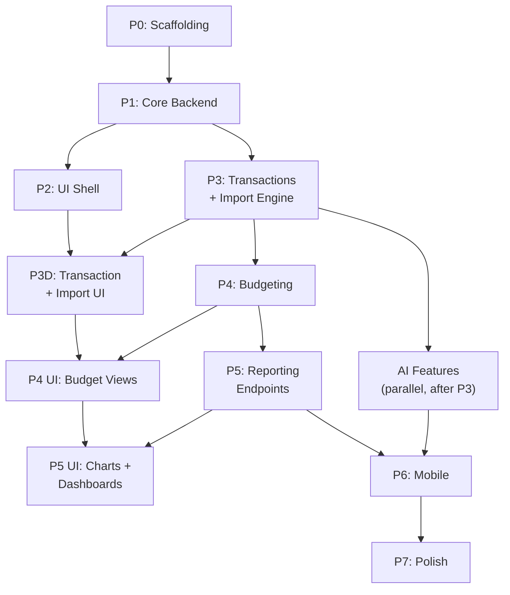

### Per-Task Checklist (for agents)

For each task, agents should:
1. Read the task description and acceptance criteria.
2. Identify files to create or modify.
3. Write implementation code.
4. Write tests (unit for logic, integration for API endpoints).
5. **Externalize all user-facing strings** into locale files (`en-US`).
6. **Write doc comments** on all `pub` Rust items and exported TypeScript.
7. **Add OpenAPI annotations** if the task involves API endpoints.
8. **Update the relevant mdBook chapter** if the feature is user-visible.
9. Run `cargo check`, `cargo clippy`, `cargo test` (backend).
10. Run `bun lint`, `bun run build` (frontend).
11. Run `vale docs/` to lint prose (if docs were modified).
12. Verify the acceptance criteria are met.
13. Commit with a descriptive message referencing the task ID (e.g., `feat(P1.2): implement user auth endpoints`).

### File Naming Conventions

- Rust: `snake_case` for files, modules, functions. `PascalCase` for types.
- SQL migrations: `NNNN_description.sql` (e.g., `0001_initial_schema.sql`).
- TypeScript: `PascalCase` for components, `camelCase` for utilities, `kebab-case` for file names.
- API routes: `kebab-case` paths, plural nouns for resources.


---

## Summary

| Phase | Key Deliverable |
|-------|-----------------|
| P0 — Scaffolding | Repo, CI, Docker, empty app shells |
| P1 — Core Backend | Auth, accounts, categories, tags CRUD + tests |
| P2 — Web UI Shell | Navigation, auth pages, entity management |
| P3 — Transactions & Import | Import pipeline, auto-categorization, transaction UI |
| P4 — Budgeting | Budget CRUD, planned vs. actual, budget dashboard |
| P5 — Visualization | Dashboard, reports, charts, export |
| P6 — Mobile | Capacitor apps for iOS/Android |
| P7 — Polish | Security, multi-user, docs, release |
| AI Features | Local + cloud AI providers, receipt scanning, smart categorization, prompts |
