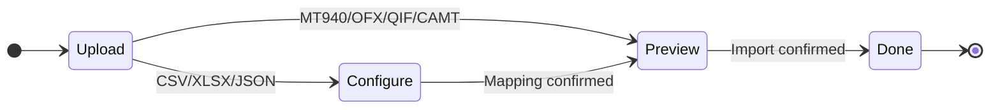

# RustVault — UI Implementation Plan

> Minimalistic, data-readable, unified web & mobile experience.
> SolidJS · Kobalte · Tailwind CSS · Capacitor

---

## Table of Contents

1. [Design Philosophy](#1-design-philosophy)
2. [Component Library Decision](#2-component-library-decision)
3. [Design System](#3-design-system)
4. [Layout Architecture](#4-layout-architecture)
5. [Component Inventory](#5-component-inventory)
6. [Page-by-Page UI Design](#6-page-by-page-ui-design)
7. [Web ↔ Mobile Unified Experience](#7-web--mobile-unified-experience)
8. [Accessibility](#8-accessibility)
9. [Motion & Interaction](#9-motion--interaction)
10. [Icon & Asset Strategy](#10-icon--asset-strategy)
11. [Implementation Phases](#11-implementation-phases)
12. [Demo Mode (Static Hosting)](#12-demo-mode-static-hosting)
13. [Anti-Patterns to Avoid](#13-anti-patterns-to-avoid)

---

## 1. Design Philosophy

### Core Principles

| Principle | Description |
|-----------|-------------|
| **Data first** | Every pixel serves readability. Numbers, balances, and trends are the hero — not decoration. |
| **Quiet interface** | The UI stays out of the way. Minimal chrome, no visual noise, no gratuitous color. Information density is a feature. |
| **One design, two platforms** | Web and mobile share the same component library, color system, typography, and interaction patterns. The same visual language applies everywhere — only layout adapts. |
| **Progressive disclosure** | Show the essentials by default. Advanced options (filters, bulk actions, rules) appear on demand. |
| **Consistent density** | Finance data benefits from higher density than typical consumer apps. Use compact spacing, readable type sizes, and efficient table layouts. |
| **Accessible by default** | Every component meets WCAG 2.1 AA. Keyboard-navigable, screen-reader-friendly, motion-safe. |

### Design Influences

The visual language draws from:
- **Linear** — Clean, minimal SaaS product. Monochrome palette with selective color.
- **Mercury OS** — Data-dense but breathable. Quiet hierarchy through type weight, not borders and shadows.
- **Firefly III** — Self-hosted finance app reference. Learnings: good data density, but improve visual hierarchy and mobile UX.
- **YNAB** — Budget visualization patterns (progress bars, category bars). Simple, scannable.
- **Apple Health/Finance widgets** — Card-based dashboard with clear metrics and sparklines.

### What "Minimalistic" Means for RustVault

```
✓ Neutral color palette — accent color used sparingly (actions, status)
✓ Sans-serif typography with clear numeric rendering
✓ Generous whitespace between sections, compact within sections
✓ Borders and dividers over shadows and cards-with-depth
✓ Icons are functional, not decorative — used only to aid scanning
✓ No gradients, no rounded-everything, no playful illustrations
✓ Tables over cards for lists (data density)
✓ Inline editing over modal dialogs where possible
✓ Status communicated via color dot/badge, not alert banners
✗ No hero images, no onboarding carousels, no empty-state illustrations
```

---

## 2. Component Library Decision

### Recommendation: Kobalte + Tailwind CSS + Custom Design System

After evaluating the SolidJS ecosystem, the best approach for our requirements is:

| Layer | Choice | Role |
|-------|--------|------|
| **Headless primitives** | **Kobalte** | Accessible, unstyled components (dialog, select, popover, tabs, etc.) — handles keyboard, focus, ARIA |
| **Styling engine** | **Tailwind CSS** | Utility-first CSS, JIT purge, consistent spacing/color tokens |
| **Design system** | **Custom (shadcn-style)** | Pre-styled, copy-paste components built on Kobalte + Tailwind. Full control over aesthetics. |
| **Data table** | **@tanstack/solid-table** | Headless table with sorting, filtering, column visibility, pagination |
| **Virtualization** | **@tanstack/solid-virtual** | Virtualized lists/tables for 10k+ transaction rows |
| **Charts** | **Apache ECharts** (modular) | Rich interactive financial charts |
| **Icons** | **Lucide** (solid wrapper or SVG imports) | Clean, consistent, MIT-licensed. 1000+ icons, 24×24 grid. |
| **Date picker** | **Kobalte DatePicker** or custom on Kobalte Popover | Locale-aware, keyboard-navigable |
| **Toast / Notifications** | **Kobalte Toast** | Non-blocking, accessible notifications |
| **Forms** | **@modular-forms/solid** | Type-safe form management with validation |

### Why This Stack Achieves "Unified Web/Mobile"

Capacitor wraps the **same SolidJS app** into native containers. By building our design system on Kobalte + Tailwind:
- Components are **responsive at the core** — the same component renders differently at mobile vs. desktop breakpoints.
- Touch targets, spacing, and typography adapt via Tailwind responsive classes — no separate mobile component library.
- Platform-specific behaviors (pull-to-refresh, bottom sheet, haptic) are added via Capacitor plugins on top of the same components.
- The user sees the **identical visual design** on web and mobile — colors, fonts, icons, layout patterns are shared.

---

## 3. Design System

### 3.1 Color Palette

A neutral-first palette with a single accent color. Semantic colors for financial data (income green, expense red).

#### Base — Light Theme

| Token | Hex | Use |
|-------|-----|-----|
| Background | `#FFFFFF` | Page background |
| Surface | `#F9FAFB` | Cards, sidebars, table headers |
| Surface Hover | `#F3F4F6` | Row/item hover state |
| Border | `#E5E7EB` | Dividers, borders |
| Border Strong | `#D1D5DB` | Input borders, table borders |
| Text Primary | `#111827` | Headings, primary content |
| Text Secondary | `#6B7280` | Labels, captions, metadata |
| Text Tertiary | `#9CA3AF` | Placeholders, disabled text |

#### Base — Dark Theme

| Token | Hex | Use |
|-------|-----|-----|
| Background | `#09090B` | Page background |
| Surface | `#18181B` | Cards, sidebars |
| Surface Hover | `#27272A` | Row/item hover state |
| Border | `#27272A` | Dividers, borders |
| Border Strong | `#3F3F46` | Input borders |
| Text Primary | `#FAFAFA` | Headings, primary content |
| Text Secondary | `#A1A1AA` | Labels, captions |
| Text Tertiary | `#71717A` | Placeholders, disabled |

#### Accent

| Token | Hex | Use |
|-------|-----|-----|
| Primary | `#2563EB` | Buttons, links, active states |
| Primary Hover | `#1D4ED8` | Button hover |
| Primary Muted | `#DBEAFE` | Subtle highlight, tag bg |

#### Semantic (shared across themes)

| Token | Hex | Use |
|-------|-----|-----|
| Income / Positive | `#16A34A` | Income amounts, +balance |
| Expense / Negative | `#DC2626` | Expense amounts, -balance |
| Warning | `#D97706` | Over-budget, duplicates |
| Info | `#2563EB` | Informational badges |
| Transfer | `#7C3AED` | Transfer badges/amounts |

#### Chart Palette (ordered, distinguishable)

| # | Hex | # | Hex |
|---|-----|---|-----|
| 1 | `#2563EB` | 6 | `#0891B2` |
| 2 | `#16A34A` | 7 | `#DB2777` |
| 3 | `#DC2626` | 8 | `#65A30D` |
| 4 | `#D97706` | 9 | `#EA580C` |
| 5 | `#7C3AED` | 10 | `#4F46E5` |

**Tailwind config** — Define as CSS custom properties in `:root` and `.dark`, consumed by Tailwind via `theme.extend.colors`. This allows runtime theme switching without rebuilding.

### 3.2 Typography

| Element | Font | Size (px/rem) | Weight | Line Height | Use |
|---------|------|---------------|--------|-------------|-----|
| **Page title** | Inter | 24 / 1.5rem | 600 (semibold) | 1.33 | Page headings |
| **Section title** | Inter | 18 / 1.125rem | 600 | 1.33 | Section headings, dialog titles |
| **Body** | Inter | 14 / 0.875rem | 400 | 1.5 | Default text, descriptions |
| **Body small** | Inter | 13 / 0.8125rem | 400 | 1.5 | Table cells, metadata |
| **Caption** | Inter | 12 / 0.75rem | 400 | 1.33 | Timestamps, helper text |
| **Label** | Inter | 13 / 0.8125rem | 500 (medium) | 1.33 | Form labels, column headers |
| **Amount (large)** | JetBrains Mono | 20 / 1.25rem | 600 | 1.2 | Dashboard balance, totals |
| **Amount (table)** | JetBrains Mono | 13 / 0.8125rem | 400 | 1.5 | Transaction amounts in lists |
| **Amount (inline)** | JetBrains Mono | 14 / 0.875rem | 500 | 1.5 | Inline amounts, budget bars |
| **Button** | Inter | 14 / 0.875rem | 500 | 1.0 | Button labels |
| **Badge** | Inter | 11 / 0.6875rem | 500 | 1.0 | Status badges, tags, counts |

**Font stack:**
```css
--font-sans: 'Inter', -apple-system, BlinkMacSystemFont, 'Segoe UI', Roboto, sans-serif;
--font-mono: 'JetBrains Mono', 'SF Mono', 'Fira Code', 'Cascadia Code', monospace;
```

**Why two fonts:**
- **Inter** — Optimized for UI. Excellent readability at small sizes. Tabular numbers (`font-variant-numeric: tabular-nums`) for aligned columns.
- **JetBrains Mono** — Monospace for financial amounts. Guarantees digit alignment across rows. Distinguishes `0` from `O`, `1` from `l`.

**Font loading:**
- Self-hosted WOFF2, subset to Latin Extended (covers most EU languages).
- `font-display: swap` — text visible immediately, fonts load async.
- Preload both fonts in `<head>` for fast initial render.

### 3.3 Spacing Scale

8px base grid. All spacing is a multiple of 4px.

| Token | Value | Use |
|-------|-------|-----|
| `spacing-0.5` | 2px | Micro gaps (badge inner padding) |
| `spacing-1` | 4px | Tightest gaps (icon-to-text in badges) |
| `spacing-2` | 8px | Within compact groups (table cell padding) |
| `spacing-3` | 12px | Between related items (form field gaps) |
| `spacing-4` | 16px | Standard component padding |
| `spacing-5` | 20px | Section padding |
| `spacing-6` | 24px | Card padding, sidebar padding |
| `spacing-8` | 32px | Between sections |
| `spacing-10` | 40px | Page top/bottom margin |
| `spacing-12` | 48px | Major section separation |

### 3.4 Border & Radius

| Token | Value | Use |
|-------|-------|-----|
| `radius-none` | 0px | N/A |
| `radius-sm` | 4px | Badges, tags, small buttons |
| `radius-md` | 6px | Inputs, cards, buttons |
| `radius-lg` | 8px | Dialogs, sheets, popovers |
| `radius-full` | 9999px | Avatars, dots, pills |
| `border-default` | 1px solid `border` | Standard dividers |
| `border-strong` | 1px solid `border-strong` | Input borders, table borders |

### 3.5 Elevation (Minimal)

The design avoids heavy shadows. Elevation is used sparingly — only for overlays.

| Level | Shadow | Use |
|-------|--------|-----|
| **Level 0** | `none` | Default. Cards, surfaces use border instead of shadow. |
| **Level 1** | `0 1px 3px rgba(0,0,0,0.08), 0 1px 2px rgba(0,0,0,0.06)` | Dropdown menus, popovers |
| **Level 2** | `0 4px 12px rgba(0,0,0,0.10), 0 2px 4px rgba(0,0,0,0.06)` | Dialogs, command palette |
| **Level 3** | `0 8px 24px rgba(0,0,0,0.12)` | Mobile bottom sheets |

### 3.6 Z-Index Scale

| Token | Value | Use |
|-------|-------|-----|
| `z-base` | 0 | Default layer |
| `z-sticky` | 10 | Sticky table headers, top bar |
| `z-dropdown` | 20 | Dropdowns, popovers, tooltips |
| `z-overlay` | 30 | Dialog backdrop |
| `z-modal` | 40 | Dialog content |
| `z-toast` | 50 | Toast notifications |
| `z-command` | 60 | Command palette (highest) |

---

## 4. Layout Architecture

### 4.1 Shell Layout

The shell is intentionally quiet — no section dividers in the sidebar, no search bar in the top bar. The sidebar is a flat list of navigation items with visual grouping through spacing alone. A global "+" action button provides quick access to all creation/import flows.

> **Wireframe:**
>
> 
>
> *Source: [`shell-layout.excalidraw`](docs/wireframes/shell-layout.excalidraw)*

**Key layout decisions:**
- **No search box in top bar** — search is contextual per page (transaction list has its own search). Keeps the top bar minimal.
- **No dividers in sidebar** — spacing between groups provides visual separation without visual noise. 16px gap between groups.
- **Import removed from sidebar** — import is accessed from the [＋] action button, not a dedicated nav item.
- **[＋] Action Button** — always visible in top bar. Opens a dropdown menu with quick-create actions.

### 4.1.1 Action Button (＋) Menu

The "+" button in the top bar is a primary accent-colored `IconButton` that opens a `DropdownMenu` with creation/import shortcuts:

- **Import Transactions** is visually separated at the top (primary action).
- Remaining items are grouped below with a subtle separator.
- Each item has an icon + label. Clicking navigates to the creation dialog/page.
- On mobile: the same menu is triggered from the center tab button in the bottom tab bar.

### 4.2 Responsive Breakpoints

| Breakpoint | Width | Layout | Sidebar | Navigation |
|------------|-------|--------|---------|------------|
| **Mobile** | < 640px (`sm`) | Single column | Hidden | Bottom tab bar (5 tabs) |
| **Tablet** | 640–1023px (`md`) | Single column | Collapsed (icon-only, 64px) or overlay | Bottom tab bar or collapsed sidebar |
| **Desktop** | 1024–1279px (`lg`) | Two column | Collapsed (icon-only, 64px) | Sidebar |
| **Wide** | ≥ 1280px (`xl`) | Two column | Expanded (240px) | Sidebar |

### 4.3 Mobile Layout

> **Wireframe:**
>
> 
>
> *Source: [`mobile-layout.excalidraw`](docs/wireframes/mobile-layout.excalidraw)*

**Bottom tab bar items:**
1. **Home** — Dashboard (portfolio overview)
2. **Transactions** — Transaction list
3. **＋** — Action menu (same as top bar [＋] button) — center accent circle, opens bottom sheet with: Import Transactions, Add Transaction, Add Bank, Add Account, Add Category, Add Tag, Add Rule, Add Budget
4. **Budget** — Budget overview
5. **More** — Settings, Reports, Banks, Categories, Tags, Rules (nested menu)

### 4.4 Sidebar Navigation

> **Wireframe:**
>
> 
>
> *Source: [`sidebar.excalidraw`](docs/wireframes/sidebar.excalidraw)*

**Collapsed sidebar** (56px) shows **icons only** with tooltip on hover.

**Sidebar behavior:**
- **No divider lines** — groups are separated by spacing (16px gap). This keeps the sidebar visually clean.
- **Import is NOT in sidebar** — import is accessed via the [＋] action button in the top bar.
- **Collapsed mode** shows icons only with tooltip on hover for each label.
- **Expand/collapse** via the toggle at the bottom, or via user preference in Settings.
- **Active state** — subtle background highlight on the current page's nav item, with a 2px left accent border.
- **Hover state** — light `surface-hover` background, no border change.

### 4.5 Page Structure

Every page follows a consistent structure: **Page Header** (title + actions) → **Optional Filter Bar** (date range, account, category, search) → **Page Content** (data table / cards / charts).

---

## 5. Component Inventory

| Layer | Components |
|-------|------------|
| **Primitives** (Kobalte + Tailwind) | `Button`, `IconButton`, `Dialog`, `Sheet`, `Popover`, `Select`, `Combobox`, `Tabs`, `Toast`, `Tooltip`, `Switch`, `Checkbox`, `DropdownMenu`, `Collapsible`, `Separator`, `Progress`, `AlertDialog`, `HoverCard`, `NumberField` |
| **Custom Components** | `DataTable`, `AmountDisplay`, `BalanceCard`, `CategoryBadge`, `TagBadge`, `StatusDot`, `DateRangePicker`, `SearchInput`, `ActionMenu`, `EmptyState`, `Skeleton`, `PageHeader`, `FilterBar`, `BudgetBar`, `SparkLine`, `QuickStat`, `SidePanel`, `FileDropZone`, `StepIndicator`, `TransferBadge`, `Avatar` |
| **Form Components** | `FormField`, `CurrencyInput`, `DateInput`, `ColorPicker`, `IconPicker` |
| **Chart Components** | `EChartsProvider`, `IncomeExpenseChart`, `CategoryDonut`, `BalanceHistory`, `CashFlowChart` |

**Dependency flow:** Primitives → Custom Components / Form Components → Chart Components

### 5.1 Primitives (from Kobalte)

These are headless Kobalte components styled with Tailwind in our design system:

| Component | Kobalte Primitive | Purpose |
|-----------|-------------------|---------|
| `Button` | N/A (native) | Primary, secondary, ghost, destructive variants |
| `IconButton` | N/A | Icon-only button with tooltip |
| `Dialog` | `Dialog` | Modal dialogs (create/edit forms, confirmations) |
| `Sheet` | `Dialog` (styled as sheet) | Slide-in panel (transaction detail, filters on mobile) |
| `Popover` | `Popover` | Contextual menus, inline editing dropdowns |
| `Select` | `Select` | Single-select dropdown (account, category, currency) |
| `Combobox` | `Combobox` | Searchable select (category with search, payee autocomplete) |
| `Tabs` | `Tabs` | Page sections, view toggles |
| `Toast` | `Toast` | Non-blocking notifications |
| `Tooltip` | `Tooltip` | Icon explanations, abbreviated text |
| `Switch` | `Switch` | Toggle settings (dark mode, AI features) |
| `Checkbox` | `Checkbox` | Multi-select in lists, filter options |
| `DropdownMenu` | `DropdownMenu` | Context menus, more-actions menu |
| `Collapsible` | `Collapsible` | Expandable sections (category tree, filter groups) |
| `Separator` | `Separator` | Visual dividers |
| `Progress` | `Progress` | Import progress, budget progress bars |
| `AlertDialog` | `AlertDialog` | Destructive confirmations (delete, rollback) |
| `HoverCard` | `HoverCard` | Rich preview on hover (account summary, category breakdown) |
| `NumberField` | `NumberField` | Amount inputs with locale-aware formatting |

### 5.2 Custom Components

Built on primitives + Tailwind for RustVault-specific needs:

| Component | Description | Used In |
|-----------|-------------|---------|
| **`DataTable`** | Built on `@tanstack/solid-table`. Sortable columns, sticky headers, row selection, column visibility toggle, virtualized rows. | Transactions, Rules, Budgets |
| **`AmountDisplay`** | Renders monetary amounts with locale formatting, monospace font, color-coded (income green / expense red / transfer purple). Right-aligned. | Everywhere |
| **`BalanceCard`** | Compact card showing account/bank balance. Logo + name + amount. | Dashboard, Banks |
| **`CategoryBadge`** | Color-coded pill with category icon and name. Clickable for filtering. | Transactions, Budget |
| **`TagBadge`** | Small colored pill with tag name. Removable (×). | Transaction detail |
| **`StatusDot`** | Tiny colored circle indicating status (reviewed ✓, unreviewed ●, error ✕). | Transaction list |
| **`DateRangePicker`** | Two date inputs with preset ranges (This month, Last month, This quarter, Last year, Custom). | Reports, Transactions, Budgets |
| **`SearchInput`** | Input with search icon, debounced (300ms), clear button, loading indicator. | Transaction list page |
| **`ActionMenu`** | [＋] button in top bar (desktop) and center tab (mobile). Opens `DropdownMenu` with quick-create actions: Import Transactions, Add Transaction, Add Bank, Add Account, Add Category, Add Tag, Add Rule, Add Budget. | Top bar, Bottom tab bar |
| **`EmptyState`** | Centered message with icon and CTA for pages with no data. Simple — no illustrations, just text-based. | All list pages |
| **`Skeleton`** | Animated placeholder matching content shape (lines, rectangles, circles). | All pages during load |
| **`PageHeader`** | Page title + optional subtitle/breadcrumb + action buttons. | Every page |
| **`FilterBar`** | Horizontal bar of filter controls. Collapsible on mobile (show as bottom sheet). | Transactions, Reports |
| **`BudgetBar`** | Horizontal stacked bar showing planned amount, actual spend, remaining — color-coded. | Budget page |
| **`SparkLine`** | Tiny inline line chart (30-day trend). No axes — just the shape. | Dashboard cards |
| **`Avatar`** | User initials in a circle. Used in top bar and settings. | Top bar, Settings |
| **`FileDropZone`** | Drag-and-drop area with file type hint. Dashed border, hover highlight. | Import wizard |
| **`StepIndicator`** | Horizontal step progress (● ━ ● ━ ○ ━ ○). | Import wizard |
| **`TransferBadge`** | Visual indicator showing transfer direction: "→ Zen PLN" or "← Revolut EUR". Clickable to navigate to counterpart. | Transaction list/detail |
| **`QuickStat`** | Numeric value + label + optional trend arrow (↑ 12%). | Dashboard |
| **`SidePanel`** | Right-side slide-in panel for detail views without leaving the list context. | Transaction detail |

### 5.3 Form Components

| Component | Description |
|-----------|-------------|
| **`FormField`** | Label + input + error message + help text wrapper |
| **`CurrencyInput`** | Number input with currency symbol prefix/suffix, locale-aware decimal handling |
| **`Select`** | Styled Kobalte Select with search for long lists |
| **`DateInput`** | Date input with locale-aware format, calendar popover |
| **`ColorPicker`** | Preset color swatches (10 palette colors) for categories/banks |
| **`IconPicker`** | Grid of icons to choose from (Lucide subset: ~50 finance-relevant icons) |

---

## 6. Page-by-Page UI Design

### 6.1 Dashboard (Portfolio Overview)

The dashboard is a **simple portfolio overview** — a single-screen snapshot of the user's financial position. It answers three questions: "What do I have?", "How is it changing?", and "Where is money going?". No clutter, no recent transactions list, no unreviewed counters — just the portfolio.

> **Wireframe:**
>
> 
>
> *Source: [`dashboard.excalidraw`](docs/wireframes/dashboard.excalidraw)*

**Dashboard structure (top to bottom — single scrollable column):**

1. **Net Worth** — the single most important number. Large type, monospace. 12-month sparkline. Delta vs. previous month (absolute + percentage).
2. **Income / Expenses** — two side-by-side stat cards. Current month totals with month-over-month change.
3. **Accounts** — flat list grouped by bank. Account name + dotted leader + balance. No nesting arrows — just indentation under bank name. Color dot per bank.
4. **This Month (budget snapshot)** — only shown if a budget exists for the current month. Overall progress bar + top 5 category bars (sorted by % used). Over-budget categories flagged with ⚠.
5. **Savings Rate** — percentage + trend sparkline. Simple, at the bottom.

**What's NOT on the dashboard:**
- No recent transactions list (that's the Transactions page).
- No unreviewed transaction counter (shown as a badge on the Transactions nav item instead).
- No donut/pie charts (budget bars are more scannable).
- No bar charts (sparklines are sufficient for trends).
- No filters or date selectors (it's always "now").

**Dashboard mobile:**
- Same single-column layout — it's already a vertical flow.
- Income/Expenses cards stack vertically on very narrow screens (< 375px).
- Accounts list is collapsible per bank (tap bank name to expand/collapse).
- Budget bars are full-width.

### 6.2 Transaction List

The most-used page. Optimized for scanning large amounts of data.

> **Wireframe:**
>
> 
>
> *Source: [`transaction-list.excalidraw`](docs/wireframes/transaction-list.excalidraw)*

**Key design decisions:**
- **Table layout on desktop** — Not cards. Tables are denser and better for scanning financial data.
- **List layout on mobile** — Each transaction is a compact row: description + amount + category badge. Swipe for actions.
- **Inline category edit** — Click the category badge → dropdown to change. No modal needed.
- **Unreviewed indicator** — Filled dot (●) for unreviewed, no dot for reviewed.
- **Transfer indicator** — Indented sub-row showing counterpart account.
- **AI suggestion** — Sparkle icon (✨) with suggested category, subtle — not intrusive.
- **Infinite scroll** — No pagination buttons. Scroll to load more, with virtualization.

**Mobile transaction list:**

<details>
<summary>ASCII wireframe — mobile (reference)</summary>

```
┌───────────────────────────────┐
│  [🔍]  [Filter ▾]  [+ Add]   │
├───────────────────────────────┤
│                               │
│  Mar 02                       │
│  ┌───────────────────────────┐│
│  │ ● SPOTIFY AB       -9.99 ││
│  │   🎵 Subs · Revolut      ││
│  ├───────────────────────────┤│
│  │   BIEDRONKA        -87.30││
│  │   🛒 Food · Lunar        ││
│  └───────────────────────────┘│
│                               │
│  Mar 01                       │
│  ┌───────────────────────────┐│
│  │   SALARY MARCH   +12,500 ││
│  │   💰 Income · Lunar      ││
│  ├───────────────────────────┤│
│  │   TRANSFER → Zen    -500 ││
│  │   ↔ Transfer · Revolut   ││
│  └───────────────────────────┘│
│                               │
└───────────────────────────────┘
```

</details>

### 6.3 Transaction Detail (Side Panel)

When a transaction is clicked, a slide-in panel opens from the right (desktop) or a full-page view (mobile).

> **Wireframe:**
>
> 
>
> *Source: [`transaction-detail.excalidraw`](docs/wireframes/transaction-detail.excalidraw)*


### 6.4 Import Wizard

Multi-step dialog — takes over the center of the screen (dialog, not a separate page).



**Step details:**

| Step | Key Actions |
|------|-------------|
| **Upload** | Drop/browse file → choose target account |
| **Configure** | Auto-detect format → map columns → optionally save mapping *(CSV/XLSX/JSON only)* |
| **Preview** | Review parsed rows → flag ⚠ duplicates & 🟡 new categories → toggle skip/auto-link |
| **Done** | Summary (imported / skipped / created / linked) → review new categories & transfers |

> **Wireframe:**
>
> 
>
> *Source: [`import-wizard.excalidraw`](docs/wireframes/import-wizard.excalidraw)*

### 6.5 Banks & Accounts Page

> **Wireframe:**
>
> 
>
> *Source: [`banks-accounts.excalidraw`](docs/wireframes/banks-accounts.excalidraw)*

### 6.6 Categories Page

> **Wireframe:**
>
> 
>
> *Source: [`categories.excalidraw`](docs/wireframes/categories.excalidraw)*

- Tree with collapsible nodes.
- Drag-and-drop to re-parent (desktop).
- Click category name to inline-edit.
- `[⋯]` menu per row: Edit, Change Icon/Color, Move, Delete/Merge.
- Transaction count shows usage — helps decide which categories to merge/delete.

### 6.7 Budget Page

> **Wireframe:**
>
> 
>
> *Source: [`budget.excalidraw`](docs/wireframes/budget.excalidraw)*

**Progress bar color logic:**
- 0–80%: `#16A34A` (green) — on track
- 80–100%: `#D97706` (amber) — approaching limit
- 100%+: `#DC2626` (red) — over budget

### 6.8 Reports Page

> **Wireframe:**
>
> 
>
> *Source: [`reports.excalidraw`](docs/wireframes/reports.excalidraw)*

### 6.9 Settings Page

> **Wireframe:**
>
> 
>
> *Source: [`settings.excalidraw`](docs/wireframes/settings.excalidraw)*

### 6.10 Auto-Rules Page

> **Wireframe:**
>
> 
>
> *Source: [`rules.excalidraw`](docs/wireframes/rules.excalidraw)*

### 6.11 Tags Page

Simple list — tags don't need a complex page.

> **Wireframe:**
>
> 
>
> *Source: [`tags.excalidraw`](docs/wireframes/tags.excalidraw)*

---

## 7. Web ↔ Mobile Unified Experience

### 7.1 Shared Design DNA

The web and mobile apps share **100% of these elements**:
- Color palette (light + dark)
- Typography (Inter + JetBrains Mono)
- Icon set (Lucide)
- Component visual style (borderless inputs, subtle borders, monochrome)
- Amount formatting (colored, monospace, right-aligned)
- Category/tag badge appearance
- Status indicators (dots, colors)
- Chart style (ECharts theme)

### 7.2 Layout Adaptations

What changes between web and mobile is **layout only**, not visual identity:

| Pattern | Web (Desktop) | Mobile |
|---------|---------------|--------|
| **Navigation** | Left sidebar (collapsible) | Bottom tab bar (5 items) |
| **Transaction list** | Table with columns | Compact list (description + amount) grouped by date |
| **Transaction detail** | Right slide-in panel (keeps list visible) | Full-screen view with back arrow |
| **Import wizard** | Centered dialog (640px max) | Full-screen stepper |
| **Filters** | Horizontal filter bar above content | Bottom sheet with filter controls |
| **Budget table** | Full table with all columns | Simplified: category + progress bar + amount |
| **Charts** | Side-by-side on dashboard | Stacked, full-width, swipeable |
| **Dialogs** | Centered modal | Full-screen modal or bottom sheet |
| **Create/Edit forms** | Dialog or side panel | Full-screen view |
| **Context menu** | Dropdown on right-click or `⋯` button | Bottom sheet (action sheet) |
| **Search** | `⌘K` command palette | Full-screen search overlay |

### 7.3 Mobile-Specific Enhancements

| Feature | Implementation |
|---------|----------------|
| **Pull-to-refresh** | Native feel on transaction list, dashboard |
| **Swipe actions** | Swipe right: quick categorize. Swipe left: delete. (iOS-style) |
| **Bottom sheets** | Used for filters, context menus, quick actions — native feel via CSS transform |
| **Safe area insets** | Respect `env(safe-area-inset-*)` for notched devices |
| **Touch targets** | All interactive elements ≥ 44×44px tap target |
| **Haptic feedback** | Via Capacitor Haptics plugin on destructive actions and confirmations |
| **Camera FAB** | Floating action button (bottom-right) for receipt capture when AI enabled |
| **Offline indicators** | Toast or banner when offline: "You're offline. Changes will sync when reconnected." |
| **Biometric unlock** | App opens to biometric prompt. After unlock, resume last state. |

### 7.4 Responsive Component Architecture

Components adapt internally via Tailwind responsive classes — **not** by swapping components:

```tsx
// Example: TransactionRow renders differently at breakpoints
// Same component, responsive layout
<div class="flex items-center gap-3 px-4 py-2.5 hover:bg-surface-hover
            border-b border-border">
  {/* Mobile: vertical stack. Desktop: horizontal row */}
  <div class="flex-1 min-w-0">
    <div class="flex items-center justify-between">
      <span class="text-sm font-medium truncate">{description}</span>
      {/* Amount always visible on all sizes */}
      <AmountDisplay amount={amount} class="ml-3 shrink-0" />
    </div>
    {/* Secondary line: category + account (always shown) */}
    <div class="flex items-center gap-2 mt-0.5">
      <CategoryBadge category={category} size="sm" />
      {/* Account name hidden on mobile to save space */}
      <span class="hidden sm:inline text-xs text-secondary">
        {accountName}
      </span>
    </div>
  </div>
</div>
```

---

## 8. Accessibility

### 8.1 Standards

| Standard | Requirement |
|----------|-------------|
| **WCAG 2.1 AA** | All components meet Level AA for contrast, keyboard, screen reader |
| **Color contrast** | Minimum 4.5:1 for normal text, 3:1 for large text. Verified with axe-core. |
| **Focus visible** | Custom focus ring: `ring-2 ring-primary ring-offset-2` on all interactive elements |
| **Keyboard navigation** | Tab through all interactive elements. Arrow keys within groups (tabs, menus, lists). Escape to close overlays. |
| **Screen reader** | All Kobalte components include ARIA attributes by default. Custom components add `aria-label`, live regions for dynamic content. |
| **Reduced motion** | `@media (prefers-reduced-motion: reduce)` disables transitions and animations |
| **RTL support** | CSS logical properties (`margin-inline-start`, `padding-block-start`). `dir="auto"` on text containers. |

### 8.2 Financial Data Accessibility

| Feature | Implementation |
|---------|----------------|
| **Amounts** | Screen reader: "negative nine dollars and ninety-nine cents" (not "-$9.99"). Use `aria-label` with full text. |
| **Color-coded amounts** | Green/red is supplemented with `+` / `-` prefix — never rely on color alone. |
| **Charts** | Every chart has an accessible data table alternative (hidden, available via "View as table" toggle). |
| **Progress bars** | Budget bars have `aria-valuenow`, `aria-valuemin`, `aria-valuemax` and text label. |
| **Status dots** | Unreviewed dot has `aria-label="Unreviewed"`, not just color. |

---

## 9. Motion & Interaction

### 9.1 Motion Principles

| Principle | Rule |
|-----------|------|
| **Purposeful only** | Animations exist to show state change or spatial relationship — never decorative. |
| **Fast** | Default duration: 150ms for micro-interactions, 200ms for page transitions. Max 300ms for complex sequences. |
| **CSS only** | All animations via CSS `transition` and `@keyframes`. No JS animation libraries. |
| **Ease curves** | `ease-out` for enter, `ease-in` for exit, `ease-in-out` for position changes. |
| **Reduced motion** | All motion disabled when `prefers-reduced-motion: reduce`. |

### 9.2 Specific Motions

| Interaction | Animation |
|-------------|-----------|
| Page transition | Content opacity fade: 100ms out, 100ms in |
| Side panel open | Slide in from right, 200ms ease-out |
| Side panel close | Slide out to right, 150ms ease-in |
| Dialog open | Fade in backdrop + scale from 95%, 150ms |
| Dialog close | Fade out, 100ms |
| Toast appear | Slide down from top + fade in, 200ms |
| Toast dismiss | Slide up + fade out, 150ms |
| Dropdown open | Scale Y from 95% + fade in, 100ms |
| Row hover | Background color transition, 100ms |
| Button press | Scale to 97%, 50ms |
| Skeleton shimmer | Left-to-right gradient animation, 1500ms loop |
| Budget bar fill | Width transition on value change, 300ms ease-in-out |
| Chart entry | ECharts default entry animation (500ms, ease-out) |
| Chart update | No animation (instant swap for snappy feel) |
| Bottom sheet (mobile) | Slide up from bottom, 250ms ease-out, with backdrop fade |

---

## 10. Icon & Asset Strategy

### 10.1 Icons: Lucide

**Why Lucide:**
- MIT licensed, open source.
- 1000+ icons, consistent 24×24 grid, 1.5px stroke width.
- Tree-shakeable — only import used icons → minimal bundle impact.
- Available as SVG (inline or import). SolidJS wrapper: `lucide-solid` or manual SVG components.
- Clean, minimal aesthetic that matches our design language.

**Finance-relevant icon subset (pre-selected):**

| Icon | Name | Use |
|------|------|-----|
| `LayoutDashboard` | Dashboard | Nav: Dashboard |
| `ArrowLeftRight` | Transactions | Nav: Transactions |
| `Upload` | Import | Nav: Import |
| `PiggyBank` | Budget | Nav: Budget |
| `BarChart3` | Reports | Nav: Reports |
| `Landmark` | Bank | Nav: Banks |
| `FolderTree` | Categories | Nav: Categories |
| `Tag` | Tags | Nav: Tags |
| `Zap` | Rules | Nav: Rules |
| `Settings` | Settings | Nav: Settings |
| `Wallet` | Account (checking) | Account type |
| `CircleDollarSign` | Income | Transaction type |
| `CreditCard` | Credit/Prepaid | Account type |
| `TrendingUp` | Investment | Account type |
| `Banknote` | Cash | Account type |
| `ArrowUpDown` | Transfer | Transaction type, Transfer badge |
| `Receipt` | Receipt | AI receipt scan |
| `Sparkles` | AI | AI suggestion indicator |
| `Search` | Search | Search input, Command palette |
| `Plus` | Create | Add buttons |
| `ChevronRight` | Expand | Collapsible, breadcrumb |
| `MoreHorizontal` | More | Context menu trigger |
| `Filter` | Filter | Filter toggle |
| `Download` | Export | Export button |
| `Check` | Done | Save confirmation, reviewed status |
| `X` | Close/Remove | Dialog close, tag remove |
| `AlertTriangle` | Warning | Over-budget, duplicates |
| `Moon` / `Sun` | Theme | Dark/light mode toggle |

### 10.2 Bank Logos

- Store bank logo identifiers (not actual images) in the `icon` field of Bank entity.
- Ship a set of ~50 common bank logos as inline SVGs (EU banks focus: Revolut, Lunar, ING, Santander, Wise, N26, Zen, etc.).
- Fallback: Colored circle with bank initial letter (like avatar).
- Users can customize icon via color picker + initial.

### 10.3 Category Icons

- Categories use Lucide icons chosen by the user.
- Default icon set for common categories (auto-assigned on creation):
  `ShoppingCart` (Groceries), `Home` (Housing), `Car` (Transport), `Music` (Subscriptions), etc.
- Icon picker shows a curated grid of ~50 finance-relevant icons.

---

## 11. Implementation Phases

Maps to the main Implementation Plan phases with UI-specific tasks.

### Phase 2 — Web UI Shell (Foundation)

| Task | Description | Priority |
|------|-------------|----------|
| **UI-2.1** | Set up Tailwind CSS with design system tokens (colors, typography, spacing as CSS custom properties). Configure dark mode via class strategy. | Critical |
| **UI-2.2** | Build `AppShell` component: sidebar + top bar + main content area. Responsive breakpoints. Sidebar collapse toggle. | Critical |
| **UI-2.3** | Build bottom tab bar for mobile (shows below `sm` breakpoint). | Critical |
| **UI-2.4** | Build primitive components on Kobalte: `Button` (4 variants), `Dialog`, `Select`, `Combobox`, `Tabs`, `Toast`, `Tooltip`, `Switch`, `Checkbox`, `DropdownMenu`, `Popover`. All styled per design system. | Critical |
| **UI-2.5** | Build `DataTable` on @tanstack/solid-table: sortable, selectable rows, sticky header, column visibility. Wire virtualization hook point. | Critical |
| **UI-2.6** | Build form components: `FormField`, `CurrencyInput`, `DateInput`, `ColorPicker`, `IconPicker`. | Critical |
| **UI-2.7** | Build `Skeleton` component with page-level skeleton variants (`DashboardSkeleton`, `ListSkeleton`, `DetailSkeleton`). | High |
| **UI-2.8** | Build `ActionMenu` component: [＋] button in top bar with dropdown (Import Transactions, Add Transaction, Add Bank/Account/Category/Tag/Rule/Budget). On mobile, same menu triggered from center tab as a bottom sheet. | Critical |
| **UI-2.9** | Build auth pages: Login, Register. Minimal layout (centered card, no sidebar). **OIDC login button**: fetch `GET /api/auth/oidc/config` on mount — if `enabled`, show a \"Sign in with {display_name}\" button below the login form with a divider (\"or\"). Clicking redirects to `/api/auth/oidc/authorize`. | Critical |
| **UI-2.9b** | Build OIDC callback route (`/auth/oidc/callback`): receives redirect from backend after OIDC flow, extracts the session (access token from intermediary cookie or URL param), stores JWT in memory, redirects to dashboard. Shows error toast if OIDC auth failed. | Critical |
| **UI-2.10** | Build Banks & Accounts page with create/edit dialogs. | Critical |
| **UI-2.11** | Build Categories page with tree view, inline editing. | Critical |
| **UI-2.12** | Build Tags page. | High |
| **UI-2.13** | Build Settings page (General + Appearance + Account tabs). | High |
| **UI-2.14** | Implement dark/light/system theme toggle. Persist to user settings. | High |
| **UI-2.15** | Self-host Inter + JetBrains Mono fonts. Configure font subsetting and preloading. | High |
| **UI-2.16** | Set up route-based code splitting: every page lazy-loaded. | Critical |
| **UI-2.17** | Install and configure Lucide icons. Create icon barrel export with only used icons. | High |

### Phase 3D — Transaction & Import UI

| Task | Description | Priority |
|------|-------------|----------|
| **UI-3D.1** | Build Transaction List page with `DataTable`, virtualization (@tanstack/solid-virtual), infinite scroll. | Critical |
| **UI-3D.2** | Build `FilterBar` component with date range, account, category, tag, status selectors. Mobile: collapsible as bottom sheet. | Critical |
| **UI-3D.3** | Build `AmountDisplay` component (monospace, colored, locale-formatted). | Critical |
| **UI-3D.4** | Build `CategoryBadge` and `TagBadge` components. | Critical |
| **UI-3D.5** | Build Transaction Detail side panel (desktop) / full-screen (mobile). | Critical |
| **UI-3D.6** | Build inline category edit on transaction list rows (click badge → dropdown). | High |
| **UI-3D.7** | Build bulk action bar (select → categorize / tag / review / delete). | High |
| **UI-3D.8** | Build `TransferBadge` component showing counterpart account. | High |
| **UI-3D.9** | Build Import Wizard (4-step dialog): Upload → Configure → Preview → Done. | Critical |
| **UI-3D.10** | Build `FileDropZone` component with drag-and-drop + file picker. | Critical |
| **UI-3D.11** | Build `StepIndicator` component for wizard progress. | Medium |
| **UI-3D.12** | Build column mapping table for CSV/XLSX/JSON configure step. | Critical |
| **UI-3D.13** | Build import preview table with duplicate/new-category badges. | Critical |
| **UI-3D.14** | Build Transfer Management panel (suggestions review, manual link, unlink). | High |
| **UI-3D.15** | Build Auto-Rules page with drag-to-reorder list. | High |
| **UI-3D.16** | Build Rule Editor dialog with visual condition builder. | High |
| **UI-3D.17** | Build `SearchInput` with 300ms debounce, loading indicator, clear button. | High |
| **UI-3D.18** | Mobile: Transaction swipe actions (categorize, delete). | Medium |
| **UI-3D.19** | Mobile: Transaction list grouped by date with section headers. | High |

### Phase 4UI — Budget Views

| Task | Description | Priority |
|------|-------------|----------|
| **UI-4.1** | Build Budget page with month navigation (◂ ▸). | Critical |
| **UI-4.2** | Build `BudgetBar` component (horizontal progress bar, color-coded). | Critical |
| **UI-4.3** | Build budget summary cards (Planned, Spent, Remaining, Savings Rate). | High |
| **UI-4.4** | Build budget creation/edit dialog with category amount inputs. | Critical |
| **UI-4.5** | Build "Copy from previous month" action. | Medium |
| **UI-4.6** | Mobile: Simplified budget view (category + bar only). | High |

### Phase 5UI — Dashboard & Charts

| Task | Description | Priority |
|------|-------------|----------|
| **UI-5.1** | Build Dashboard page with responsive grid (3-col → 1-col). | Critical |
| **UI-5.2** | Build `QuickStat` cards with `SparkLine` component. | Critical |
| **UI-5.3** | Configure ECharts theme to match the design system (colors, fonts, tooltip style). | Critical |
| **UI-5.4** | Build Income vs Expense bar chart (ECharts). | Critical |
| **UI-5.5** | Build Spending by Category donut chart. | High |
| **UI-5.6** | Build Account Balance line chart. | High |
| **UI-5.7** | Build Reports page with Tabs (Income/Expense, Categories, Balances, Cash Flow). | High |
| **UI-5.8** | Build `DateRangePicker` with presets for reports. | High |
| **UI-5.9** | Lazy-load ECharts only on dashboard/report routes (modular import). | Critical |
| **UI-5.10** | Build Accounts section on dashboard (bank-grouped, with balances). | High |
| **UI-5.11** | Mobile: Horizontally scrollable QuickStat cards. | High |
| **UI-5.12** | Mobile: Full-width stacked charts. | High |

### Phase 6 — Mobile Adaptations (Capacitor)

| Task | Description | Priority |
|------|-------------|----------|
| **UI-6.1** | Configure Capacitor with iOS + Android platforms. Build from `web/dist`. | Critical |
| **UI-6.2** | Add pull-to-refresh on transaction list and dashboard. | High |
| **UI-6.3** | Build bottom sheet component for filters, context menus. | Critical |
| **UI-6.4** | Add safe area padding (`env(safe-area-inset-*)`). | Critical |
| **UI-6.5** | Build camera FAB for receipt scanning (visible when AI enabled). | Medium |
| **UI-6.6** | Implement biometric unlock screen. | Medium |
| **UI-6.7** | Test and tune touch targets (≥ 44px). | High |
| **UI-6.8** | Configure splash screens and app icons. | High |

### AI UI Tasks (Parallel, after Phase 3)

| Task | Description | Priority |
|------|-------------|----------|
| **UI-AI.1** | Build AI Settings panel (provider selector, model picker, toggles, health check). | High |
| **UI-AI.2** | Build receipt upload/camera button (desktop: upload, mobile: camera FAB). | Medium |
| **UI-AI.3** | Build receipt preview dialog (editable extracted data before creating transaction). | Medium |
| **UI-AI.4** | Build AI suggestion badge on uncategorized transactions (✨ sparkle icon + category suggestion popover). | Medium |
| **UI-AI.5** | Build "AI Categorize" bulk action (progress + preview before applying). | Medium |

---

## 12. Demo Mode (Static Hosting)

> **Goal:** Ship the full UI as a static site (GitHub Pages, Netlify, Vercel, etc.) for a live demo — no backend required. Every component that normally calls the API uses mock functions returning realistic seed data instead.

### 12.1 Architecture

The API client layer (`src/api/`) is the single boundary between UI and backend. In demo mode, all modules in `src/api/` are swapped for mock implementations that return hardcoded or generated data from `src/api/mock/`.

```
src/api/
├── client.ts           # Real fetch wrapper (used in production)
├── auth.ts             # Re-exports from real or mock based on mode
├── banks.ts
├── accounts.ts
├── categories.ts
├── tags.ts
├── transactions.ts
├── imports.ts
├── rules.ts
├── budgets.ts
├── reports.ts
├── settings.ts
├── ai.ts
└── mock/               # Mock implementations (demo mode only)
    ├── index.ts         # Mock provider — re-exports all mock modules
    ├── data/            # Seed data (JSON fixtures)
    │   ├── banks.ts
    │   ├── accounts.ts
    │   ├── categories.ts
    │   ├── tags.ts
    │   ├── transactions.ts
    │   ├── budgets.ts
    │   ├── reports.ts
    │   ├── rules.ts
    │   └── settings.ts
    ├── auth.mock.ts
    ├── banks.mock.ts
    ├── accounts.mock.ts
    ├── categories.mock.ts
    ├── tags.mock.ts
    ├── transactions.mock.ts
    ├── imports.mock.ts
    ├── rules.mock.ts
    ├── budgets.mock.ts
    ├── reports.mock.ts
    ├── settings.mock.ts
    └── ai.mock.ts
```

### 12.2 Switching Mechanism

A single Vite environment variable controls the mode:

```typescript
// vite.config.ts
define: {
  __DEMO_MODE__: JSON.stringify(process.env.VITE_DEMO_MODE === 'true'),
}
```

Each API module conditionally re-exports the real or mock implementation:

```typescript
// src/api/banks.ts
import type { Bank, NewBank, BankWithAccounts } from '../types/bank';

const impl = __DEMO_MODE__
  ? await import('./mock/banks.mock')
  : await import('./real/banks.real');

export const listBanks = impl.listBanks;
export const createBank = impl.createBank;
export const updateBank = impl.updateBank;
export const archiveBank = impl.archiveBank;
```

Vite's tree-shaking eliminates the unused path — demo builds contain zero real API code, production builds contain zero mock code.

### 12.3 Mock Behavior Rules

| Behavior | Implementation |
|----------|----------------|
| **Read operations** (list, get, search) | Return seed data from `mock/data/` JSON fixtures. Support filtering/sorting in-memory. |
| **Write operations** (create, update, delete) | Mutate an in-memory store (SolidJS signal/store). Changes persist for the session but reset on page reload. |
| **Auth** | Auto-authenticated. Login always succeeds. Register shows success toast. No JWT handling. OIDC button hidden (mock `oidc/config` returns `enabled: false`). |
| **Import wizard** | Simulates file parsing with a 1-second delay. Returns pre-built preview data regardless of uploaded file. |
| **AI features** | Return canned suggestions after a short delay to simulate inference time. |
| **Reports/charts** | Return pre-computed aggregates from seed data. |
| **Latency simulation** | All mock functions wrap responses in a `setTimeout` (50–300ms random) to simulate realistic network latency and show skeleton/loading states. |
| **Error simulation** | Optional — a `?simulate_errors=true` query param triggers random 4xx/5xx responses for testing error states. |

### 12.4 Seed Data

The seed dataset should be realistic and comprehensive enough to showcase all features:

| Entity | Count | Notes |
|--------|-------|-------|
| Banks | 3 | Revolut, Lunar, Zen — with icons and colors |
| Accounts | 6 | Mix of checking, savings, credit, prepaid across banks |
| Categories | 15 | Hierarchical tree (3 levels), both income and expense |
| Tags | 8 | Common tags (vacation, business, recurring, etc.) |
| Transactions | 500 | 6 months of realistic data — varied amounts, payees, categories |
| Transfers | 10 | Cross-bank and internal transfers |
| Rules | 5 | Auto-categorization rules with different condition types |
| Budgets | 2 | Current month + previous month with realistic actuals |
| Import history | 3 | Past imports with stats |

### 12.5 Demo UI Indicators

When running in demo mode:

- A persistent **"Demo Mode"** banner appears at the top of the page: subtle, non-intrusive, dismissible per session.
- Banner text: *"This is a live demo with sample data. Changes are not saved."* with a link to the GitHub repo.
- The banner uses the `Warning` semantic color (`#D97706`) with low opacity background.
- Auth pages show a "Skip to demo" button that bypasses login.

### 12.6 Build & Deploy

```bash
# Build demo-mode static site
VITE_DEMO_MODE=true bun run build

# Output: dist/ — deployable to any static host
# All API calls are mocked, no backend needed
```

GitHub Actions workflow publishes the demo build to GitHub Pages on every push to `main`.

### 12.7 Implementation Tasks

| Task | Description | Priority |
|------|-------------|----------|
| **DEMO.1** | Set up Vite `__DEMO_MODE__` flag and conditional API re-exports | Critical |
| **DEMO.2** | Create seed data fixtures for all entities | Critical |
| **DEMO.3** | Implement mock modules for all API domains (auth, banks, accounts, categories, tags, transactions, imports, rules, budgets, reports, settings, AI) | Critical |
| **DEMO.4** | Add in-memory store layer for write operations (session-scoped persistence) | High |
| **DEMO.5** | Add demo mode banner component | High |
| **DEMO.6** | Add latency simulation wrapper | Medium |
| **DEMO.7** | GitHub Actions workflow for demo build + GitHub Pages deploy | High |
| **DEMO.8** | Verify all pages work end-to-end in demo mode (no real API calls, no runtime errors) | Critical |

---

## 13. Anti-Patterns to Avoid

| Anti-Pattern | Our Approach |
|---|---|
| Card-heavy layouts for list data | Tables for data, cards only for summary metrics |
| Heavy shadows and elevation everywhere | Flat design with subtle borders. Shadow only on overlays |
| Large rounded corners on everything | Subtle radius (4–8px). No pill-shaped containers |
| Bright colorful UI | Monochrome with selective color (amounts, status, accents) |
| Hamburger menu on desktop | Persistent sidebar (collapsible, never hidden on desktop) |
| Different UI for web and mobile | Same visual identity — only layout adapts |
| Section dividers everywhere | Spacing-only grouping in sidebar and between content sections |
| Global search box in top bar | Search is contextual per page (inline on transaction list, etc.) |
| Separate "Import" nav item | All creation/import actions unified in the [+] action button |
| Modal for everything | Side panels, inline editing, and popovers preferred over modals |
| Spinner loading states | Skeleton screens that match content shape |
| Auto-closing dialogs on success | Toast notification + user-initiated close |
| Empty states with illustrations | Simple text + CTA: "No transactions yet. Import your first statement." |
| Pagination controls (page 1, 2, 3…) | Infinite scroll with virtualization |
| Custom scrollbars | Native scrollbars (respect OS behavior) |
| Animated chart updates | Instant chart data updates (animation only on first render) |
| Separate component library package | Co-located components in `web/src/components/ui/` — no external package, no version management overhead |

---

## Appendix: File Structure

```
web/
├── src/
│   ├── components/
│   │   ├── ui/                          # Design system primitives
│   │   │   ├── button.tsx
│   │   │   ├── dialog.tsx
│   │   │   ├── select.tsx
│   │   │   ├── combobox.tsx
│   │   │   ├── tabs.tsx
│   │   │   ├── toast.tsx
│   │   │   ├── tooltip.tsx
│   │   │   ├── switch.tsx
│   │   │   ├── checkbox.tsx
│   │   │   ├── dropdown-menu.tsx
│   │   │   ├── popover.tsx
│   │   │   ├── separator.tsx
│   │   │   ├── progress.tsx
│   │   │   ├── alert-dialog.tsx
│   │   │   ├── number-field.tsx
│   │   │   ├── data-table.tsx
│   │   │   ├── skeleton.tsx
│   │   │   ├── badge.tsx
│   │   │   └── sheet.tsx               # Side panel / bottom sheet
│   │   │
│   │   ├── app/                         # App-specific components
│   │   │   ├── app-shell.tsx            # Layout: sidebar + topbar + content
│   │   │   ├── sidebar.tsx
│   │   │   ├── top-bar.tsx
│   │   │   ├── bottom-tab-bar.tsx       # Mobile navigation
│   │   │   ├── action-menu.tsx
│   │   │   ├── page-header.tsx
│   │   │   ├── filter-bar.tsx
│   │   │   └── empty-state.tsx
│   │   │
│   │   ├── finance/                     # Domain-specific components
│   │   │   ├── amount-display.tsx
│   │   │   ├── balance-card.tsx
│   │   │   ├── category-badge.tsx
│   │   │   ├── tag-badge.tsx
│   │   │   ├── transfer-badge.tsx
│   │   │   ├── status-dot.tsx
│   │   │   ├── budget-bar.tsx
│   │   │   ├── spark-line.tsx
│   │   │   ├── quick-stat.tsx
│   │   │   ├── date-range-picker.tsx
│   │   │   ├── currency-input.tsx
│   │   │   ├── account-select.tsx
│   │   │   ├── category-select.tsx
│   │   │   ├── icon-picker.tsx
│   │   │   └── color-picker.tsx
│   │   │
│   │   ├── import/                      # Import wizard components
│   │   │   ├── import-wizard.tsx
│   │   │   ├── file-drop-zone.tsx
│   │   │   ├── step-indicator.tsx
│   │   │   ├── column-mapper.tsx
│   │   │   ├── import-preview-table.tsx
│   │   │   └── import-summary.tsx
│   │   │
│   │   └── charts/                      # Chart wrappers
│   │       ├── echarts-provider.tsx      # Lazy ECharts initialization
│   │       ├── income-expense-chart.tsx
│   │       ├── category-donut-chart.tsx
│   │       ├── balance-history-chart.tsx
│   │       └── cash-flow-chart.tsx
│   │
│   ├── pages/
│   │   ├── dashboard.tsx
│   │   ├── transactions.tsx
│   │   ├── transaction-detail.tsx
│   │   ├── import.tsx
│   │   ├── banks.tsx
│   │   ├── categories.tsx
│   │   ├── tags.tsx
│   │   ├── rules.tsx
│   │   ├── budget.tsx
│   │   ├── reports.tsx
│   │   ├── settings.tsx
│   │   ├── login.tsx
│   │   ├── register.tsx
│   │   └── oidc-callback.tsx            # Handles OIDC redirect, extracts session
│   │
│   ├── stores/                          # SolidJS reactivity stores
│   │   ├── auth.ts
│   │   ├── transactions.ts
│   │   ├── accounts.ts
│   │   ├── categories.ts
│   │   ├── tags.ts
│   │   ├── budget.ts
│   │   ├── settings.ts
│   │   └── ui.ts                        # Theme, sidebar state, etc.
│   │
│   ├── api/                             # API client layer
│   │   ├── client.ts                    # Fetch wrapper with auth refresh
│   │   ├── auth.ts                      # Re-exports real or mock based on __DEMO_MODE__
│   │   ├── banks.ts
│   │   ├── accounts.ts
│   │   ├── categories.ts
│   │   ├── tags.ts
│   │   ├── transactions.ts
│   │   ├── imports.ts
│   │   ├── rules.ts
│   │   ├── budgets.ts
│   │   ├── reports.ts
│   │   ├── settings.ts
│   │   ├── ai.ts
│   │   ├── real/                        # Real API implementations
│   │   │   ├── auth.real.ts
│   │   │   ├── banks.real.ts
│   │   │   └── ...                      # One per domain
│   │   └── mock/                        # Demo mode mocks (see §12)
│   │       ├── index.ts
│   │       ├── data/                    # Seed data fixtures
│   │       │   ├── banks.ts
│   │       │   ├── accounts.ts
│   │       │   ├── transactions.ts
│   │       │   └── ...
│   │       ├── auth.mock.ts
│   │       ├── banks.mock.ts
│   │       └── ...                      # One per domain
│   │
│   ├── lib/                             # Utilities
│   │   ├── format.ts                    # Amount, date, number formatting
│   │   ├── cn.ts                        # Tailwind class merge utility
│   │   └── constants.ts                 # Breakpoints, limits, etc.
│   │
│   ├── locales/                         # i18n (per existing plan)
│   │   ├── en-US/
│   │   └── index.ts
│   │
│   ├── styles/
│   │   ├── globals.css                  # CSS custom properties, fonts, base
│   │   └── tailwind.css                 # Tailwind directives
│   │
│   ├── App.tsx                          # Root: providers, router
│   ├── index.tsx                        # Entry point
│   └── router.tsx                       # Route definitions (lazy imports)
│
├── index.html
├── tailwind.config.ts                   # Extends design tokens
├── vite.config.ts
├── tsconfig.json
└── package.json
```

---

## Summary

| Decision | Choice | Rationale |
|----------|--------|-----------|
| **Component primitives** | Kobalte | SolidJS-native, accessible, headless, well-maintained |
| **Styling** | Tailwind CSS | Utility-first, JIT purge, consistent tokens, small bundle |
| **Design approach** | Custom design system (shadcn-style) | Full aesthetic control, minimal, data-first |
| **Typography** | Inter + JetBrains Mono | UI clarity + digit alignment for finance |
| **Icons** | Lucide | MIT, clean, tree-shakeable, 1000+ icons |
| **Data table** | @tanstack/solid-table + solid-virtual | Performant, headless, virtualized |
| **Charts** | ECharts (modular) | Financial-grade, lazy-loaded |
| **Forms** | @modular-forms/solid | Type-safe, SolidJS-native |
| **Color philosophy** | Monochrome + semantic (green/red/purple) | Minimalist, scannable, finance-appropriate |
| **Navigation** | Sidebar (desktop) + Bottom tabs (mobile) | Platform-native patterns |
| **Global actions** | [＋] action button with create/import menu | Unified entry point for all creation flows |
| **Data display** | Tables over cards | Density, scannability, alignment |
| **Loading states** | Skeleton screens | No layout shift, perceived speed |
| **Mobile delivery** | Capacitor wrapping same SPA | 100% code sharing, unified design |
