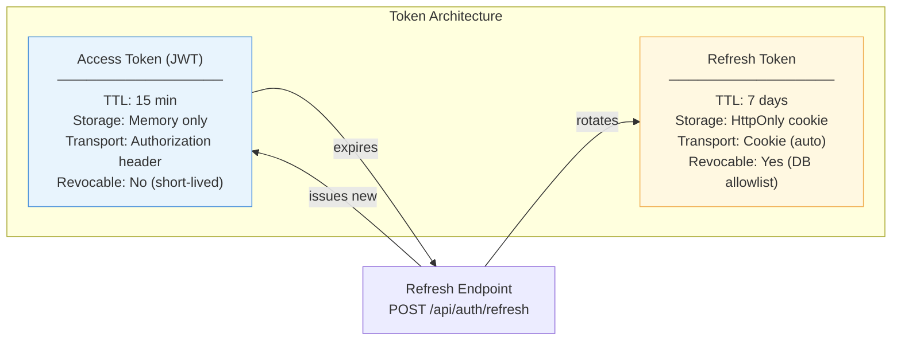
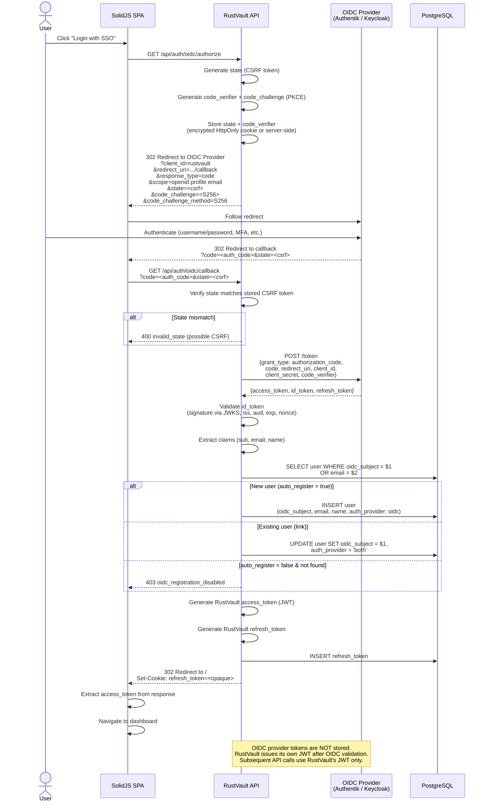
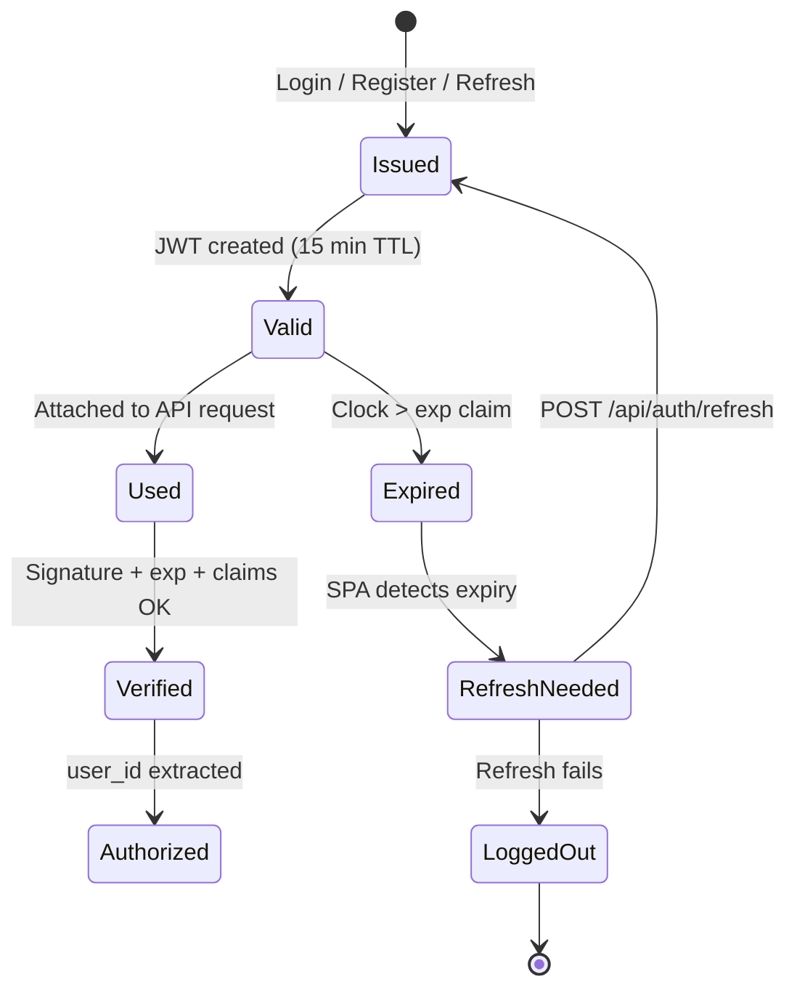
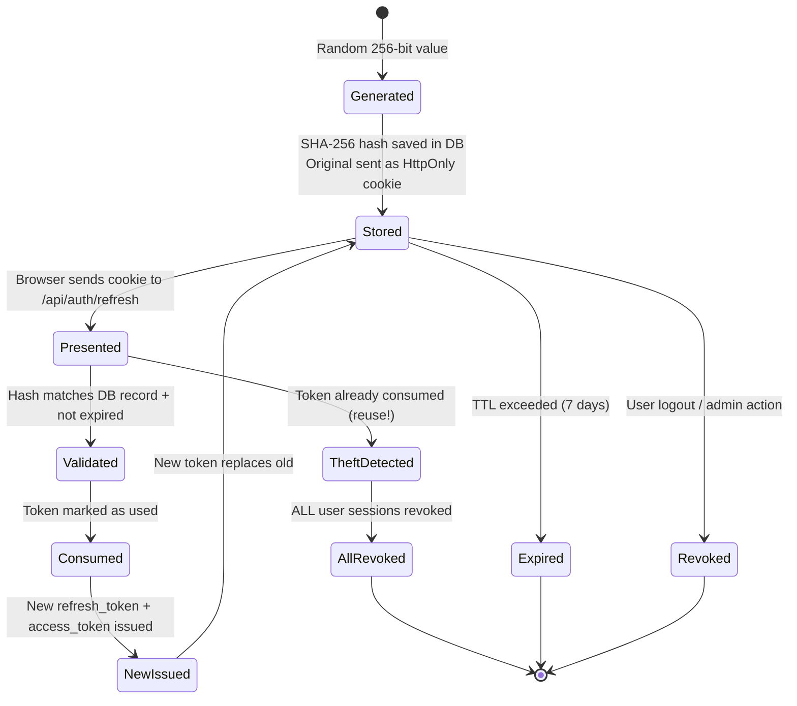
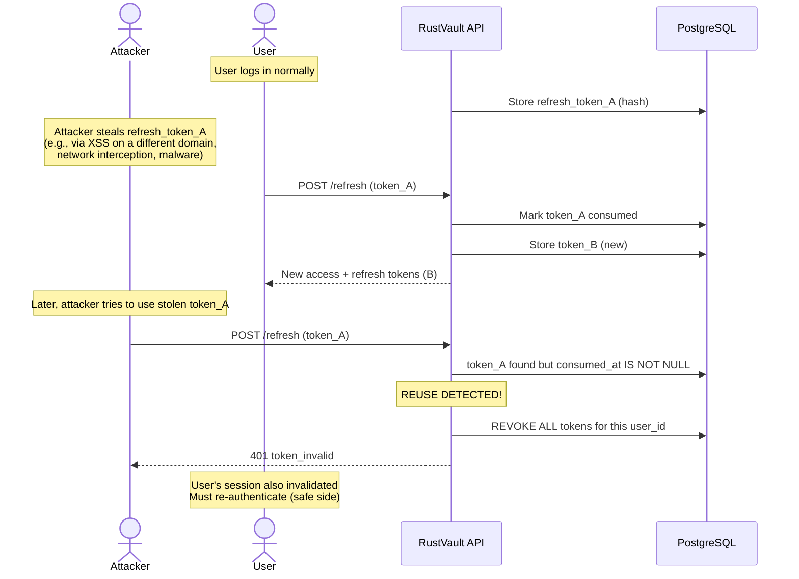
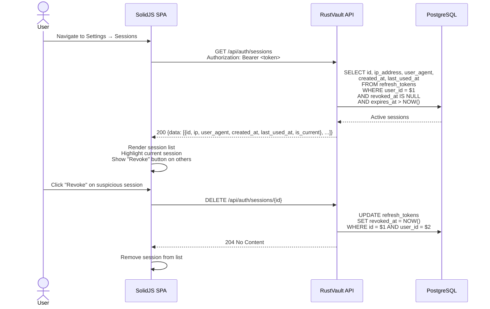
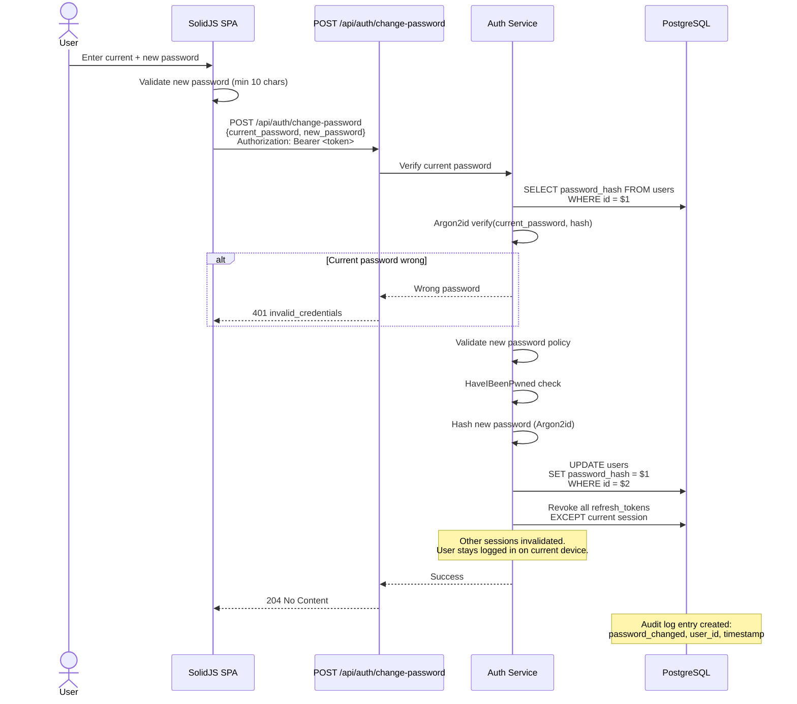
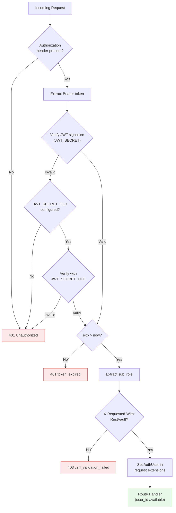
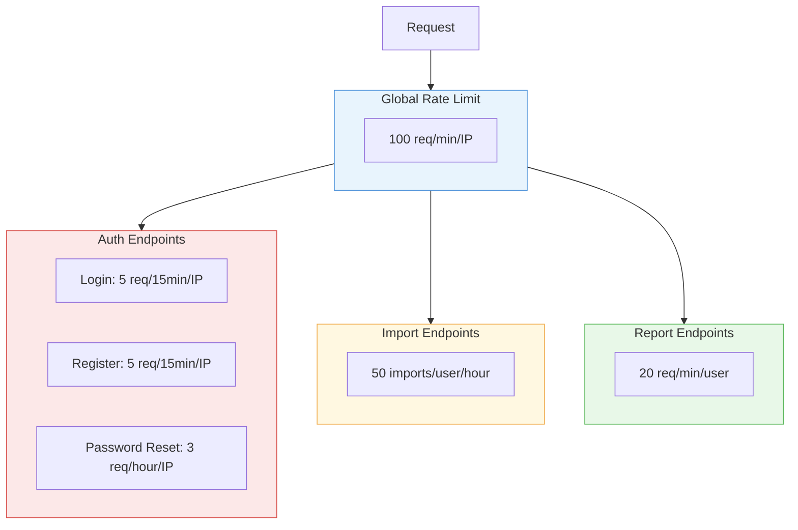
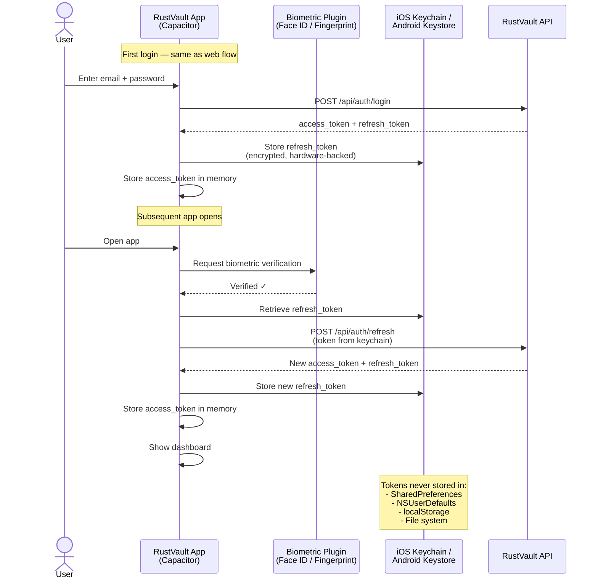

# Authentication Architecture

> Detailed authentication and session management flows for RustVault.
> Covers local auth (password + JWT), OIDC/SSO, token lifecycle, and session management.

---

## Table of Contents

1. [Overview](#1-overview)
2. [Auth Strategy Summary](#2-auth-strategy-summary)
3. [Registration Flow](#3-registration-flow)
4. [Login Flow (Local)](#4-login-flow-local)
5. [OIDC / SSO Login Flow](#5-oidc--sso-login-flow)
6. [Token Lifecycle](#6-token-lifecycle)
7. [Token Refresh Flow](#7-token-refresh-flow)
8. [Logout & Session Revocation](#8-logout--session-revocation)
9. [Session Management](#9-session-management)
10. [Password Change Flow](#10-password-change-flow)
11. [Security Controls](#11-security-controls)
12. [Mobile Authentication](#12-mobile-authentication)
13. [Token Storage Model](#13-token-storage-model)

---

## 1. Overview

RustVault uses a **dual-token architecture** for authentication:

- **Access token** (JWT) — short-lived (15 min), stored in browser memory, sent in `Authorization` header
- **Refresh token** — longer-lived (7 days), stored in an `HttpOnly; Secure; SameSite=Strict` cookie, single-use with rotation

This design balances security (short exposure window) with UX (no frequent re-login).



---

## 2. Auth Strategy Summary

| Aspect | Design Decision | Rationale |
|--------|----------------|-----------|
| **Access token format** | JWT (HS256) | Stateless verification at middleware layer — no DB call per request |
| **Access token storage** | JavaScript variable (SPA memory) | Not accessible to XSS via `document.cookie` or `localStorage` |
| **Access token TTL** | 15 minutes | Limits exposure window if token is leaked |
| **Refresh token format** | Opaque random string | No sensitive claims to decode; server-side validation only |
| **Refresh token storage** | `HttpOnly; Secure; SameSite=Strict` cookie | Inaccessible to JavaScript, not sent cross-origin |
| **Refresh token TTL** | 7 days | Balances security with "stay logged in" UX |
| **Refresh token rotation** | Single-use (each refresh issues a new token) | Detects token theft — reuse triggers full session revocation |
| **Password hashing** | Argon2id (19 MiB, 2 iterations, 1 parallelism) | Memory-hard — resistant to GPU/ASIC attacks |
| **OIDC support** | Authorization Code Flow + PKCE | Industry standard for SPAs, prevents authorization code interception |
| **CSRF protection** | `SameSite=Strict` + `X-Requested-With` header | Defense-in-depth — cookie not sent cross-origin, custom header blocks simple CORS |

> For the reasoning behind choosing JWTs over session cookies, see [ADR-0008: Auth & JWT Design](../adr/0008-auth-jwt-design.md).

---

## 3. Registration Flow

```mermaid
sequenceDiagram
    actor User
    participant SPA as SolidJS SPA
    participant API as POST /api/auth/register
    participant Auth as Auth Service
    participant DB as PostgreSQL

    User->>SPA: Fill registration form
    SPA->>SPA: Client-side validation<br/>(length, format)

    SPA->>API: POST /api/auth/register<br/>{username, email, password}<br/>+ X-Requested-With: RustVault

    API->>API: Rate limit check (5/15min/IP)
    
    alt Rate limited
        API-->>SPA: 429 rate_limited
    end

    API->>Auth: Validate input
    Auth->>Auth: Check password policy<br/>(min 10 chars, max 128)
    Auth->>Auth: HaveIBeenPwned check<br/>(k-anonymity API)
    
    alt Password breached
        Auth-->>API: Password found in breach database
        API-->>SPA: 400 password_breached
    end

    Auth->>DB: SELECT WHERE email = $1 OR username = $2
    
    alt Already exists
        Auth-->>API: Conflict
        API-->>SPA: 409 conflict
    end

    Auth->>Auth: Hash password (Argon2id)
    Auth->>DB: INSERT INTO users (...)
    Auth->>Auth: Generate access_token (JWT, 15 min)
    Auth->>Auth: Generate refresh_token (random, 7 days)
    Auth->>DB: INSERT INTO refresh_tokens (hash, user_id, ...)
    Auth-->>API: User + tokens

    API-->>SPA: 201 {user, access_token, expires_in}<br/>Set-Cookie: refresh_token=<opaque>;<br/>HttpOnly; Secure; SameSite=Strict; Path=/api

    SPA->>SPA: Store access_token in memory<br/>Schedule refresh at expires_in - 60s
    SPA->>SPA: Redirect to dashboard

    Note over SPA: First user gets role: admin<br/>Subsequent users get role: member
```

---

## 4. Login Flow (Local)

```mermaid
sequenceDiagram
    actor User
    participant SPA as SolidJS SPA
    participant API as POST /api/auth/login
    participant Auth as Auth Service
    participant DB as PostgreSQL

    User->>SPA: Enter email + password
    SPA->>API: POST /api/auth/login<br/>{email, password}<br/>+ X-Requested-With: RustVault

    API->>API: Rate limit check (5/15min/IP)

    alt Rate limited
        API-->>SPA: 429 rate_limited<br/>{retry_after: seconds}
    end

    API->>Auth: Authenticate
    Auth->>DB: SELECT user WHERE email = $1
    
    alt User not found
        Auth->>Auth: Dummy Argon2id hash<br/>(constant-time, prevents timing attack)
        Auth-->>API: Invalid credentials
        API-->>SPA: 401 invalid_credentials
    end

    Auth->>Auth: Argon2id verify(password, stored_hash)

    alt Wrong password
        Auth->>DB: INCREMENT failed_login_count
        alt Lockout threshold (20) reached
            Auth->>DB: SET locked_until = NOW() + 1 hour
            Auth-->>API: Account locked
            API-->>SPA: 403 account_locked
        end
        Auth-->>API: Invalid credentials
        API-->>SPA: 401 invalid_credentials
    end

    Auth->>DB: RESET failed_login_count
    Auth->>Auth: Generate access_token (JWT)
    Auth->>Auth: Generate refresh_token (random)
    Auth->>DB: INSERT INTO refresh_tokens<br/>(token_hash, user_id, ip, user_agent, expires_at)
    Auth-->>API: User + tokens

    API-->>SPA: 200 {user, access_token, expires_in}<br/>Set-Cookie: refresh_token=<opaque>;<br/>HttpOnly; Secure; SameSite=Strict; Path=/api

    SPA->>SPA: Store access_token in memory
    SPA->>SPA: Start refresh timer

    Note over Auth,DB: Login event logged to audit_log<br/>(user_id, ip, user_agent, timestamp)
```

---

## 5. OIDC / SSO Login Flow



---

## 6. Token Lifecycle

### Access Token (JWT)



#### JWT Claims (Access Token Payload)

```json
{
  "sub": "550e8400-e29b-41d4-a716-446655440000",
  "role": "admin",
  "iat": 1709463600,
  "exp": 1709464500
}
```

| Claim | Type | Description |
|-------|------|-------------|
| `sub` | UUID | User ID |
| `role` | string | `admin` or `member` |
| `iat` | timestamp | Issued at (Unix seconds) |
| `exp` | timestamp | Expires at (iat + 900s = 15 min) |

**Not included in JWT:** email, username, settings — fetched via `GET /api/auth/me` and cached in SPA.

### Refresh Token



#### Refresh Token DB Schema

```sql
CREATE TABLE refresh_tokens (
    id          UUID PRIMARY KEY DEFAULT gen_random_uuid(),
    user_id     UUID NOT NULL REFERENCES users(id) ON DELETE CASCADE,
    token_hash  BYTEA NOT NULL,          -- SHA-256 of the token
    ip_address  INET,
    user_agent  TEXT,
    created_at  TIMESTAMPTZ NOT NULL DEFAULT now(),
    expires_at  TIMESTAMPTZ NOT NULL,
    consumed_at TIMESTAMPTZ,             -- NULL = active, set on use
    revoked_at  TIMESTAMPTZ              -- NULL = not revoked
);

CREATE INDEX idx_refresh_tokens_user_id ON refresh_tokens(user_id);
CREATE INDEX idx_refresh_tokens_hash ON refresh_tokens(token_hash);
```

---

## 7. Token Refresh Flow

```mermaid
sequenceDiagram
    participant SPA as SolidJS SPA
    participant API as POST /api/auth/refresh
    participant Auth as Auth Service
    participant DB as PostgreSQL

    Note over SPA: Access token expired<br/>(or 60s before expiry)

    SPA->>API: POST /api/auth/refresh<br/>Cookie: refresh_token=<token_value>

    API->>Auth: Extract token from cookie
    Auth->>Auth: SHA-256 hash the token
    Auth->>DB: SELECT FROM refresh_tokens<br/>WHERE token_hash = $1<br/>AND expires_at > NOW()<br/>AND revoked_at IS NULL

    alt Token not found or expired
        Auth-->>API: Invalid token
        API-->>SPA: 401 token_expired
        SPA->>SPA: Redirect to /login
    end

    alt Token already consumed (consumed_at IS NOT NULL)
        Note over Auth: TOKEN REUSE DETECTED!<br/>Possible theft scenario
        Auth->>DB: UPDATE refresh_tokens<br/>SET revoked_at = NOW()<br/>WHERE user_id = $1
        Note over Auth: ALL sessions for this user revoked
        Auth-->>API: Token reuse detected
        API-->>SPA: 401 token_invalid<br/>{code: "token_reuse_detected"}
        SPA->>SPA: Redirect to /login<br/>Show security warning
    end

    Auth->>DB: UPDATE refresh_tokens<br/>SET consumed_at = NOW()<br/>WHERE id = $1
    
    Auth->>Auth: Generate new access_token (JWT, 15 min)
    Auth->>Auth: Generate new refresh_token (random)
    Auth->>DB: INSERT INTO refresh_tokens<br/>(new token_hash, user_id, ...)

    Auth-->>API: New access_token + refresh_token
    API-->>SPA: 200 {access_token, expires_in}<br/>Set-Cookie: refresh_token=<new_token>;<br/>HttpOnly; Secure; SameSite=Strict; Path=/api

    SPA->>SPA: Store new access_token in memory
    SPA->>SPA: Reset refresh timer
```

### Refresh Token Reuse Detection

Token reuse indicates a potential theft scenario:



---

## 8. Logout & Session Revocation

### Single Session Logout

```mermaid
sequenceDiagram
    actor User
    participant SPA as SolidJS SPA
    participant API as POST /api/auth/logout
    participant Auth as Auth Service
    participant DB as PostgreSQL

    User->>SPA: Click "Log out"
    SPA->>API: POST /api/auth/logout<br/>Authorization: Bearer <access_token><br/>Cookie: refresh_token=<token>

    API->>Auth: Extract refresh_token from cookie
    Auth->>Auth: SHA-256 hash the token
    Auth->>DB: UPDATE refresh_tokens<br/>SET revoked_at = NOW()<br/>WHERE token_hash = $1

    Auth-->>API: Success
    API-->>SPA: 204 No Content<br/>Clear-Cookie: refresh_token=; Max-Age=0

    SPA->>SPA: Clear access_token from memory
    SPA->>SPA: Clear cached user data
    SPA->>SPA: Redirect to /login
```

### Revoke All Sessions ("Log Out Everywhere")

```mermaid
sequenceDiagram
    actor User
    participant SPA as SolidJS SPA
    participant API as DELETE /api/auth/sessions
    participant Auth as Auth Service
    participant DB as PostgreSQL

    User->>SPA: Click "Log out everywhere"
    SPA->>API: DELETE /api/auth/sessions<br/>Authorization: Bearer <access_token>

    API->>Auth: Get user_id from JWT
    Auth->>DB: UPDATE refresh_tokens<br/>SET revoked_at = NOW()<br/>WHERE user_id = $1<br/>AND revoked_at IS NULL

    Note over DB: All sessions revoked.<br/>Other devices will fail<br/>on next refresh attempt.

    Auth-->>API: Revoked count
    API-->>SPA: 200 {revoked_sessions: 5}<br/>Clear-Cookie: refresh_token=; Max-Age=0

    SPA->>SPA: Clear tokens + redirect to /login

    Note over User: Access tokens on other devices<br/>remain valid until expiry (max 15 min).<br/>Refresh will fail → forced re-login.
```

---

## 9. Session Management

### Session List UI Flow



### Session Data Model

```
┌──────────────────────────────────────────────────────────┐
│ Active Sessions                                          │
├──────────────────────────────────────────────────────────┤
│ 🟢 Current Session                                      │
│   Chrome on macOS · 192.168.1.10                         │
│   Last active: Just now                                  │
│                                                          │
│ 🔵 Firefox on Windows · 10.0.0.5          [Revoke]      │
│   Last active: 2 hours ago                               │
│                                                          │
│ 🔵 RustVault iOS · 192.168.1.20           [Revoke]      │
│   Last active: 1 day ago                                 │
│                                                          │
│                            [Log out everywhere]          │
└──────────────────────────────────────────────────────────┘
```

---

## 10. Password Change Flow



---

## 11. Security Controls

### Request Authentication Middleware

Every protected API request passes through the auth middleware:



### CSRF Protection Layers

```
Layer 1: SameSite=Strict cookie
  └── Browser won't send refresh_token cookie on cross-site requests

Layer 2: X-Requested-With: RustVault header
  └── Simple CORS requests can't add custom headers
  └── Preflight required, which checks CORS origin allowlist

Layer 3: Authorization: Bearer header for API requests
  └── Not a cookie — inherently not sent automatically by browser
```

### Rate Limiting Tiers



---

## 12. Mobile Authentication

### Capacitor App Flow



---

## 13. Token Storage Model

### Where Tokens Live (by Platform)

| Token | Web (SPA) | iOS (Capacitor) | Android (Capacitor) |
|-------|-----------|-----------------|---------------------|
| **Access token** | JavaScript variable | JavaScript variable | JavaScript variable |
| **Refresh token** | `HttpOnly; Secure; SameSite=Strict` cookie | iOS Keychain (via Capacitor Preferences + Biometric plugin) | Android Keystore (via Capacitor Preferences + Biometric plugin) |

### Why NOT localStorage

| Risk | localStorage | Memory (JS variable) |
|------|-------------|---------------------|
| XSS access | Readable by any JS on the page | Not accessible via DOM APIs |
| Persistence after tab close | Yes — persists until cleared | No — gone on page close |
| Accessible by browser extensions | Yes | Limited |
| Survives page refresh | Yes | No (requires refresh token to get new access token) |

The trade-off: losing the access token on page refresh requires a transparent refresh call. This is handled automatically by the SPA's HTTP client interceptor.

### SPA Token Refresh Interceptor

```
┌─────────────────────────────────────────────────┐
│ HTTP Client (fetch wrapper)                     │
│                                                 │
│  1. Attach Authorization: Bearer <access_token> │
│  2. Send request                                │
│  3. If 401 received:                            │
│     a. Call POST /api/auth/refresh              │
│     b. If refresh succeeds:                     │
│        - Update access_token in memory          │
│        - Retry original request                 │
│     c. If refresh fails:                        │
│        - Clear all auth state                   │
│        - Redirect to /login                     │
│  4. Queue concurrent requests during refresh    │
│     (only one refresh call at a time)           │
└─────────────────────────────────────────────────┘
```

---

## References

- [ADR-0008: Auth & JWT Design](../adr/0008-auth-jwt-design.md) — Decision record on JWT vs session cookies
- [RustVault API — Authentication Section](../../API_PLAN.md#2-authentication--sessions) — Full endpoint specifications
- [OWASP JWT Cheat Sheet](https://cheatsheetseries.owasp.org/cheatsheets/JSON_Web_Token_for_Java_Cheat_Sheet.html)
- [OWASP Session Management Cheat Sheet](https://cheatsheetseries.owasp.org/cheatsheets/Session_Management_Cheat_Sheet.html)
- [Auth0: Refresh Token Rotation](https://auth0.com/docs/secure/tokens/refresh-tokens/refresh-token-rotation)
- [RustVault Threat Model](threat-model.md) — Threat analysis including auth-related threats (S1–S6)
