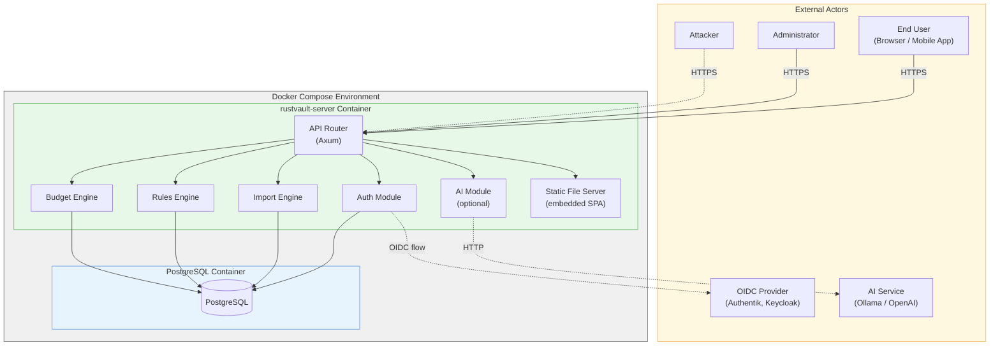
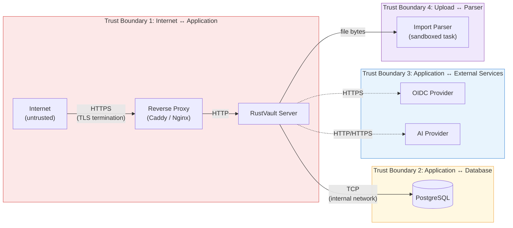
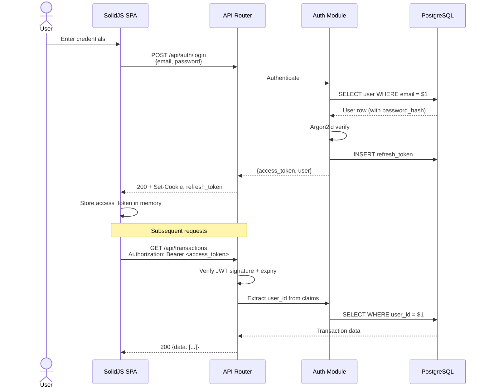
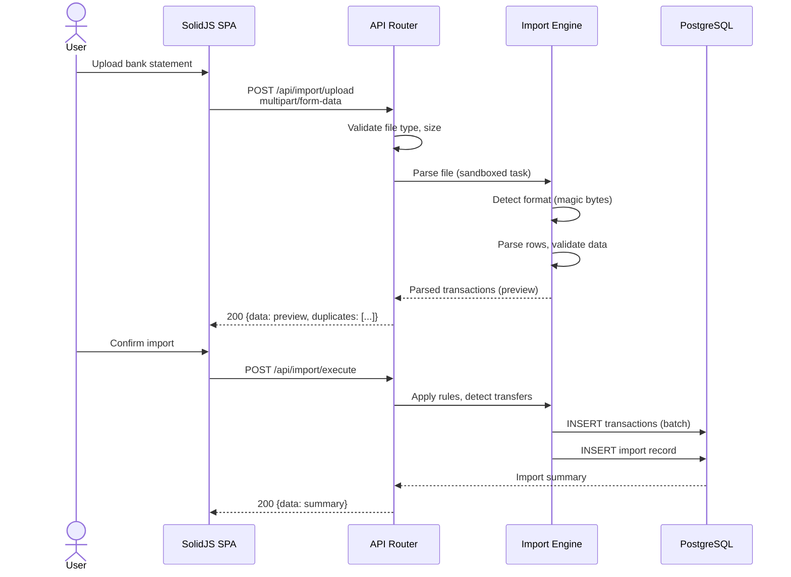

# RustVault Threat Model

> Comprehensive threat analysis using the **STRIDE** methodology.
> This document identifies threats to the RustVault platform, assesses their risk, and maps them to mitigations.

---

## Table of Contents

1. [Overview](#1-overview)
2. [System Decomposition](#2-system-decomposition)
3. [Trust Boundaries](#3-trust-boundaries)
4. [STRIDE Analysis](#4-stride-analysis)
5. [Data Flow Diagrams](#5-data-flow-diagrams)
6. [Asset Inventory](#6-asset-inventory)
7. [Risk Assessment Matrix](#7-risk-assessment-matrix)
8. [Mitigations Summary](#8-mitigations-summary)

---

## 1. Overview

### Purpose

This threat model documents the security analysis of RustVault, a self-hosted personal finance platform. It identifies potential threats to the system, evaluates their impact and likelihood, and maps each threat to concrete mitigations implemented (or planned) in the codebase.

### Methodology

We apply **STRIDE** — a threat classification framework developed by Microsoft:

| Category | Threat Type | Property Violated |
|----------|-------------|-------------------|
| **S** | Spoofing | Authentication |
| **T** | Tampering | Integrity |
| **R** | Repudiation | Non-repudiation |
| **I** | Information Disclosure | Confidentiality |
| **D** | Denial of Service | Availability |
| **E** | Elevation of Privilege | Authorization |

### Scope

| In Scope | Out of Scope |
|----------|--------------|
| RustVault backend (Axum server) | Host OS hardening (covered in [hardening guide](hardening-guide.md)) |
| SolidJS frontend SPA | Third-party OIDC provider internals |
| PostgreSQL as used by RustVault | Network infrastructure (ISP, DNS) |
| Docker container and compose setup | Physical security of the server |
| Import pipeline (file parsing) | Capacitor native bridges (deferred to P6) |
| REST API and WebSocket | |

---

## 2. System Decomposition

### Components

### Data Stores

| Store | Contents | Sensitivity |
|-------|----------|-------------|
| PostgreSQL `users` table | Usernames, emails, Argon2id password hashes, roles, settings | **High** — authentication material |
| PostgreSQL `transactions` table | Financial transactions, amounts, descriptions, dates | **High** — personal financial data |
| PostgreSQL `accounts` / `banks` | Account names, types, balances, bank names | **High** — financial structure |
| PostgreSQL `refresh_tokens` table | Hashed refresh token allowlist, session metadata | **High** — session material |
| PostgreSQL `audit_log` table | All data mutations with actor and timestamp | **Medium** — operational data |
| Docker volume (DB data) | PostgreSQL data directory | **High** — all of the above |
| `/tmp/rustvault-imports` | Temporary uploaded files during import processing | **Medium** — transient bank statements |
| Environment variables / `.env` | `JWT_SECRET`, `PGPASSWORD`, `ENCRYPTION_KEY`, `OIDC_CLIENT_SECRET` | **Critical** — system secrets |
| Application memory | Active JWT access tokens, decrypted config | **High** — runtime secrets |

---

## 3. Trust Boundaries

| Boundary | From (Trust Level) | To (Trust Level) | Data Crossing |
|----------|-------------------|-------------------|---------------|
| **TB1** | Untrusted (Internet) | Trusted (App) | HTTP requests, JWT tokens, uploaded files |
| **TB2** | Trusted (App) | Trusted (DB) | SQL queries, credentials |
| **TB3** | Trusted (App) | Semi-trusted (External) | OIDC tokens, AI prompts with transaction descriptions |
| **TB4** | Semi-trusted (Upload) | Sandboxed (Parser) | Raw file bytes from user-uploaded bank statements |

---

## 4. STRIDE Analysis

### S — Spoofing

| ID | Threat | Target | Likelihood | Impact | Risk | Mitigation |
|----|--------|--------|------------|--------|------|------------|
| S1 | **Credential stuffing** — attacker uses breached credentials | Auth endpoint | High | High | **High** | Rate limiting (5 attempts/15 min/IP), progressive lockout, account lockout after 20 failures, HaveIBeenPwned password check |
| S2 | **Brute force JWT secret** — attacker guesses weak signing key | JWT verification | Low | Critical | **Medium** | Minimum 256-bit key enforced, auto-generated if not set, rotation support via `JWT_SECRET_OLD` |
| S3 | **Stolen refresh token** — attacker replays a leaked refresh token | Refresh endpoint | Medium | High | **High** | Single-use rotation (reuse = theft detection → all sessions revoked), `HttpOnly; Secure; SameSite=Strict` cookie |
| S4 | **OIDC token forgery** — fake ID tokens from a malicious provider | OIDC callback | Low | High | **Medium** | Validate ID token signature against provider's JWKS, verify `iss`, `aud`, `nonce`, `exp` claims, PKCE prevents code interception |
| S5 | **Session hijacking** — attacker steals access token from memory | API requests | Low | High | **Medium** | Short-lived tokens (15 min), no localStorage, memory-only storage in SPA, CSP prevents XSS exfiltration |
| S6 | **IP spoofing for rate limit bypass** | Rate limiter | Medium | Medium | **Medium** | Trust `X-Forwarded-For` only from configured reverse proxy, per-user rate limits in addition to per-IP |

### T — Tampering

| ID | Threat | Target | Likelihood | Impact | Risk | Mitigation |
|----|--------|--------|------------|--------|------|------------|
| T1 | **SQL injection** — attacker modifies queries via user input | Database queries | Low | Critical | **Medium** | SQLx compile-time checked parameterized queries — no string concatenation in SQL, ever |
| T2 | **Mass assignment** — attacker sets `role: admin` in request body | API endpoints | Medium | High | **High** | `#[serde(deny_unknown_fields)]` on all request DTOs, explicit field mapping, separate Create/Update types |
| T3 | **Import file manipulation** — malicious content in CSV/OFX files | Import parser | Medium | Medium | **Medium** | Parsing in sandboxed tokio task, input validation, no execution of file content, size/type limits |
| T4 | **Transaction amount tampering** — modify financial data | Transaction API | Low | High | **Medium** | Audit log records old/new values, `user_id` ownership checks, `original_desc` field is immutable |
| T5 | **JWT payload modification** — alter claims in access token | JWT verification | Very Low | Critical | **Low** | HMAC-SHA256 signature verification, claims validated on every request |
| T6 | **JSONB injection** — oversized or deeply nested metadata | JSONB columns | Medium | Low | **Low** | Max depth (5 levels), max size (64 KB), schema validation before storage |
| T7 | **Response tampering (MITM)** — modify API responses in transit | HTTPS connection | Low | High | **Medium** | TLS required for production, HSTS header, certificate pinning on mobile (optional) |

### R — Repudiation

| ID | Threat | Target | Likelihood | Impact | Risk | Mitigation |
|----|--------|--------|------------|--------|------|------------|
| R1 | **User denies modifying transaction** | Transaction history | Medium | Medium | **Medium** | Immutable audit log (`audit_log` table) records actor, action, timestamp, old/new values — no UPDATE/DELETE on audit_log |
| R2 | **Admin denies accessing user data** | Admin operations | Low | High | **Medium** | Admin actions are logged with same audit trail, including IP and request ID |
| R3 | **Attacker covers tracks after breach** | Security logs | Low | High | **Medium** | Structured logging to stdout (append-only in Docker), security events at WARN level, separate audit log in DB |

### I — Information Disclosure

| ID | Threat | Target | Likelihood | Impact | Risk | Mitigation |
|----|--------|--------|------------|--------|------|------------|
| I1 | **Cross-user data leak** — user A sees user B's transactions | API queries | Medium | Critical | **High** | Every DB query filters by `user_id`, row-level security, resource ownership checks, 404 (not 403) for other users' resources |
| I2 | **Password hash exposure** — password_hash in API response | User API | Low | High | **Medium** | `#[serde(skip)]` on `password_hash`, explicit response DTOs separate from DB models |
| I3 | **Error message information leakage** — stack traces, SQL errors | API errors | Medium | Medium | **Medium** | Generic error messages in production, structured error codes, no query text in responses, `tracing` filters |
| I4 | **Secrets in logs** — JWT, passwords, amounts in log output | Application logs | Medium | High | **High** | Middleware scrubs `Authorization` headers, passwords redacted, financial amounts configurable |
| I5 | **Database exposure** — PostgreSQL port accessible from internet | PostgreSQL | Medium | Critical | **High** | Internal Docker network only, DB port not exposed to host by default, documented in hardening guide |
| I6 | **Backup data exposure** — unencrypted database dump intercepted | Backup endpoint | Medium | Critical | **High** | Backup encryption with user-provided key, download over HTTPS only, no persistent storage of backup files |
| I7 | **AI provider data leak** — transaction descriptions sent to external AI | AI module | Medium | Medium | **Medium** | AI module is optional and off by default, Ollama (local) is the default provider, clear documentation on what data is sent |
| I8 | **User enumeration** — different responses for existing vs non-existing emails | Auth endpoints | Medium | Low | **Low** | Generic "Invalid credentials" for both wrong email and wrong password, no timing side-channels (constant-time comparison) |
| I9 | **Version/technology disclosure** — Server header reveals stack | HTTP headers | Low | Low | **Low** | Remove `Server` header, health endpoint returns no version info, no technology-specific error pages |

### D — Denial of Service

| ID | Threat | Target | Likelihood | Impact | Risk | Mitigation |
|----|--------|--------|------------|--------|------|------------|
| D1 | **API flood** — high volume of requests | API server | High | Medium | **High** | Global rate limit (100 req/min/IP), Tower middleware, configurable via env var |
| D2 | **Login brute force flood** — massive login attempts | Auth endpoint | High | Medium | **High** | Auth-specific rate limit (5/15min/IP), progressive lockout, fail2ban-compatible logging |
| D3 | **Large file upload** — oversized file exhausts memory/disk | Import endpoint | Medium | Medium | **Medium** | Max upload size (50 MB), streaming upload, temp directory cleanup, per-user import rate limit |
| D4 | **Zip bomb / decompression bomb** — compressed file expands to huge size | Import parser | Low | Medium | **Low** | No archive files accepted, flat files only, parser memory/time limits via tokio task budget |
| D5 | **Slowloris attack** — slow HTTP connections exhaust server resources | HTTP server | Medium | Medium | **Medium** | Axum/Hyper timeouts: 30s request, 10s header read, connection limits per IP |
| D6 | **Heavy report queries** — expensive aggregation queries | Report endpoints | Medium | Low | **Medium** | Report-specific rate limit (20/min/user), query timeouts, indexed aggregation queries |
| D7 | **WebSocket connection exhaustion** — open many idle WS connections | WebSocket endpoint | Medium | Low | **Medium** | Max connections per user, idle timeout, JWT required for WS handshake, connection closed on token expiry |
| D8 | **Database connection exhaustion** — pool saturation | SQLx connection pool | Low | High | **Medium** | Pool limits (max 10, configurable), acquire timeout (5s), connection health checks |

### E — Elevation of Privilege

| ID | Threat | Target | Likelihood | Impact | Risk | Mitigation |
|----|--------|--------|------------|--------|------|------------|
| E1 | **Horizontal privilege escalation** — user accesses another user's resources | API endpoints | Medium | Critical | **High** | `user_id` filter on ALL queries, ownership verification on PUT/DELETE, no global queries outside admin endpoints |
| E2 | **Vertical privilege escalation** — member escalates to admin | Role system | Low | Critical | **Medium** | Role in JWT cannot be modified client-side (signature verification), role checked at middleware layer, `role` field not accepted in user update API |
| E3 | **IDOR (Insecure Direct Object Reference)** — access resources by guessing UUIDs | Resource endpoints | Medium | High | **High** | UUIDv4 (unguessable), ownership check on every access, 404 for non-owned resources |
| E4 | **Container escape** — break out of Docker container | Docker runtime | Very Low | Critical | **Low** | Non-root user, `cap_drop: [ALL]`, read-only filesystem, no privileged mode, minimal base image |
| E5 | **Dependency vulnerability** — exploitable CVE in a crate | Supply chain | Medium | Varies | **Medium** | `cargo audit` in CI, `cargo deny` for license/advisory checks, Dependabot/Renovate for updates, Trivy scan on Docker image |

---

## 5. Data Flow Diagrams

### Authentication Flow

### Import Pipeline Flow

---

## 6. Asset Inventory

| Asset | Type | Confidentiality | Integrity | Availability | Owner |
|-------|------|-----------------|-----------|--------------|-------|
| User credentials (password hashes) | Data | **Critical** | **Critical** | Medium | Auth Module |
| Financial transactions | Data | **High** | **High** | High | Core Domain |
| Account balances & bank info | Data | **High** | High | High | Core Domain |
| JWT signing secret | Secret | **Critical** | **Critical** | High | Config System |
| Database credentials | Secret | **Critical** | High | High | Config System |
| OIDC client secret | Secret | **High** | High | Medium | Auth Module |
| Encryption key (AI configs) | Secret | **High** | High | Medium | Config System |
| Audit log | Data | Medium | **Critical** | High | Audit System |
| User-uploaded files (import) | Data | Medium | Medium | Low | Import Engine |
| Application binary | Code | Low | **High** | High | Build System |
| Docker image | Artifact | Low | **High** | High | CI/CD |

---

## 7. Risk Assessment Matrix

| | **Low Impact** | **Medium Impact** | **High Impact** | **Critical Impact** |
|---|---|---|---|---|
| **High Likelihood** | — | D1 (API flood), D2 (Login flood) | S1 (Credential stuffing) | — |
| **Medium Likelihood** | I8 (User enum), T6 (JSONB) | T3 (Import file), D3 (Large upload), D5 (Slowloris), D6 (Reports) | S3 (Token theft), T2 (Mass assign), I4 (Secrets in logs), S6 (IP spoof) | I1 (Cross-user), I5 (DB exposure), I6 (Backup), E1 (Horizontal), E3 (IDOR) |
| **Low Likelihood** | I9 (Version leak) | D4 (Zip bomb), R3 (Cover tracks) | S5 (Session hijack), T4 (Tampering), T7 (MITM), I2 (Password hash), R2 (Admin deny) | S2 (JWT secret), T1 (SQLi), E2 (Vertical) |
| **Very Low Likelihood** | — | — | — | T5 (JWT modify), E4 (Container escape) |

---

## 8. Mitigations Summary

### By Implementation Phase

#### Phase 0 (Scaffolding)

- [x] Non-root Docker container (`USER rustvault:rustvault`)
- [x] Minimal base image (`debian:bookworm-slim`)
- [x] Read-only container filesystem
- [x] `cap_drop: [ALL]` in Docker Compose
- [x] Internal Docker network (DB not exposed)
- [x] `cargo audit` in CI pipeline
- [x] Environment-based secret management
- [x] Structured logging with `tracing`

#### Phase 1 (Core Backend)

- [ ] Argon2id password hashing (19 MiB memory, 2 iterations)
- [ ] JWT access tokens (15 min TTL, memory-only)
- [ ] Refresh token rotation with theft detection
- [ ] `HttpOnly; Secure; SameSite=Strict` cookies
- [ ] Rate limiting on auth endpoints (5/15min/IP)
- [ ] Account lockout (20 failures)
- [ ] HaveIBeenPwned password check
- [ ] CORS strict origin allowlist
- [ ] `X-Requested-With` CSRF header requirement
- [ ] Row-level security (`user_id` filtering)
- [ ] `#[serde(skip)]` on sensitive fields
- [ ] Input validation (`validator` crate)
- [ ] `#[serde(deny_unknown_fields)]` on request DTOs
- [ ] Audit log for all mutations
- [ ] Security event logging (failed logins, rate limits)
- [ ] No secrets in log output
- [ ] OIDC with PKCE and full claim validation

#### Phase 2 (Web UI)

- [ ] CSP header (no inline scripts)
- [ ] No `innerHTML` usage
- [ ] Access tokens in memory only (no localStorage)
- [ ] Session management UI

#### Phase 3 (Import Pipeline)

- [ ] File type validation by magic bytes
- [ ] Filename sanitization (UUID-based internal names)
- [ ] Size limits (50 MB statements, 25 MB receipts)
- [ ] Sandboxed parsing (separate tokio task)
- [ ] No archive files, flat files only
- [ ] Import rate limiting (50/user/hour)
- [ ] Temporary file cleanup

#### Phase 7 (Hardening & Release)

- [ ] HSTS header
- [ ] Full security header suite
- [ ] Global rate limiting (100 req/min/IP)
- [ ] RBAC enforcement (admin vs member)
- [ ] Backup encryption
- [ ] Data deletion ("delete my account")
- [ ] JWT key rotation (`JWT_SECRET_OLD`)
- [ ] Docker image scanning (Trivy/Grype)
- [ ] Max concurrent connections per IP
- [ ] Security alerting webhooks

---

## References

- [STRIDE Threat Modeling](https://learn.microsoft.com/en-us/azure/security/develop/threat-modeling-tool-threats)
- [OWASP Threat Modeling](https://owasp.org/www-community/Threat_Modeling)
- [OWASP Top 10 (2021)](https://owasp.org/www-project-top-ten/)
- [RustVault Auth Architecture](auth-architecture.md)
- [RustVault Hardening Guide](hardening-guide.md)
